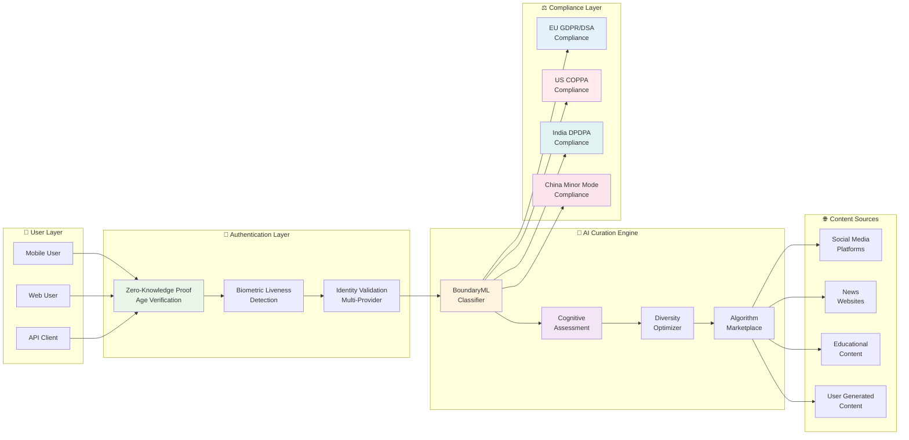
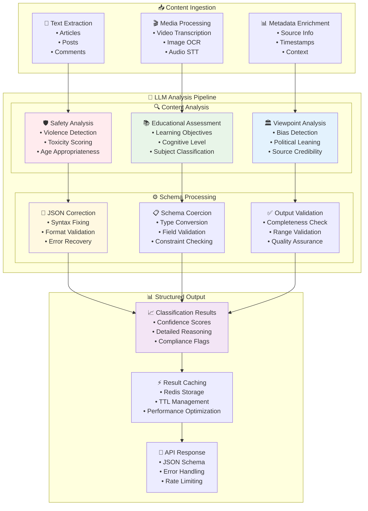
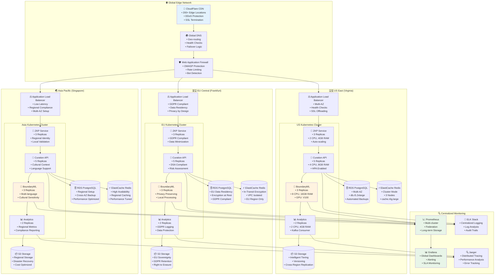
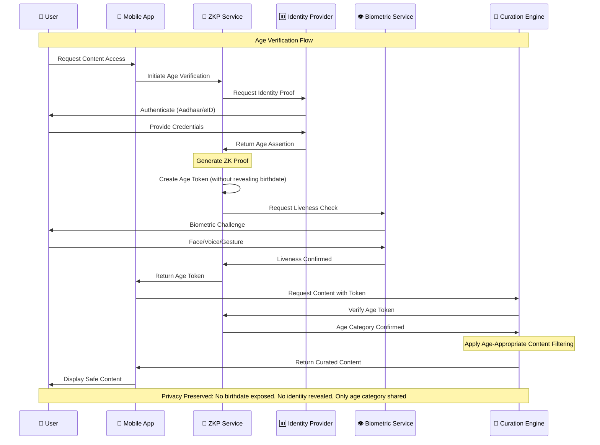
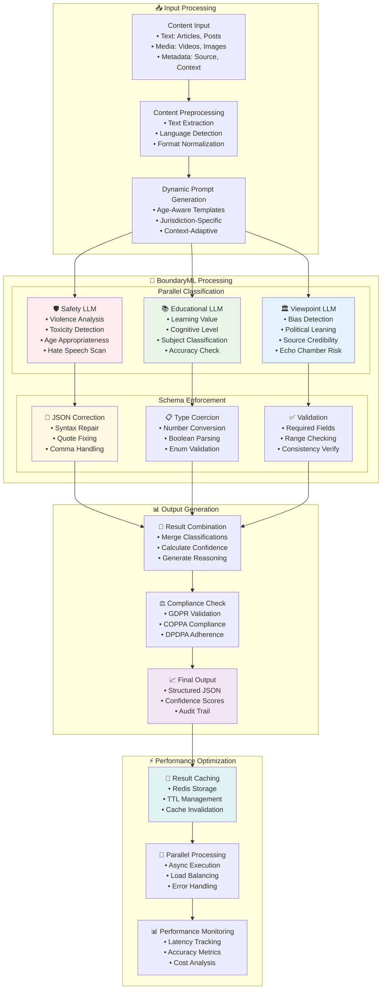
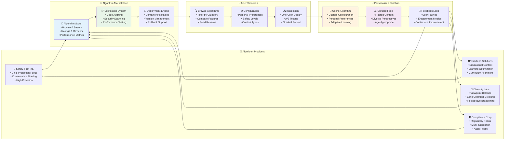
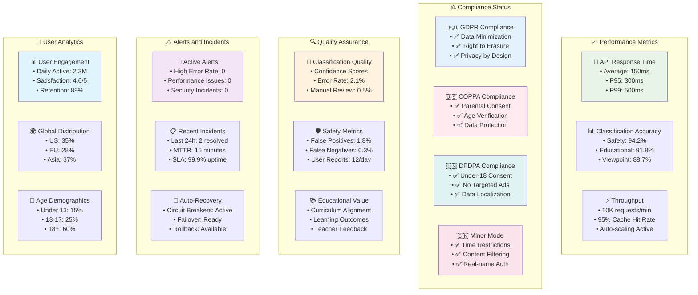

# Advanced Architecture Diagrams for AI Curation Engine

This document provides enhanced visual representations of the AI Curation Engine architecture using advanced diagramming techniques.

## 🏗️ System Architecture Overview

### High-Level System Flow

## 🔄 Content Classification Pipeline

### BoundaryML Processing Flow

## 🌍 Global Deployment Architecture

### Multi-Region Infrastructure

## 🔐 Zero-Knowledge Proof Flow

### Privacy-Preserving Age Verification

## 🧠 BoundaryML Classification Process

### LLM-Based Content Analysis

## 🔄 Algorithm Marketplace Ecosystem

### Curation Algorithm Selection and Deployment

## 📊 Compliance and Monitoring Dashboard

### Real-Time System Health and Compliance

---

## 🎨 Diagram Legend

### Color Coding
- 🟦 **Blue**: User interfaces and external interactions
- 🟩 **Green**: Security and privacy components
- 🟨 **Yellow**: Processing and analysis engines
- 🟥 **Red**: Compliance and regulatory systems
- 🟪 **Purple**: Data storage and caching
- 🟧 **Orange**: Monitoring and observability

### Icons Reference
- 👤 **User/Human**: End users and stakeholders
- 🔐 **Security**: Authentication, encryption, privacy
- 🤖 **AI/ML**: Machine learning and AI components
- 🌐 **Network**: APIs, services, global infrastructure
- 📊 **Data**: Analytics, metrics, databases
- ⚖️ **Compliance**: Legal, regulatory, governance
- 🔍 **Monitoring**: Observability, logging, tracing
- 🚀 **Performance**: Speed, optimization, scaling

### Mermaid Diagram Benefits
1. **Interactive**: Click and zoom functionality
2. **Version Control**: Text-based, easy to track changes
3. **Responsive**: Adapts to different screen sizes
4. **Accessible**: Screen reader compatible
5. **Maintainable**: Easy to update and modify
6. **Professional**: Clean, consistent styling

These enhanced diagrams provide a comprehensive visual understanding of the AI Curation Engine architecture, making it easier for stakeholders, developers, and implementers to grasp the system's complexity and interactions.
