# 🚀 AI Curation Engine - Complete Local Deployment Guide

## Overview

This comprehensive guide provides step-by-step instructions to deploy the AI Curation Engine locally with **real BAML integration**, **no fallbacks**, and **automated deployment scripts**. Perfect for development, testing, and privacy-focused deployments using local Llama models.

## 📋 Prerequisites

### System Requirements
- **OS**: macOS, Linux, or Windows with WSL2
- **RAM**: Minimum 8GB, Recommended 16GB+
- **Storage**: 20GB+ free space for models
- **CPU**: Modern multi-core processor
- **GPU**: Optional but recommended for faster inference

### Software Requirements
- **Python 3.8+** (for the application)
- **pip3** (Python package manager)
- **Git** (for cloning repository)
- **curl** (for testing endpoints)

## 🏗️ Updated Architecture

```mermaid
graph TB
    subgraph "Local Deployment (2024)"
        DEMO[🎯 Demo Frontend<br/>Flask:5001]
        ENGINE[🤖 Curation Engine<br/>Pluggable Strategies]
        BAML[🔄 BAML Integration<br/>Real Implementation]
        OLLAMA[🦙 Ollama Server<br/>:11434]
    end
    
    subgraph "Curation Strategies"
        LLM[🧠 LLM-Only Strategy<br/>5-10s processing]
        MULTI[⚡ Multi-Layer Strategy<br/>0.1-5s processing]
        HYBRID[🎯 Hybrid Strategy<br/>Adaptive]
    end
    
    subgraph "Local AI Models"
        LLAMA32[🧠 Llama 3.2<br/>7B Parameters]
    end
    
    DEMO --> ENGINE
    ENGINE --> LLM
    ENGINE --> MULTI
    ENGINE --> HYBRID
    BAML --> OLLAMA
    OLLAMA --> LLAMA32
    LLM --> BAML
    MULTI --> BAML
    HYBRID --> BAML
```



## 🛠️ Quick Start (Automated Deployment)

### Step 1: Clone Repository
```bash
git clone https://github.com/gitmujoshi/ai-curation-engine.git
cd ai-curation-engine
```

### Step 2: One-Command Deployment
```bash
# Make scripts executable
chmod +x *.sh

# Deploy everything automatically
./deploy_local.sh
```

**That's it!** The script will:
- ✅ Check all dependencies
- ✅ Install Python packages
- ✅ Start Ollama with Llama 3.2
- ✅ Generate BAML client
- ✅ Start demo frontend on port 5001
- ✅ Provide complete status report

## 📱 Available URLs (After Deployment)

### 🎯 Main Application
- **🏠 Demo UI**: `http://localhost:5001/`
- **🧪 Content Tester**: `http://localhost:5001/content-test` ⭐
- **❤️ Health Check**: `http://localhost:5001/health`

### 🔧 API Endpoints
- **🤖 Content Classification**: `POST http://localhost:5001/api/classify`
- **⚙️ Strategy Management**: `GET/POST http://localhost:5001/api/strategy`
- **👥 Child Profiles**: `GET http://localhost:5001/api/children`

### 🦙 Local AI Infrastructure
- **🔗 Ollama API**: `http://localhost:11434`
- **📋 Models List**: `http://localhost:11434/api/tags`

## 🎮 Testing Your Deployment

### Quick Health Check
```bash
# Check all services
./status_check.sh

# Or manual check
curl http://localhost:5001/health | jq
```

### Test Content Classification
```bash
# Test with educational content
curl -X POST http://localhost:5001/api/classify \
     -H "Content-Type: application/json" \
     -d '{"content": "This educational content teaches science concepts", "childId": "child_1"}' | jq

# Test strategy switching
curl -X POST http://localhost:5001/api/strategy \
     -H "Content-Type: application/json" \
     -d '{"strategy": "multi_layer"}' | jq
```

### Interactive Testing
1. Open `http://localhost:5001/content-test`
2. Try different content samples
3. Switch between curation strategies
4. Monitor processing times and results

## 🚀 Management Scripts

### Deployment & Control
```bash
./deploy_local.sh     # 🚀 Start everything
./status_check.sh     # 🔍 Check all services
./stop_services.sh    # 🛑 Stop all services
./build_and_test.sh   # 🏗️ Validate and test build
```

### What Each Script Does

#### `deploy_local.sh`
- Checks Python, pip, and Ollama dependencies
- Sets up environment variables
- Starts Ollama with Llama 3.2 model
- Generates BAML client
- Starts demo frontend
- Provides complete service status

#### `status_check.sh`
- Tests all service endpoints
- Shows process information
- Validates API functionality
- Provides quick test commands
- Displays all available URLs

#### `stop_services.sh`
- Gracefully stops all services
- Cleans up PID files
- Optionally keeps Ollama running

#### `build_and_test.sh`
- Validates code syntax
- Tests core functionality
- Checks for remaining fallbacks
- Generates documentation

## 🎯 Curation Strategies Explained

### 1. LLM-Only Strategy (`llm_only`)
- **Purpose**: Maximum accuracy with comprehensive analysis
- **Processing Time**: 5-10 seconds
- **Best For**: Complex content requiring detailed reasoning
- **Use Case**: High-stakes content moderation

### 2. Multi-Layer Strategy (`multi_layer`)
- **Purpose**: Performance optimization with selective LLM usage
- **Processing Time**: 0.1-5 seconds (adaptive)
- **Layers**: Fast filters → Specialized AI → LLM (if needed)
- **Best For**: High-volume content processing

### 3. Hybrid Strategy (`hybrid`)
- **Purpose**: Intelligent strategy selection
- **Processing Time**: Variable (1-8 seconds)
- **Logic**: Chooses optimal strategy based on content complexity
- **Best For**: Balanced speed/accuracy requirements

## 🔧 Manual Installation (If Needed)

### Install Dependencies
```bash
# macOS with Homebrew
brew install python ollama

# Ubuntu/Debian
sudo apt update
sudo apt install python3 python3-pip curl

# Install Ollama
curl -fsSL https://ollama.ai/install.sh | sh
```

### Install Python Packages
```bash
# Create requirements.txt
cat > requirements.txt << 'EOF'
flask==2.3.3
flask-cors==4.0.0
requests==2.31.0
pydantic==2.4.2
python-dotenv==1.0.0
baml-py>=0.46.0
EOF

# Install packages
pip3 install -r requirements.txt
```

### Setup Ollama
```bash
# Start Ollama
ollama serve &

# Download Llama 3.2 (one-time setup)
ollama pull llama3.2

# Verify installation
ollama list
```

### Generate BAML Client
```bash
# Install BAML CLI (if needed)
pip3 install baml-py

# Generate client
baml-cli generate
```

### Start Services Manually
```bash
# Terminal 1: Ollama (if not running)
ollama serve

# Terminal 2: Demo Frontend
cd demo-frontend
python3 app.js
```

## 📊 What's New in This Version

### ✅ Removed All Fallbacks
- **No mock data**: Pure BAML integration
- **No hardcoded values**: Real AI analysis only
- **Error handling**: Graceful failures without fake responses

### ✅ Pluggable Architecture
- **Three strategies**: LLM-Only, Multi-Layer, Hybrid
- **Runtime switching**: Change strategies without restart
- **Performance monitoring**: Real-time metrics

### ✅ Enhanced UI
- **Strategy control panel**: Switch and monitor strategies
- **Performance display**: Processing times and confidence
- **Sample highlighting**: Better user experience
- **Real-time results**: No cached/static responses

### ✅ Complete Automation
- **One-command deployment**: `./deploy_local.sh`
- **Comprehensive monitoring**: `./status_check.sh`
- **Clean shutdown**: `./stop_services.sh`
- **Build validation**: `./build_and_test.sh`

## 🔍 Monitoring and Debugging

### Log Files
```bash
# View frontend logs
tail -f logs/demo-frontend.log

# View Ollama logs
tail -f logs/ollama.log

# View BAML generation logs
tail -f logs/baml-generate.log
```

### Common Issues

#### Health Check Fails
```bash
# Check if frontend is running
curl http://localhost:5001/health

# Restart if needed
./stop_services.sh && ./deploy_local.sh
```

#### Slow Classification (>15 seconds)
```bash
# Check Ollama status
curl http://localhost:11434/api/tags

# Restart Ollama if needed
ollama serve
```

#### Strategy Switching Fails
```bash
# Check current strategy
curl http://localhost:5001/api/strategy

# Verify available strategies
curl http://localhost:5001/api/strategy | jq '.available_strategies'
```

## 🛠️ Customization

### Add New Content Samples
Edit `demo-frontend/app.js` and add to `DEMO_DATA['sample_content']`:
```python
'your_category': {
    'title': 'Your Sample Title',
    'content': 'Your sample content here...'
}
```

### Modify Curation Strategies
Edit `curation_engine_pluggable.py` to customize:
- Filter thresholds in `FastFilterLayer`
- LLM triggers in `_requires_llm_analysis`
- Specialized AI logic in `SpecializedAILayer`

### Environment Configuration
Create `.env` file:
```bash
BAML_LOG_LEVEL=ERROR
BOUNDARY_TELEMETRY_DISABLED=true
OLLAMA_BASE_URL=http://localhost:11434
```

## 🚀 Production Considerations

### Performance Optimization
```bash
# Use GPU if available
ollama serve --gpu

# Increase parallel processing
export OLLAMA_NUM_PARALLEL=4

# Optimize for your CPU
export OLLAMA_NUM_THREAD=8
```

### Security Hardening
- Run behind reverse proxy (nginx)
- Enable HTTPS with SSL certificates
- Implement authentication/authorization
- Configure firewall rules
- Monitor resource usage

### Scaling Options
- **Horizontal**: Multiple Ollama instances with load balancer
- **Vertical**: More RAM/CPU for larger models
- **Hybrid**: Cloud fallback for peak loads

## 📈 Expected Performance

### Processing Times (Local Hardware)
- **LLM-Only**: 5-10 seconds (full analysis)
- **Multi-Layer**: 0.1-5 seconds (adaptive)
- **Hybrid**: 1-8 seconds (intelligent selection)

### Resource Usage
- **RAM**: 8-16GB (depending on model size)
- **CPU**: High during inference
- **Storage**: 10-20GB for models
- **Network**: Local only (no external calls)

## 📚 Documentation Reference

- **Complete URLs**: `APP_URLS_COMPLETE.md`
- **API Documentation**: `API_ENDPOINTS.md`
- **Architecture Details**: `PRODUCTION_CURATION_ARCHITECTURE.md`
- **BAML Implementation**: `BAML_IMPLEMENTATION_STATUS.md`
- **Strategy Demo Guide**: `STRATEGY_DEMO_GUIDE.md`

## 🎉 Quick Success Verification

After running `./deploy_local.sh`, you should see:

```
✅ Demo Frontend: Running (port 5001)
✅ Ollama: Running (port 11434)
✅ Health Check: Working
✅ Classification API: Working (7+s processing time)
✅ Strategy API: Working
✅ BAML Integration: Available
✅ No Fallbacks: Pure BAML implementation
```

**🚀 Start testing**: Open `http://localhost:5001/content-test`

---

This deployment guide reflects the latest updates with **no fallbacks**, **automated deployment**, **pluggable strategies**, and **comprehensive monitoring**. The setup prioritizes **real AI analysis**, **performance flexibility**, and **ease of use** while maintaining privacy with local-only processing.