# 🚀 Local Deployment Guide - AI Curation Engine with Llama

## Overview

This guide provides comprehensive step-by-step instructions to deploy and run the AI Curation Engine locally using Llama models instead of cloud APIs. This setup is perfect for development, testing, and privacy-focused deployments.

## 📋 Prerequisites

### System Requirements
- **OS**: macOS, Linux, or Windows with WSL2
- **RAM**: Minimum 8GB, Recommended 16GB+
- **Storage**: 20GB+ free space for models
- **CPU**: Modern multi-core processor
- **GPU**: Optional but recommended for faster inference

### Software Requirements
- **Docker & Docker Compose** (for containerized deployment)
- **Node.js 18+** (for BAML CLI)
- **Python 3.8+** (for the application)
- **Git** (for cloning repository)

## 🏗️ Architecture Overview

```mermaid
graph TB
    subgraph "Local Development Environment"
        WEB[🌐 Web Interface<br/>Flask App:5000]
        API[🔌 Curation API<br/>Express.js:3001]
        BAML[🤖 BAML Client<br/>Python Integration]
        OLLAMA[🦙 Ollama Server<br/>:11434]
        MONGO[🗄️ MongoDB<br/>:27017]
    end
    
    subgraph "Llama Models"
        LLAMA3[🧠 Llama 3.2<br/>7B Parameters]
        LLAMA31[🧠 Llama 3.1<br/>8B Parameters]
        CODELLAMA[💻 CodeLlama<br/>7B Parameters]
    end
    
    WEB --> API
    WEB --> BAML
    BAML --> OLLAMA
    OLLAMA --> LLAMA3
    OLLAMA --> LLAMA31
    OLLAMA --> CODELLAMA
    API --> MONGO
```



## 🛠️ Installation Steps

### Step 1: Clone and Setup Repository

```bash
# Clone the repository
git clone https://github.com/gitmujoshi/ai-curation-engine.git
cd ai-curation-engine

# Make scripts executable
chmod +x setup_baml.sh
chmod +x test-app/app.py
```

### Step 2: Install System Dependencies

#### macOS (using Homebrew)
```bash
# Install Homebrew if not already installed
/bin/bash -c "$(curl -fsSL https://raw.githubusercontent.com/Homebrew/install/HEAD/install.sh)"

# Install dependencies
brew install node python mongodb-community docker
brew install --cask docker

# Install Ollama
curl -fsSL https://ollama.ai/install.sh | sh
```

#### Ubuntu/Debian
```bash
# Update package list
sudo apt update

# Install Node.js
curl -fsSL https://deb.nodesource.com/setup_18.x | sudo -E bash -
sudo apt-get install -y nodejs

# Install Python and pip
sudo apt-get install -y python3 python3-pip python3-venv

# Install Docker
sudo apt-get install -y docker.io docker-compose
sudo systemctl start docker
sudo systemctl enable docker
sudo usermod -aG docker $USER

# Install MongoDB
wget -qO - https://www.mongodb.org/static/pgp/server-7.0.asc | sudo apt-key add -
echo "deb [ arch=amd64,arm64 ] https://repo.mongodb.org/apt/ubuntu jammy/mongodb-org/7.0 multiverse" | sudo tee /etc/apt/sources.list.d/mongodb-org-7.0.list
sudo apt-get update
sudo apt-get install -y mongodb-org

# Install Ollama
curl -fsSL https://ollama.ai/install.sh | sh
```

### Step 3: Setup Ollama and Download Models

```bash
# Start Ollama service
ollama serve &

# Download required models (this may take 15-30 minutes)
echo "📥 Downloading Llama models..."
ollama pull llama3.2:latest
ollama pull llama3.1:latest
ollama pull codellama:latest

# Verify models are installed
ollama list
```

### Step 4: Setup Python Environment

```bash
# Create virtual environment
python3 -m venv venv
source venv/bin/activate  # On Windows: venv\Scripts\activate

# Install Python dependencies
pip install --upgrade pip
pip install flask flask-cors asyncio aiohttp pymongo bcrypt jwt
```

### Step 5: Setup BAML with Llama Configuration

```bash
# Install BAML CLI
npm install -g @boundaryml/baml

# Generate BAML client for Llama configuration
baml-cli generate --from ./baml_src --lang python --output ./baml_client

# Alternative: Use Llama-specific configuration
baml-cli generate --from ./baml_src/llama_content_classification.baml --lang python --output ./baml_client_llama
```

### Step 6: Setup Database

```bash
# Start MongoDB
mongod --dbpath ./data/db &

# Or using systemctl on Linux
sudo systemctl start mongod

# Create database and collections (optional - will be created automatically)
mongo
> use curation_engine
> db.users.createIndex({"email": 1}, {"unique": true})
> db.child_profiles.createIndex({"parent_id": 1})
> exit
```

### Step 7: Configure Environment Variables

```bash
# Copy environment template
cp .env.example .env

# Edit environment variables
cat > .env << 'EOF'
# Database Configuration
MONGODB_URI=mongodb://localhost:27017/curation_engine

# Ollama Configuration (Local Llama)
OLLAMA_BASE_URL=http://localhost:11434
OLLAMA_API_KEY=ollama

# BAML Configuration
BAML_LOG_LEVEL=INFO
BAML_CACHE_ENABLED=true
BAML_TIMEOUT_MS=30000
BAML_RETRY_ATTEMPTS=3

# Application Configuration
FLASK_ENV=development
FLASK_DEBUG=true
JWT_SECRET_KEY=your-secret-key-here

# Optional: Fallback API keys (for cloud models if Ollama fails)
# OPENAI_API_KEY=your_openai_key_here
# ANTHROPIC_API_KEY=your_anthropic_key_here
EOF
```

## 🐳 Docker Deployment (Alternative)

### Create Docker Compose Configuration

```bash
# Create docker-compose.yml
cat > docker-compose.yml << 'EOF'
version: '3.8'

services:
  # MongoDB Database
  mongodb:
    image: mongo:7.0
    container_name: curation_db
    restart: unless-stopped
    ports:
      - "27017:27017"
    environment:
      MONGO_INITDB_DATABASE: curation_engine
    volumes:
      - mongodb_data:/data/db
      - ./scripts/init-mongo.js:/docker-entrypoint-initdb.d/init-mongo.js:ro

  # Ollama Service
  ollama:
    image: ollama/ollama:latest
    container_name: ollama_server
    restart: unless-stopped
    ports:
      - "11434:11434"
    volumes:
      - ollama_data:/root/.ollama
    environment:
      - OLLAMA_ORIGINS=*

  # Main Application
  curation_engine:
    build: .
    container_name: curation_app
    restart: unless-stopped
    ports:
      - "3001:3001"  # Backend API
    depends_on:
      - mongodb
      - ollama
    environment:
      - MONGODB_URI=mongodb://mongodb:27017/curation_engine
      - OLLAMA_BASE_URL=http://ollama:11434
    volumes:
      - .:/app
      - /app/node_modules

  # Test Web Interface
  test_app:
    build:
      context: .
      dockerfile: test-app/Dockerfile
    container_name: test_web_interface
    restart: unless-stopped
    ports:
      - "5000:5000"  # Web interface
    depends_on:
      - curation_engine
      - ollama
    environment:
      - OLLAMA_BASE_URL=http://ollama:11434
      - CURATION_API_URL=http://curation_engine:3001
    volumes:
      - ./test-app:/app

volumes:
  mongodb_data:
  ollama_data:
EOF
```

### Create Dockerfiles

```bash
# Main application Dockerfile
cat > Dockerfile << 'EOF'
FROM node:18-alpine

WORKDIR /app

# Copy package files
COPY curation-engine-ui/package*.json ./
RUN npm install

# Copy application code
COPY curation-engine-ui/ ./

# Install Python for BAML integration
RUN apk add --no-cache python3 py3-pip
RUN pip3 install flask flask-cors asyncio aiohttp pymongo

EXPOSE 3001

CMD ["npm", "run", "backend"]
EOF

# Test app Dockerfile
cat > test-app/Dockerfile << 'EOF'
FROM python:3.11-slim

WORKDIR /app

# Install system dependencies
RUN apt-get update && apt-get install -y \
    curl \
    && rm -rf /var/lib/apt/lists/*

# Install Node.js for BAML CLI
RUN curl -fsSL https://deb.nodesource.com/setup_18.x | bash - \
    && apt-get install -y nodejs

# Install BAML CLI
RUN npm install -g @boundaryml/baml

# Copy requirements and install Python dependencies
COPY test-app/requirements.txt .
RUN pip install --no-cache-dir -r requirements.txt

# Copy application code
COPY . .

# Generate BAML client
RUN baml-cli generate --from ./baml_src/llama_content_classification.baml --lang python --output ./baml_client_llama

EXPOSE 5000

CMD ["python", "test-app/app.py"]
EOF

# Create requirements.txt for test app
cat > test-app/requirements.txt << 'EOF'
flask==3.0.0
flask-cors==4.0.0
asyncio
aiohttp==3.9.1
pymongo==4.6.0
bcrypt==4.1.2
PyJWT==2.8.0
requests==2.31.0
EOF
```

### Deploy with Docker

```bash
# Build and start all services
docker-compose up --build -d

# Download models into Ollama container
docker exec ollama_server ollama pull llama3.2
docker exec ollama_server ollama pull llama3.1
docker exec ollama_server ollama pull codellama

# Check service status
docker-compose ps

# View logs
docker-compose logs -f
```

## 🚀 Starting the Application

### Method 1: Manual Start (Development)

```bash
# Terminal 1: Start MongoDB
mongod --dbpath ./data/db

# Terminal 2: Start Ollama
ollama serve

# Terminal 3: Start Backend API
cd curation-engine-ui
npm install
npm run backend

# Terminal 4: Start Test Web Interface
cd test-app
python app.py

# Terminal 5: Start Frontend (Optional)
cd curation-engine-ui
npm run dev
```

### Method 2: Using Scripts

```bash
# Create startup script
cat > start_local.sh << 'EOF'
#!/bin/bash

echo "🚀 Starting AI Curation Engine Locally..."

# Start MongoDB
echo "📄 Starting MongoDB..."
mongod --dbpath ./data/db --fork --logpath ./logs/mongodb.log

# Start Ollama
echo "🦙 Starting Ollama..."
ollama serve &
sleep 5

# Ensure models are available
echo "📥 Checking Llama models..."
ollama list

# Start Backend API
echo "🔧 Starting Backend API..."
cd curation-engine-ui
npm run backend &
cd ..

# Start Test App
echo "🌐 Starting Test Web Interface..."
cd test-app
python app.py &
cd ..

echo "✅ All services started!"
echo "📱 Web Interface: http://localhost:5000"
echo "🔌 API Endpoint: http://localhost:3001"
echo "🦙 Ollama API: http://localhost:11434"

# Wait for user input to stop
read -p "Press Enter to stop all services..."

# Cleanup
echo "🛑 Stopping services..."
pkill -f "ollama serve"
pkill -f "mongod"
pkill -f "npm run backend"
pkill -f "python app.py"
EOF

chmod +x start_local.sh
./start_local.sh
```

## 🧪 Testing the Setup

### 1. Verify Ollama Models

```bash
# Check if Ollama is running
curl http://localhost:11434/api/tags

# Test model inference
curl http://localhost:11434/api/generate -d '{
  "model": "llama3.2",
  "prompt": "Explain machine learning in simple terms.",
  "stream": false
}'
```

### 2. Test BAML Client

```bash
# Test BAML client generation
python -c "
try:
    from baml_client import b
    print('✅ BAML client imported successfully')
except ImportError as e:
    print(f'❌ BAML client import failed: {e}')
"
```

### 3. Test Content Classification

```bash
# Test the API endpoint
curl -X POST http://localhost:5000/api/test \
  -H "Content-Type: application/json" \
  -d '{
    "content": "This is a test article about artificial intelligence and machine learning.",
    "user_context": {
      "age_category": "adult",
      "jurisdiction": "US",
      "parental_controls": false,
      "content_preferences": ["educational"],
      "sensitivity_level": "medium"
    }
  }'
```

### 4. Access Web Interface

Open your browser and navigate to:
- **Test App**: http://localhost:5000
- **Main API**: http://localhost:3001
- **Ollama API**: http://localhost:11434

## 📊 Monitoring and Debugging

### Log Locations
- **Application**: `./logs/app.log`
- **MongoDB**: `./logs/mongodb.log`
- **Ollama**: Check with `ollama logs`

### Common Issues and Solutions

#### Issue: Ollama models not downloading
```bash
# Solution: Check internet connection and disk space
df -h  # Check disk space
ollama pull llama3.2 --verbose  # Verbose download
```

#### Issue: BAML client generation fails
```bash
# Solution: Reinstall BAML CLI and regenerate
npm uninstall -g @boundaryml/baml
npm install -g @boundaryml/baml
baml-cli generate --from ./baml_src --lang python --output ./baml_client
```

#### Issue: MongoDB connection failed
```bash
# Solution: Check MongoDB status and create data directory
mkdir -p ./data/db
mongod --dbpath ./data/db --repair
```

#### Issue: Port conflicts
```bash
# Solution: Check and kill processes using required ports
lsof -i :5000  # Check what's using port 5000
lsof -i :3001  # Check what's using port 3001
lsof -i :11434 # Check what's using port 11434
```

### Performance Optimization

#### For Better Llama Performance:
```bash
# Use GPU if available
ollama run llama3.2 --gpu

# Adjust context window
export OLLAMA_NUM_CTX=4096

# Optimize for your hardware
export OLLAMA_NUM_THREAD=8  # Adjust based on CPU cores
```

#### For Better Application Performance:
```bash
# Enable caching
export BAML_CACHE_ENABLED=true

# Adjust timeout for local models
export BAML_TIMEOUT_MS=60000  # 60 seconds for local inference
```

## 🔒 Security Considerations

### Local Development Security
1. **No API Keys Required**: Using local models eliminates API key exposure
2. **Network Isolation**: All processing happens locally
3. **Data Privacy**: No data sent to external services

### Production Deployment Security
1. **Firewall Configuration**: Restrict access to necessary ports only
2. **Authentication**: Enable MongoDB authentication
3. **HTTPS**: Use SSL certificates for web interfaces
4. **Resource Limits**: Configure Docker resource constraints

## 📈 Scaling and Performance

### Single Machine Optimization
- **CPU**: Use all available cores for Ollama
- **Memory**: Allocate sufficient RAM for models (8GB+ recommended)
- **Storage**: Use SSD for better model loading times

### Multi-Machine Deployment
- **Load Balancer**: Distribute requests across multiple Ollama instances
- **Database Clustering**: Set up MongoDB replica sets
- **Container Orchestration**: Use Kubernetes for automatic scaling

## 🆘 Troubleshooting

### Complete Reset
```bash
# Stop all services
pkill -f ollama
pkill -f mongod
pkill -f python
pkill -f npm

# Remove and recreate data directories
rm -rf ./data/db
mkdir -p ./data/db

# Remove BAML client and regenerate
rm -rf ./baml_client
baml-cli generate --from ./baml_src --lang python --output ./baml_client

# Restart everything
./start_local.sh
```

### Health Check Script
```bash
# Create health check script
cat > health_check.sh << 'EOF'
#!/bin/bash

echo "🔍 Health Check - AI Curation Engine"

# Check Ollama
if curl -s http://localhost:11434/api/tags > /dev/null; then
    echo "✅ Ollama: Running"
else
    echo "❌ Ollama: Not responding"
fi

# Check MongoDB
if mongosh --quiet --eval "db.runCommand('ping')" curation_engine > /dev/null 2>&1; then
    echo "✅ MongoDB: Running"
else
    echo "❌ MongoDB: Not responding"
fi

# Check API
if curl -s http://localhost:3001/api/health > /dev/null; then
    echo "✅ Backend API: Running"
else
    echo "❌ Backend API: Not responding"
fi

# Check Test App
if curl -s http://localhost:5000/api/health > /dev/null; then
    echo "✅ Test App: Running"
else
    echo "❌ Test App: Not responding"
fi
EOF

chmod +x health_check.sh
./health_check.sh
```

## 🎯 Next Steps

After successful deployment:

1. **Test Content Classification**: Use the web interface to test various content types
2. **Customize Models**: Fine-tune Llama models for specific use cases
3. **Integrate with Applications**: Use the REST API in your applications
4. **Scale Deployment**: Move to production-ready infrastructure
5. **Monitor Performance**: Set up comprehensive monitoring and alerting

## 📚 Additional Resources

- **Ollama Documentation**: https://ollama.ai/docs
- **BAML Documentation**: https://docs.boundaryml.com
- **MongoDB Documentation**: https://docs.mongodb.com
- **Flask Documentation**: https://flask.palletsprojects.com

---

This deployment guide provides everything needed to run the AI Curation Engine locally with Llama models. The setup prioritizes privacy, performance, and ease of use while maintaining all the advanced features of the cloud-based version.
