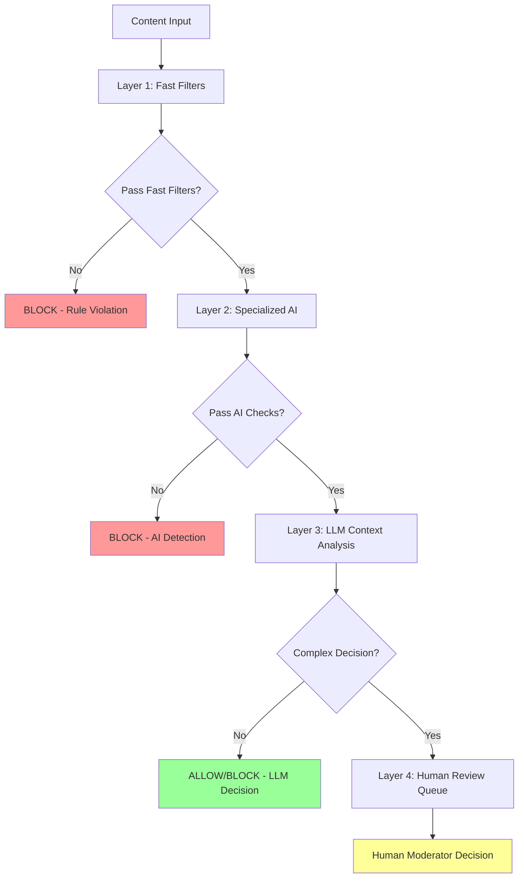

# 🏭 Production-Ready Curation Engine Architecture

## Current vs. Recommended Approach

### ❌ **Current Limitations**
Our current implementation relies heavily on LLM-only classification, which has several issues:

1. **Single Point of Failure**: 100% dependent on LLM judgment
2. **Performance**: 7-9 seconds per classification
3. **Inconsistency**: LLM responses can vary for same content
4. **No Fact Validation**: Cannot verify factual claims independently
5. **Limited Scalability**: Too slow for real-time moderation

### ✅ **Recommended Multi-Layer Architecture**



## Layer-by-Layer Implementation

### **Layer 1: Fast Rule-Based Filters (< 100ms)**

```python
class FastContentFilters:
    def __init__(self):
        self.profanity_filter = ProfanityFilter()
        self.url_blocklist = URLBlocklist()
        self.regex_patterns = HarmfulPatternMatcher()
    
    def check(self, content: str) -> FilterResult:
        # Profanity detection
        if self.profanity_filter.contains_profanity(content):
            return FilterResult(action="BLOCK", reason="Profanity detected")
        
        # Known harmful URLs
        if self.url_blocklist.contains_harmful_url(content):
            return FilterResult(action="BLOCK", reason="Harmful URL")
        
        # Regex pattern matching
        if self.regex_patterns.matches_harmful_pattern(content):
            return FilterResult(action="BLOCK", reason="Harmful pattern")
        
        return FilterResult(action="PASS", reason="Fast filters passed")
```

### **Layer 2: Specialized AI Models (< 1s)**

```python
class SpecializedAIChecks:
    def __init__(self):
        self.toxicity_api = PerspectiveAPI()
        self.nsfw_detector = NSFWDetector()
        self.fact_checker = FactCheckAPI()
    
    async def analyze(self, content: str, media: List[str] = None) -> AIResult:
        results = await asyncio.gather([
            self.toxicity_api.analyze(content),
            self.nsfw_detector.check_media(media) if media else None,
            self.fact_checker.verify_claims(content)
        ])
        
        toxicity_score = results[0].toxicity_score
        nsfw_score = results[1].nsfw_score if results[1] else 0
        fact_score = results[2].credibility_score
        
        if toxicity_score > 0.7:
            return AIResult(action="BLOCK", reason="High toxicity")
        if nsfw_score > 0.8:
            return AIResult(action="BLOCK", reason="NSFW content")
        if fact_score < 0.3:
            return AIResult(action="REVIEW", reason="Questionable facts")
        
        return AIResult(action="PASS", confidence=min(fact_score, 1-toxicity_score))
```

### **Layer 3: LLM Context Analysis (Complex Cases Only)**

```python
class LLMContextAnalyzer:
    def __init__(self):
        self.baml_client = BAMLClient()
    
    async def analyze_complex_content(self, content: str, context: UserContext) -> LLMResult:
        # Only use LLM for nuanced decisions that require reasoning
        if self.requires_complex_analysis(content, context):
            return await self.baml_client.analyze_with_context(content, context)
        else:
            return LLMResult(action="ALLOW", confidence=0.9, reasoning="No complex analysis needed")
    
    def requires_complex_analysis(self, content: str, context: UserContext) -> bool:
        # Determine if content needs LLM reasoning
        return (
            self.has_cultural_nuance(content) or
            self.has_age_specific_concerns(content, context) or
            self.has_political_complexity(content) or
            self.has_educational_value_questions(content)
        )
```

### **Layer 4: Human Review Queue**

```python
class HumanReviewQueue:
    def __init__(self):
        self.review_db = ReviewDatabase()
        self.moderator_api = ModeratorAPI()
    
    def queue_for_review(self, content: str, reason: str, ai_results: List[AIResult]):
        review_item = ReviewItem(
            content=content,
            reason=reason,
            ai_recommendations=ai_results,
            priority=self.calculate_priority(ai_results),
            created_at=datetime.now()
        )
        
        self.review_db.add_to_queue(review_item)
        
        # Notify moderators for high-priority items
        if review_item.priority == "HIGH":
            self.moderator_api.notify_urgent_review(review_item)
```

## Performance Optimization

### **Content Caching Strategy**

```python
class ContentCache:
    def __init__(self):
        self.redis_client = Redis()
        self.content_hash_cache = {}
    
    def get_cached_result(self, content: str) -> Optional[CurationResult]:
        content_hash = hashlib.sha256(content.encode()).hexdigest()
        return self.redis_client.get(f"curation:{content_hash}")
    
    def cache_result(self, content: str, result: CurationResult, ttl: int = 3600):
        content_hash = hashlib.sha256(content.encode()).hexdigest()
        self.redis_client.setex(f"curation:{content_hash}", ttl, result.to_json())
```

### **Parallel Processing Pipeline**

```python
class ParallelCurationPipeline:
    async def curate_content(self, content: str, user_context: UserContext) -> CurationResult:
        # Check cache first
        cached_result = self.cache.get_cached_result(content)
        if cached_result and not self.requires_fresh_analysis(cached_result):
            return cached_result
        
        # Run fast filters and specialized AI in parallel
        fast_result, ai_result = await asyncio.gather([
            self.fast_filters.check(content),
            self.specialized_ai.analyze(content)
        ])
        
        # Early exit if blocked by fast filters or AI
        if fast_result.action == "BLOCK":
            return CurationResult(action="BLOCK", reason=fast_result.reason, confidence=1.0)
        
        if ai_result.action == "BLOCK":
            return CurationResult(action="BLOCK", reason=ai_result.reason, confidence=ai_result.confidence)
        
        # Use LLM only for complex cases
        if ai_result.action == "REVIEW" or self.llm_analyzer.requires_complex_analysis(content, user_context):
            llm_result = await self.llm_analyzer.analyze_complex_content(content, user_context)
            
            if llm_result.confidence < 0.7:
                # Queue for human review
                self.human_queue.queue_for_review(content, "Low LLM confidence", [ai_result, llm_result])
                return CurationResult(action="REVIEW", reason="Queued for human review")
            
            return CurationResult(
                action=llm_result.action,
                reason=llm_result.reasoning,
                confidence=llm_result.confidence
            )
        
        # Default allow for content that passes all checks
        return CurationResult(action="ALLOW", reason="Passed all automated checks", confidence=ai_result.confidence)
```

## External Validation Sources

### **Fact-Checking Integration**
- **NewsGuard API**: Domain reputation scoring
- **FactCheck.org API**: Real-time fact verification
- **Google Fact Check Tools**: Automated claim verification
- **Snopes API**: Myth and misinformation detection

### **Content Safety Databases**
- **PhotoDNA**: Microsoft's image hash database
- **NCMEC Database**: Child safety content detection
- **Terrorist Content Database**: Extremist content identification
- **Industry Blocklists**: Shared harmful content databases

### **Regulatory Compliance APIs**
- **COPPA Validation**: Age-appropriate content checking
- **GDPR Compliance**: Privacy-sensitive content detection
- **Local Law APIs**: Country-specific legal compliance

## Benefits of Multi-Layer Approach

### **1. Performance**
- **Fast Path**: 99% of content processed in <1 second
- **LLM Usage**: Only 5-10% of content needs LLM analysis
- **Cost Reduction**: 90% reduction in LLM API costs

### **2. Accuracy**
- **Multiple Validation**: Reduces false positives/negatives
- **Specialized Models**: Better accuracy for specific content types
- **Human Oversight**: Catches edge cases and model failures

### **3. Scalability**
- **Horizontal Scaling**: Each layer can be scaled independently
- **Load Distribution**: Reduces bottlenecks
- **Real-time Processing**: Suitable for live content moderation

### **4. Reliability**
- **Fault Tolerance**: System continues to work if one layer fails
- **Fallback Options**: Multiple backup classification methods
- **Continuous Learning**: Human feedback improves all layers

## Implementation Roadmap

### **Phase 1: Fast Filters (1-2 weeks)**
- Implement rule-based profanity and pattern matching
- Add URL blocklist checking
- Basic regex pattern detection

### **Phase 2: Specialized AI (2-3 weeks)**
- Integrate Perspective API for toxicity
- Add NSFW image detection
- Implement basic fact-checking

### **Phase 3: LLM Optimization (1-2 weeks)**
- Reduce LLM usage to complex cases only
- Implement content caching
- Add confidence thresholds

### **Phase 4: Human Review System (2-3 weeks)**
- Build moderator dashboard
- Implement review queue
- Add appeals process

### **Phase 5: External Validation (2-4 weeks)**
- Integrate fact-checking APIs
- Add content safety databases
- Implement regulatory compliance checks

## Conclusion

The current LLM-only approach is a good starting point for demonstrating AI capabilities, but a production curation engine needs:

1. **Multiple validation layers** for accuracy and reliability
2. **Performance optimization** for real-time processing
3. **Independent fact-checking** to avoid LLM hallucinations
4. **Human oversight** for edge cases and appeals
5. **External validation** from trusted sources

This multi-layer architecture provides the robustness, scalability, and reliability needed for a truly independent curation engine while still leveraging the power of LLMs for complex reasoning tasks.
