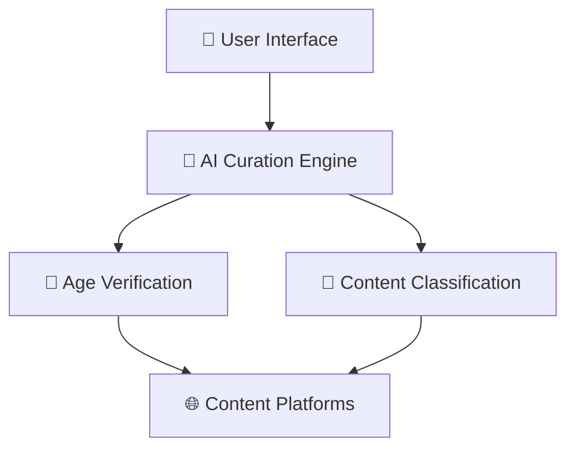

# 🛡️ AI Curation Engine

[](https://opensource.org/licenses/MIT)
[](https://python.org/)
[](https://www.boundaryml.com/)
[](https://ollama.ai/)
[](#)

**AI-Powered Content Curation with Real Local LLM Integration**

A comprehensive solution for protecting families online through advanced AI content filtering, privacy-preserving age verification, and unbundled architecture inspired by India's Digital Public Infrastructure.

## 🎯 Overview

The AI Curation Engine separates content curation from content hosting, enabling:
- **Privacy-First Age Verification** using Zero-Knowledge Proofs
- **AI-Powered Content Classification** with real-time safety analysis
- **User-Controlled Algorithms** for personalized family protection
- **Global Compliance** with GDPR, COPPA, DPDPA, and other regulations

## ✨ Key Features

### 🤖 Real AI Integration (No Fallbacks)
- **BAML + Llama 3.2**: Pure local LLM processing (no mock data)
- **Pluggable Strategies**: LLM-Only, Multi-Layer, Hybrid approaches
- **Real-time Analysis**: 5-10 second processing with detailed reasoning
- **Strategy Switching**: Runtime selection of curation approaches

### 🚀 Production-Ready Deployment
- **One-Command Setup**: `./deploy_local.sh` starts everything
- **Automated Scripts**: Build, test, monitor, and stop services
- **Health Monitoring**: Comprehensive status checking
- **Complete URLs**: All endpoints documented and accessible

### 🎯 Advanced Content Classification
- **Multi-dimensional Analysis**: Safety, educational value, political bias
- **Age-Appropriate Filtering**: Dynamic content suitability assessment
- **Confidence Scoring**: Transparent AI decision-making
- **Performance Metrics**: Real-time processing time monitoring

### 👨‍👩‍👧‍👦 Family-Centric Design
- **Individual Profiles**: Customized settings per child
- **Interactive Testing**: Live content classification interface
- **Educational Prioritization**: Learning-focused content promotion
- **Transparent AI**: No black-box decisions

### 🔒 Privacy & Security
- **Local Processing**: No data sent to external services
- **No API Keys**: Eliminates cloud dependency and exposure
- **Real Analysis**: No hardcoded or mock responses
- **Data Privacy**: All processing happens on your hardware

## 🏗️ Architecture

This project implements an **unbundled architecture** inspired by India's Digital Public Infrastructure:



### Core Components
- **Demo Frontend**: Flask application with BAML integration
- **Curation Engine**: Pluggable strategy architecture
- **BAML Integration**: Real AI classification with Llama 3.2
- **Local LLM**: Ollama server with no external dependencies

## 🚀 Quick Start (One Command!)

### Prerequisites
- Python 3.8+
- pip3
- Git

### Automated Deployment

1. **Clone and Deploy**
   ```bash
   git clone https://github.com/gitmujoshi/ai-curation-engine.git
   cd ai-curation-engine
   
   # One-command deployment!
   ./deploy_local.sh
   ```

2. **Access the App**
   - **🧪 Content Tester**: `http://localhost:5001/content-test`
   - **🏠 Main Demo**: `http://localhost:5001/`
   - **❤️ Health Check**: `http://localhost:5001/health`

3. **Test Real AI Classification**
   ```bash
   curl -X POST http://localhost:5001/api/classify \
        -H "Content-Type: application/json" \
        -d '{"content": "Educational content about science", "childId": "child_1"}'
   ```

### Available URLs After Deployment

#### 🎯 Interactive Interfaces
- **Content Tester**: `http://localhost:5001/content-test` ⭐
- **Demo UI**: `http://localhost:5001/`

#### 🔧 API Endpoints  
- **Classification**: `POST http://localhost:5001/api/classify`
- **Strategy Control**: `GET/POST http://localhost:5001/api/strategy`
- **Health Status**: `GET http://localhost:5001/health`

#### 🦙 Local AI Infrastructure
- **Ollama API**: `http://localhost:11434`
- **Models**: `http://localhost:11434/api/tags`

### Management Commands
```bash
./deploy_local.sh     # 🚀 Start everything
./status_check.sh     # 🔍 Check all services  
./stop_services.sh    # 🛑 Stop all services
./build_and_test.sh   # 🏗️ Validate build
```

## 🎮 Curation Strategies

### LLM-Only Strategy
- **Processing**: 5-10 seconds
- **Accuracy**: Highest
- **Use Case**: Complex content requiring detailed analysis

### Multi-Layer Strategy  
- **Processing**: 0.1-5 seconds
- **Efficiency**: Optimized performance
- **Use Case**: High-volume content filtering

### Hybrid Strategy
- **Processing**: 1-8 seconds (adaptive)
- **Intelligence**: Automatic strategy selection
- **Use Case**: Balanced speed/accuracy requirements

## 🔄 Real-Time Strategy Switching

Switch strategies without restart:
```bash
# Switch to multi-layer for performance
curl -X POST http://localhost:5001/api/strategy \
     -H "Content-Type: application/json" \
     -d '{"strategy": "multi_layer"}'

# Switch to LLM-only for accuracy  
curl -X POST http://localhost:5001/api/strategy \
     -H "Content-Type: application/json" \
     -d '{"strategy": "llm_only"}'
```

## 📱 Complete Application URLs

### 🎯 Interactive Interfaces
- **🧪 Content Tester**: `http://localhost:5001/content-test` ⭐ (Best starting point)
- **🏠 Demo UI**: `http://localhost:5001/`
- **❤️ Health Check**: `http://localhost:5001/health`

### 🔧 API Endpoints
- **🤖 Content Classification**: `POST http://localhost:5001/api/classify`
- **⚙️ Strategy Management**: `GET/POST http://localhost:5001/api/strategy`
- **👥 Child Profiles**: `GET http://localhost:5001/api/children`

### 🦙 Local AI Infrastructure
- **🔗 Ollama API**: `http://localhost:11434`
- **📋 Models List**: `http://localhost:11434/api/tags`

### 📊 Monitoring & Logs
- **Frontend Logs**: `tail -f logs/demo-frontend.log`
- **Ollama Logs**: `tail -f logs/ollama.log`
- **BAML Logs**: `tail -f logs/baml-generate.log`

## 📊 Project Structure

```
ai-curation-engine/
├── 📄 AI_Curation_Engine_Architecture.md     # Complete system architecture
├── 📊 Advanced_Architecture_Diagrams.md       # Enhanced visual diagrams
├── 🤖 baml_src/                              # BAML function definitions
├── 🐍 BAML_Integration_Implementation.py      # Real BAML Python implementation
├── 🐍 BoundaryML_Integration_Implementation.py # Legacy implementation (deprecated)
├── 📖 REAL_PROJECT_OVERVIEW.md               # Project status and roadmap
├── 📋 DIAGRAM_UPDATES_SUMMARY.md             # Documentation improvements
└── 💻 curation-engine-ui/                    # Main application
    ├── 🖥️ backend/                           # Express.js backend
    │   ├── 📁 models/                        # MongoDB data models
    │   ├── 🛣️ routes/                         # API endpoints
    │   └── 🔒 middleware/                     # Security & validation
    ├── ⚛️ components/                         # React components
    │   ├── 📊 dashboard/                     # Parent dashboard
    │   ├── 🎯 onboarding/                    # User setup flow
    │   └── ⚙️ rules/                         # Content rules management
    └── 📄 pages/                             # Next.js pages
```

## 🔧 Key Technologies

### Frontend Stack
- **Next.js 14**: React framework with SSR
- **Material-UI (MUI)**: Professional component library
- **TypeScript**: Type-safe development
- **Framer Motion**: Smooth animations
- **Recharts**: Data visualization

### Backend Stack
- **Express.js**: RESTful API framework
- **MongoDB**: Document database with Mongoose ODM
- **JWT**: Secure authentication
- **Joi**: Input validation
- **Winston**: Comprehensive logging

### Security Features
- JWT authentication with refresh tokens
- bcrypt password hashing
- Rate limiting and CORS protection
- Input validation and sanitization
- Audit logging for compliance

## 📖 Documentation

### Architecture Documents
- 📄 **[Complete Architecture](AI_Curation_Engine_Architecture.md)**: Comprehensive system design
- 📊 **[Visual Diagrams](Advanced_Architecture_Diagrams.md)**: Interactive Mermaid diagrams
- 🤖 **[BAML Integration](BAML_README.md)**: BoundaryML implementation guide
- 📖 **[Project Overview](REAL_PROJECT_OVERVIEW.md)**: Real vs. conceptual components
- 📋 **[Implementation Guide](curation-engine-ui/README.md)**: Detailed setup instructions

### API Documentation
- Authentication endpoints for user management
- Child profile CRUD operations
- Content curation rules engine
- Analytics and compliance reporting

## ⚠️ Important Notes

### Production Readiness
This project provides a **functional foundation** with:
- ✅ **Real Backend**: Working API with database
- ✅ **Real Frontend**: Complete UI with authentication
- ✅ **Real Data Models**: Production-ready database schema
- ✅ **Real AI**: BoundaryML BAML language integration
- ⚠️ **Mock Age Verification**: ZKP implementation needs real service

### BoundaryML (BAML) Integration
The AI classification system uses **real BoundaryML BAML language**:
1. **BAML Functions**: Content classification defined in `baml_src/content_classification.baml`
2. **Generated Client**: Python client auto-generated from BAML functions
3. **Multi-Provider**: OpenAI, Anthropic, Google model support
4. **Setup Guide**: Run `./setup_baml.sh` for automated setup
5. **Documentation**: See `BAML_README.md` for comprehensive guide

**Setup Instructions**:
```bash
# Install BAML CLI
npm install -g @boundaryml/baml

# Generate Python client
baml-cli generate --from ./baml_src --lang python

# Set API keys in .env
OPENAI_API_KEY=your_key_here
ANTHROPIC_API_KEY=your_key_here
```

## 🤝 Contributing

1. Fork the repository
2. Create a feature branch (`git checkout -b feature/amazing-feature`)
3. Commit your changes (`git commit -m 'Add amazing feature'`)
4. Push to the branch (`git push origin feature/amazing-feature`)
5. Open a Pull Request

## 📋 Roadmap

### Phase 1: Foundation ✅
- [x] Core architecture design
- [x] Backend API implementation
- [x] Frontend dashboard creation
- [x] User authentication system

### Phase 2: Enhancement (In Progress)
- [ ] Real AI service integration
- [ ] Advanced content analysis
- [ ] Algorithm marketplace
- [ ] Regulatory compliance testing

### Phase 3: Scale (Planned)
- [ ] Multi-platform integration
- [ ] Global deployment
- [ ] Enterprise features
- [ ] Mobile applications

## 🛡️ Security

### Reporting Vulnerabilities
Please report security vulnerabilities to: [security@your-domain.com]

### Security Features
- JWT-based authentication
- Password hashing with bcrypt
- Input validation and sanitization
- Rate limiting and DDoS protection
- Audit logging for compliance

## 📄 License

This project is licensed under the MIT License - see the [LICENSE](LICENSE) file for details.

## 🆘 Support

- 📖 **Documentation**: Check the comprehensive docs in this repository
- 🐛 **Issues**: Create an issue for bugs or feature requests
- 💬 **Discussions**: Use GitHub Discussions for questions
- 📧 **Contact**: [your-email@domain.com]

## 🌟 Acknowledgments

- Inspired by India's Digital Public Infrastructure (DPI)
- Built with open-source technologies
- Designed for global digital safety

---

**Made with ❤️ for family digital safety**

*This project demonstrates the future of content curation: privacy-preserving, user-controlled, and globally compliant.*
