# 🛡️ AI Curation Engine

[](https://opensource.org/licenses/MIT)
[](https://nodejs.org/)
[](https://reactjs.org/)
[](https://www.mongodb.com/)

**AI-Powered Content Curation for Family Safety**

A comprehensive solution for protecting families online through advanced AI content filtering, privacy-preserving age verification, and unbundled architecture inspired by India's Digital Public Infrastructure.

## 🎯 Overview

The AI Curation Engine separates content curation from content hosting, enabling:
- **Privacy-First Age Verification** using Zero-Knowledge Proofs
- **AI-Powered Content Classification** with real-time safety analysis
- **User-Controlled Algorithms** for personalized family protection
- **Global Compliance** with GDPR, COPPA, DPDPA, and other regulations

## ✨ Key Features

### 🔐 Privacy-Preserving Technology
- Zero-Knowledge Proof age verification
- No personal data exposure or storage
- End-to-end encryption for sensitive operations

### 🤖 Advanced AI Classification
- Multi-dimensional content analysis (safety, educational value, bias)
- Cognitive capability assessment for age-appropriate filtering
- Real-time processing with confidence scoring

### 👨‍👩‍👧‍👦 Family-Centric Design
- Individual child profiles with customized settings
- Parental dashboard with real-time insights
- Educational content prioritization

### 🌍 Global Compliance
- **EU**: GDPR data protection & DSA risk mitigation
- **US**: COPPA compliance & state privacy laws
- **India**: DPDPA consent management
- **China**: Minor Mode restrictions

## 🏗️ Architecture

This project implements an **unbundled architecture** inspired by India's Digital Public Infrastructure:

```mermaid
graph TB
    UI[👤 User Interface] --> ENGINE[🤖 AI Curation Engine]
    ENGINE --> ZKP[🔐 Age Verification]
    ENGINE --> BML[🧠 Content Classification]
    ZKP --> PLATFORMS[🌐 Content Platforms]
    BML --> PLATFORMS
```



### Core Components
- **Frontend**: React/Next.js application with Material-UI
- **Backend**: Express.js API with MongoDB database
- **AI Classification**: Extensible content analysis pipeline
- **Authentication**: JWT-based security with role management

## 🚀 Quick Start

### Prerequisites
- Node.js 18+
- MongoDB
- Git

### Installation

1. **Clone the repository**
   ```bash
   git clone https://github.com/yourusername/ai-curation-engine.git
   cd ai-curation-engine
   ```

2. **Automated Setup**
   ```bash
   cd curation-engine-ui
   chmod +x setup.sh
   ./setup.sh
   ```

3. **Start Development**
   ```bash
   npm run dev:full
   ```

### Manual Setup

1. **Install Dependencies**
   ```bash
   cd curation-engine-ui
   npm install
   ```

2. **Configure Environment**
   ```bash
   cp env.example .env.local
   # Edit .env.local with your configuration
   ```

3. **Start Services**
   ```bash
   # Terminal 1: Backend
   npm run backend
   
   # Terminal 2: Frontend
   npm run dev
   ```

## 📱 Application URLs

- **Frontend**: http://localhost:3000
- **Backend API**: http://localhost:3001
- **Database**: mongodb://localhost:27017/curation-engine

## 📊 Project Structure

```
ai-curation-engine/
├── 📄 AI_Curation_Engine_Architecture.md     # Complete system architecture
├── 📊 Advanced_Architecture_Diagrams.md       # Enhanced visual diagrams
├── 🤖 baml_src/                              # BAML function definitions
├── 🐍 BAML_Integration_Implementation.py      # Real BAML Python implementation
├── 🐍 BoundaryML_Integration_Implementation.py # Legacy implementation (deprecated)
├── 📖 REAL_PROJECT_OVERVIEW.md               # Project status and roadmap
├── 📋 DIAGRAM_UPDATES_SUMMARY.md             # Documentation improvements
└── 💻 curation-engine-ui/                    # Main application
    ├── 🖥️ backend/                           # Express.js backend
    │   ├── 📁 models/                        # MongoDB data models
    │   ├── 🛣️ routes/                         # API endpoints
    │   └── 🔒 middleware/                     # Security & validation
    ├── ⚛️ components/                         # React components
    │   ├── 📊 dashboard/                     # Parent dashboard
    │   ├── 🎯 onboarding/                    # User setup flow
    │   └── ⚙️ rules/                         # Content rules management
    └── 📄 pages/                             # Next.js pages
```

## 🔧 Key Technologies

### Frontend Stack
- **Next.js 14**: React framework with SSR
- **Material-UI (MUI)**: Professional component library
- **TypeScript**: Type-safe development
- **Framer Motion**: Smooth animations
- **Recharts**: Data visualization

### Backend Stack
- **Express.js**: RESTful API framework
- **MongoDB**: Document database with Mongoose ODM
- **JWT**: Secure authentication
- **Joi**: Input validation
- **Winston**: Comprehensive logging

### Security Features
- JWT authentication with refresh tokens
- bcrypt password hashing
- Rate limiting and CORS protection
- Input validation and sanitization
- Audit logging for compliance

## 📖 Documentation

### Architecture Documents
- 📄 **[Complete Architecture](AI_Curation_Engine_Architecture.md)**: Comprehensive system design
- 📊 **[Visual Diagrams](Advanced_Architecture_Diagrams.md)**: Interactive Mermaid diagrams
- 🤖 **[BAML Integration](BAML_README.md)**: BoundaryML implementation guide
- 📖 **[Project Overview](REAL_PROJECT_OVERVIEW.md)**: Real vs. conceptual components
- 📋 **[Implementation Guide](curation-engine-ui/README.md)**: Detailed setup instructions

### API Documentation
- Authentication endpoints for user management
- Child profile CRUD operations
- Content curation rules engine
- Analytics and compliance reporting

## ⚠️ Important Notes

### Production Readiness
This project provides a **functional foundation** with:
- ✅ **Real Backend**: Working API with database
- ✅ **Real Frontend**: Complete UI with authentication
- ✅ **Real Data Models**: Production-ready database schema
- ✅ **Real AI**: BoundaryML BAML language integration
- ⚠️ **Mock Age Verification**: ZKP implementation needs real service

### BoundaryML (BAML) Integration
The AI classification system uses **real BoundaryML BAML language**:
1. **BAML Functions**: Content classification defined in `baml_src/content_classification.baml`
2. **Generated Client**: Python client auto-generated from BAML functions
3. **Multi-Provider**: OpenAI, Anthropic, Google model support
4. **Setup Guide**: Run `./setup_baml.sh` for automated setup
5. **Documentation**: See `BAML_README.md` for comprehensive guide

**Setup Instructions**:
```bash
# Install BAML CLI
npm install -g @boundaryml/baml

# Generate Python client
baml-cli generate --from ./baml_src --lang python

# Set API keys in .env
OPENAI_API_KEY=your_key_here
ANTHROPIC_API_KEY=your_key_here
```

## 🤝 Contributing

1. Fork the repository
2. Create a feature branch (`git checkout -b feature/amazing-feature`)
3. Commit your changes (`git commit -m 'Add amazing feature'`)
4. Push to the branch (`git push origin feature/amazing-feature`)
5. Open a Pull Request

## 📋 Roadmap

### Phase 1: Foundation ✅
- [x] Core architecture design
- [x] Backend API implementation
- [x] Frontend dashboard creation
- [x] User authentication system

### Phase 2: Enhancement (In Progress)
- [ ] Real AI service integration
- [ ] Advanced content analysis
- [ ] Algorithm marketplace
- [ ] Regulatory compliance testing

### Phase 3: Scale (Planned)
- [ ] Multi-platform integration
- [ ] Global deployment
- [ ] Enterprise features
- [ ] Mobile applications

## 🛡️ Security

### Reporting Vulnerabilities
Please report security vulnerabilities to: [security@your-domain.com]

### Security Features
- JWT-based authentication
- Password hashing with bcrypt
- Input validation and sanitization
- Rate limiting and DDoS protection
- Audit logging for compliance

## 📄 License

This project is licensed under the MIT License - see the [LICENSE](LICENSE) file for details.

## 🆘 Support

- 📖 **Documentation**: Check the comprehensive docs in this repository
- 🐛 **Issues**: Create an issue for bugs or feature requests
- 💬 **Discussions**: Use GitHub Discussions for questions
- 📧 **Contact**: [your-email@domain.com]

## 🌟 Acknowledgments

- Inspired by India's Digital Public Infrastructure (DPI)
- Built with open-source technologies
- Designed for global digital safety

---

**Made with ❤️ for family digital safety**

*This project demonstrates the future of content curation: privacy-preserving, user-controlled, and globally compliant.*
