# AI Curation Engine: Architecture and Design Document

## Executive Summary

This document outlines the architecture and design for an AI Curation Engine based on the unbundled digital safety framework inspired by India's Digital Public Infrastructure (DPI) model. The system separates content curation from content hosting, implementing privacy-preserving age verification and AI-driven content filtering to create a safer digital environment for all users.

## Table of Contents

1. [System Overview](#system-overview)
2. [Architecture Principles](#architecture-principles)
3. [Layer 1: Privacy-Preserving Age Gating](#layer-1-privacy-preserving-age-gating)
4. [Layer 2: AI Curation Engine](#layer-2-ai-curation-engine)
5. [System Components](#system-components)
6. [API Specifications](#api-specifications)
7. [Global Compliance Framework](#global-compliance-framework)
8. [Implementation Strategy](#implementation-strategy)
9. [Security Considerations](#security-considerations)
10. [Deployment and Operations](#deployment-and-operations)

## System Overview

### Vision
Create an unbundled content curation system that separates the algorithmic filtering of content from the platforms that host and distribute it, enabling user-controlled, privacy-preserving, and globally compliant digital safety.

### Key Objectives
- **Privacy-First**: Implement zero-knowledge proof (ZKP) based age verification
- **User Autonomy**: Enable users to choose their own curation algorithms
- **Global Compliance**: Support diverse regulatory requirements (EU DSA, US COPPA, India DPDPA, China Minor Mode)
- **Child Safety**: Provide cognitive capability-based content filtering
- **Anti-Polarization**: Break the engagement-driven echo chamber cycle

### High-Level Architecture

```mermaid
graph TB
    subgraph "User Layer"
        UI[👤 User Interface]
        UC[🔧 User Controls]
        UP[⚙️ User Preferences]
    end
    
    subgraph "AI Curation Engine"
        CA[🧠 Cognitive Assessment]
        CF[🔍 Content Filter]
        DO[🎯 Diversity Optimizer]
        BML[🤖 BoundaryML Classifier]
    end
    
    subgraph "Privacy-Preserving Age Gating"
        ZKP[🔐 ZKP Age Verification]
        BIO[👁️ Biometric Liveness]
        AUTH[🛡️ Authentication Layer]
    end
    
    subgraph "Platform Integration"
        CAPI[📡 Content API]
        META[📊 Metadata API]
        ANAL[📈 Analytics Engine]
        COMP[⚖️ Compliance Monitor]
    end
    
    subgraph "External Systems"
        ID[🆔 Identity Providers]
        PLAT[🌐 Content Platforms]
        REG[🏛️ Regulatory Systems]
    end
    
    UI --> CA
    UI --> CF
    UI --> DO
    CA --> BML
    CF --> BML
    DO --> BML
    
    ZKP --> ID
    BIO --> AUTH
    AUTH --> CA
    
    CAPI --> PLAT
    META --> PLAT
    ANAL --> REG
    COMP --> REG
    
    BML --> CAPI
    CF --> ANAL
    DO --> COMP
    
    style UI fill:#e1f5fe
    style CA fill:#f3e5f5
    style BML fill:#fff3e0
    style ZKP fill:#e8f5e8
    style COMP fill:#fce4ec
```

**Alternative ASCII Diagram:**
```
╔═══════════════════════════════════════════════════════════════════════════════╗
║                           🎯 AI CURATION ENGINE ARCHITECTURE                  ║
╠═══════════════════════════════════════════════════════════════════════════════╣
║                                                                               ║
║  ┌─────────────────────────────────────────────────────────────────────────┐  ║
║  │                        👤 USER INTERFACE LAYER                         │  ║
║  │  ┌─────────────────┐  ┌─────────────────┐  ┌─────────────────────────┐  │  ║
║  │  │   📱 Mobile App  │  │  💻 Web Portal  │  │  🔧 Algorithm Selector  │  │  ║
║  │  └─────────────────┘  └─────────────────┘  └─────────────────────────┘  │  ║
║  └─────────────────────────────────────────────────────────────────────────┘  ║
║                                     │                                         ║
║                                     ▼                                         ║
║  ┌─────────────────────────────────────────────────────────────────────────┐  ║
║  │                     🤖 AI CURATION ENGINE CORE                         │  ║
║  │                                                                         │  ║
║  │  ┌─────────────────┐  ┌─────────────────┐  ┌─────────────────────────┐  │  ║
║  │  │   🧠 Cognitive   │  │  🔍 Content     │  │  🎯 Diversity          │  │  ║
║  │  │   Assessment    │◄─┤   Filter        │◄─┤   Optimizer            │  │  ║
║  │  │   Engine        │  │   (BoundaryML)  │  │   (Anti-Echo)           │  │  ║
║  │  └─────────────────┘  └─────────────────┘  └─────────────────────────┘  │  ║
║  │                                │                                        │  ║
║  │  ┌─────────────────────────────┼────────────────────────────────────┐   │  ║
║  │  │        🤖 BOUNDARYML CLASSIFICATION PIPELINE               │   │  ║
║  │  │                             │                                    │   │  ║
║  │  │  ┌─────────────┐  ┌─────────▼─────────┐  ┌─────────────────────┐ │   │  ║
║  │  │  │ 🛡️ Safety   │  │ 📚 Educational   │  │ 🏛️ Viewpoint       │ │   │  ║
║  │  │  │ Classifier  │  │ Value Assessor   │  │ Bias Analyzer       │ │   │  ║
║  │  │  └─────────────┘  └───────────────────┘  └─────────────────────┘ │   │  ║
║  │  └────────────────────────────────────────────────────────────────────┘   │  ║
║  └─────────────────────────────────────────────────────────────────────────┘  ║
║                                     │                                         ║
║                                     ▼                                         ║
║  ┌─────────────────────────────────────────────────────────────────────────┐  ║
║  │                  🔐 PRIVACY-PRESERVING AGE GATING                      │  ║
║  │                                                                         │  ║
║  │  ┌─────────────────┐  ┌─────────────────┐  ┌─────────────────────────┐  │  ║
║  │  │   🔐 ZKP Age    │  │  👁️ Biometric   │  │  🛡️ Identity           │  │  ║
║  │  │   Verification  │◄─┤   Liveness      │◄─┤   Validation           │  │  ║
║  │  │   (Aadhaar)     │  │   Detection     │  │   (Multi-Provider)      │  │  ║
║  │  └─────────────────┘  └─────────────────┘  └─────────────────────────┘  │  ║
║  └─────────────────────────────────────────────────────────────────────────┘  ║
║                                     │                                         ║
║                                     ▼                                         ║
║  ┌─────────────────────────────────────────────────────────────────────────┐  ║
║  │                    🌐 PLATFORM INTEGRATION LAYER                       │  ║
║  │                                                                         │  ║
║  │  ┌─────────────────┐  ┌─────────────────┐  ┌─────────────────────────┐  │  ║
║  │  │   📡 Content    │  │  📊 Metadata    │  │  📈 Analytics &        │  │  ║
║  │  │   Gateway API   │  │   Enrichment    │  │   Compliance Monitor   │  │  ║
║  │  │   (Universal)   │  │   Service       │  │   (Global Regs)        │  │  ║
║  │  └─────────────────┘  └─────────────────┘  └─────────────────────────┘  │  ║
║  └─────────────────────────────────────────────────────────────────────────┘  ║
║                                     │                                         ║
║                                     ▼                                         ║
║  ┌─────────────────────────────────────────────────────────────────────────┐  ║
║  │                        🌍 EXTERNAL ECOSYSTEMS                          │  ║
║  │                                                                         │  ║
║  │  ┌─────────────────┐  ┌─────────────────┐  ┌─────────────────────────┐  │  ║
║  │  │  🆔 Identity    │  │  🌐 Content     │  │  ⚖️ Regulatory          │  │  ║
║  │  │   Providers     │  │   Platforms     │  │   Authorities           │  │  ║
║  │  │   (Aadhaar,eID) │  │   (Social,News) │  │   (EU,US,IN,CN)         │  │  ║
║  │  └─────────────────┘  └─────────────────┘  └─────────────────────────┘  │  ║
║  └─────────────────────────────────────────────────────────────────────────┘  ║
╚═══════════════════════════════════════════════════════════════════════════════╝
```

## Architecture Principles

### 1. Unbundling
- **Separation of Concerns**: Content hosting, distribution, and curation are distinct functions
- **Interoperability**: Standard APIs enable multiple curation engines to work with any platform
- **Competition**: Users can choose from multiple curation algorithm providers

### 2. Privacy by Design
- **Zero-Knowledge Proofs**: Age verification without identity disclosure
- **Data Minimization**: Collect only necessary data for curation decisions
- **Local Processing**: Maximum computation on user devices

### 3. User Sovereignty
- **Algorithm Choice**: Users select their preferred curation approach
- **Transparency**: Open source algorithms with auditable decision logic
- **Control**: Fine-grained user control over filtering parameters

### 4. Global Compliance
- **Regulatory Flexibility**: Adaptable to different jurisdictional requirements
- **Standard Interfaces**: Common APIs that can implement region-specific rules
- **Audit Trails**: Comprehensive logging for regulatory compliance

## Layer 1: Privacy-Preserving Age Gating

### ZKP Age Verification System

#### Architecture Components

```mermaid
flowchart TD
    subgraph "🆔 Identity Providers"
        AADHAAR[🇮🇳 Aadhaar
India Digital ID]
        EID[🇪🇺 eID
European Identity]
        NATIONAL[🌍 National ID
Global Systems]
    end
    
    subgraph "🔐 ZKP Proof Generation Service"
        direction TB
        CIRCUIT[⚙️ Age Assertion Circuit
zk-SNARK/STARK Technology]
        
        subgraph "Age Validation Rules"
            COPPA[👶 Age >= 13
US COPPA Compliance]
            GDPR[🧒 Age >= 16
EU GDPR Compliance] 
            GLOBAL[👦 Age >= 18
Global Adult]
        end
        
        CIRCUIT --> COPPA
        CIRCUIT --> GDPR
        CIRCUIT --> GLOBAL
    end
    
    subgraph "🎫 ZKP Age Token Output"
        TOKEN["📄 Cryptographic Proof
        {
          proof: zkp_proof_data
          age_assertion: over_18
          jurisdiction: IN
          timestamp: 2025-09-25T10:00:00Z
          validity: 24h
        }"]
    end
    
    AADHAAR --> CIRCUIT
    EID --> CIRCUIT
    NATIONAL --> CIRCUIT
    
    COPPA --> TOKEN
    GDPR --> TOKEN
    GLOBAL --> TOKEN
    
    style AADHAAR fill:#e8f5e8
    style EID fill:#e3f2fd
    style NATIONAL fill:#fff3e0
    style CIRCUIT fill:#f3e5f5
    style TOKEN fill:#e0f2f1
```

#### Implementation Specifications

**ZKP Circuit Design**
```circom
pragma circom 2.0.0;

template AgeVerification() {
    signal input birthDate;
    signal input currentDate;
    signal input minAge;
    signal output isValid;
    
    component ageCalculator = AgeCalculator();
    ageCalculator.birthDate <== birthDate;
    ageCalculator.currentDate <== currentDate;
    
    component ageComparator = GreaterEqualThan(8);
    ageComparator.in[0] <== ageCalculator.age;
    ageComparator.in[1] <== minAge;
    
    isValid <== ageComparator.out;
}
```

**Age Token Structure**
```typescript
interface ZKPAgeToken {
  proof: string;              // ZKP proof data
  ageAssertion: AgeCategory;   // 'under_13' | 'under_16' | 'under_18' | 'adult'
  jurisdiction: string;        // ISO country code
  issuedAt: Date;
  expiresAt: Date;
  providerSignature: string;   // Digital signature from ID provider
}

interface BiometricChallenge {
  challengeId: string;
  livenessCheck: boolean;
  deviceFingerprint: string;
  timestamp: Date;
}
```

### Biometric Liveness Verification

#### Implementation
- **Local Biometric Processing**: Face detection and liveness checks on device
- **Anti-Spoofing**: Multi-modal verification (face + voice + gesture)
- **Privacy Protection**: Biometric templates never leave the device
- **Account Integrity**: Prevents token sharing and account compromise

## BoundaryML (BAML) Integration for LLM-Based Content Classification

### Overview
**IMPORTANT UPDATE**: After reviewing the actual [BoundaryML GitHub repository](https://github.com/BoundaryML/baml), this implementation now uses the real BAML (BoundaryML's AI Markup Language) - a domain-specific language for structured LLM interactions.

BAML provides:
- **Type-safe LLM Functions**: Define prompts as functions with structured inputs/outputs
- **Multi-provider Support**: OpenAI, Anthropic, Google, Azure, and more
- **Schema-Aligned Parsing (SAP)**: Reliable structured output parsing even with model variations
- **Streaming Support**: Real-time classification with type-safe partial results
- **IDE Integration**: VSCode extension with prompt playground for fast iteration

### BoundaryML Architecture Integration

```mermaid
flowchart TD
    subgraph "🔄 Content Ingestion Pipeline"
        TXT[📝 Text Content
Extraction]
        VID[🎥 Video/Audio
Transcription]
        IMG[🖼️ Images
OCR/Alt Text]
        DOC[📄 Document
Parsing]
    end
    
    subgraph "🤖 BoundaryML Classification Engine"
        subgraph "📊 Multi-Modal Analysis"
            SAFE[🛡️ Safety
Classifier]
            EDU[📚 Educational
Value Assessor]
            VIEW[🏛️ Viewpoint
Bias Analyzer]
        end
        
        subgraph "🔍 Detailed Assessment"
            TOX[☠️ Toxicity
Detector]
            READ[📖 Reading
Level Analyzer]
            EMO[😊 Emotional
Intensity Meter]
        end
        
        subgraph "⚙️ Schema Enforcement"
            JSON[🔧 JSON
Correction]
            SCHEMA[📋 Schema
Coercion]
            VALID[✅ Output
Validation]
        end
    end
    
    subgraph "📤 Structured Output"
        RESULT[📊 Classification Results
JSON Schema Compliant]
    end
    
    TXT --> SAFE
    VID --> EDU
    IMG --> VIEW
    DOC --> TOX
    
    SAFE --> JSON
    EDU --> SCHEMA
    VIEW --> VALID
    TOX --> JSON
    READ --> SCHEMA
    EMO --> VALID
    
    JSON --> RESULT
    SCHEMA --> RESULT
    VALID --> RESULT
    
    style SAFE fill:#ffebee
    style EDU fill:#e8f5e8
    style VIEW fill:#e3f2fd
    style JSON fill:#fff8e1
    style RESULT fill:#f3e5f5
```

**Detailed ASCII Flow Diagram:**
```
╔══════════════════════════════════════════════════════════════════════════════════════╗
║                         🤖 BOUNDARYML CLASSIFICATION PIPELINE                        ║
╠══════════════════════════════════════════════════════════════════════════════════════╣
║                                                                                      ║
║ ┌────────────────────────────────────────────────────────────────────────────────┐   ║
║ │                          📥 CONTENT INGESTION LAYER                            │   ║
║ │                                                                                │   ║
║ │  ┌─────────────┐   ┌─────────────┐   ┌─────────────┐   ┌─────────────────┐    │   ║
║ │  │ 📝 Text     │   │ 🎥 Video    │   │ 🖼️ Images   │   │ 📄 Documents   │    │   ║
║ │  │ Content     │   │ Audio       │   │ Photos      │   │ PDFs           │    │   ║
║ │  │ Extraction  │   │ Speech-to-  │   │ OCR/Alt     │   │ Web Pages      │    │   ║
║ │  │             │   │ Text        │   │ Text        │   │ Articles       │    │   ║
║ │  └─────────────┘   └─────────────┘   └─────────────┘   └─────────────────┘    │   ║
║ └────────┬───────────────┬───────────────┬───────────────────┬─────────────────────┘   ║
║          │               │               │                   │                         ║
║          ▼               ▼               ▼                   ▼                         ║
║ ┌────────────────────────────────────────────────────────────────────────────────┐   ║
║ │                    🧠 LLM PROCESSING & CLASSIFICATION                          │   ║
║ │                                                                                │   ║
║ │  ┌─────────────────────────────────────────────────────────────────────────┐  │   ║
║ │  │                      🔄 PARALLEL CLASSIFICATION                         │  │   ║
║ │  │                                                                         │  │   ║
║ │  │  ┌─────────────┐   ┌─────────────┐   ┌─────────────────────────────┐   │  │   ║
║ │  │  │ 🛡️ SAFETY    │   │ 📚 EDUCATION │   │ 🏛️ VIEWPOINT & BIAS        │   │  │   ║
║ │  │  │ CLASSIFIER  │   │ ASSESSOR    │   │ ANALYZER                   │   │  │   ║
║ │  │  │             │   │             │   │                            │   │  │   ║
║ │  │  │ • Violence  │   │ • Learning  │   │ • Political Leaning        │   │  │   ║
║ │  │  │ • Toxicity  │   │ • Cognitive │   │ • Bias Detection           │   │  │   ║
║ │  │  │ • Age Check │   │ • Reading   │   │ • Echo Chamber Risk        │   │  │   ║
║ │  │  │ • Hate      │   │ • Accuracy  │   │ • Source Credibility       │   │  │   ║
║ │  │  │ • Misinfo   │   │ • Subject   │   │ • Controversy Level        │   │  │   ║
║ │  │  └─────────────┘   └─────────────┘   └─────────────────────────────┘   │  │   ║
║ │  └─────────────┬───────────┬───────────────────┬─────────────────────────┘  │   ║
║ │                │           │                   │                            │   ║
║ │                ▼           ▼                   ▼                            │   ║
║ │  ┌─────────────────────────────────────────────────────────────────────┐   │   ║
║ │  │                    ⚙️ SCHEMA ENFORCEMENT ENGINE                     │   │   ║
║ │  │                                                                     │   │   ║
║ │  │  ┌─────────────┐   ┌─────────────┐   ┌─────────────────────────┐   │   │   ║
║ │  │  │ 🔧 JSON     │   │ 📋 Schema   │   │ ✅ Output              │   │   │   ║
║ │  │  │ Error       │ ➤ │ Validation  │ ➤ │ Verification           │   │   │   ║
║ │  │  │ Correction  │   │ & Coercion  │   │ & Quality Check        │   │   │   ║
║ │  │  │             │   │             │   │                        │   │   │   ║
║ │  │  │ • Fix       │   │ • Type      │   │ • Confidence Score     │   │   │   ║
║ │  │  │   Trailing  │   │   Checking  │   │ • Completeness Check   │   │   │   ║
║ │  │  │   Commas    │   │ • Required  │   │ • Range Validation     │   │   │   ║
║ │  │  │ • Quote     │   │   Fields    │   │ • Consistency Verify   │   │   │   ║
║ │  │  │   Keys      │   │ • Enum      │   │ • Error Flagging       │   │   │   ║
║ │  │  └─────────────┘   └─────────────┘   └─────────────────────────┘   │   │   ║
║ │  └─────────────────────────┬───────────────────────────────────────────┘   │   ║
║ └────────────────────────────┼─────────────────────────────────────────────────┘   ║
║                              ▼                                                     ║
║ ┌────────────────────────────────────────────────────────────────────────────────┐   ║
║ │                        📊 STRUCTURED OUTPUT LAYER                             │   ║
║ │                                                                                │   ║
║ │  ┌──────────────────────────────────────────────────────────────────────────┐ │   ║
║ │  │                      🎯 CLASSIFICATION RESULTS                           │ │   ║
║ │  │                                                                          │ │   ║
║ │  │   {                                                                      │ │   ║
║ │  │     "content_id": "article_12345",                                      │ │   ║
║ │  │     "timestamp": "2025-09-25T10:30:00Z",                               │ │   ║
║ │  │     "model_version": "gpt-4-turbo",                                     │ │   ║
║ │  │     "processing_time_ms": 1250,                                         │ │   ║
║ │  │                                                                          │ │   ║
║ │  │     "safety_classification": {                                          │ │   ║
║ │  │       "safety_score": 0.85,                                            │ │   ║
║ │  │       "age_appropriateness": "13+",                                     │ │   ║
║ │  │       "violence_level": 0.12,                                           │ │   ║
║ │  │       "toxicity_level": 0.08,                                           │ │   ║
║ │  │       "hate_speech": 0.03,                                              │ │   ║
║ │  │       "misinformation_risk": 0.15,                                      │ │   ║
║ │  │       "reasoning": "Educational content with minor complex topics"      │ │   ║
║ │  │     },                                                                   │ │   ║
║ │  │                                                                          │ │   ║
║ │  │     "educational_classification": {                                     │ │   ║
║ │  │       "educational_value": 0.78,                                        │ │   ║
║ │  │       "reading_level": 9.2,                                             │ │   ║
║ │  │       "cognitive_level": "analyze",                                     │ │   ║
║ │  │       "subject_areas": ["technology", "science"],                      │ │   ║
║ │  │       "learning_objectives": ["AI understanding", "Critical thinking"] │ │   ║
║ │  │     },                                                                   │ │   ║
║ │  │                                                                          │ │   ║
║ │  │     "viewpoint_classification": {                                       │ │   ║
║ │  │       "political_leaning": "neutral",                                   │ │   ║
║ │  │       "bias_score": 0.22,                                               │ │   ║
║ │  │       "source_credibility": 0.89,                                       │ │   ║
║ │  │       "echo_chamber_risk": 0.18,                                        │ │   ║
║ │  │       "controversy_level": 0.25                                         │ │   ║
║ │  │     },                                                                   │ │   ║
║ │  │                                                                          │ │   ║
║ │  │     "overall_confidence": 0.92,                                         │ │   ║
║ │  │     "compliance_flags": {                                               │ │   ║
║ │  │       "gdpr_compliant": true,                                           │ │   ║
║ │  │       "coppa_safe": true,                                               │ │   ║
║ │  │       "dpdpa_approved": true                                            │ │   ║
║ │  │     }                                                                    │ │   ║
║ │  │   }                                                                      │ │   ║
║ │  └──────────────────────────────────────────────────────────────────────────┘ │   ║
║ └────────────────────────────────────────────────────────────────────────────────┘   ║
╚══════════════════════════════════════════════════════════════════════════════════════╝
```

### Content Classification Schemas

#### Safety Classification Schema
```typescript
interface SafetyClassificationSchema {
  type: "object";
  properties: {
    safety_score: {
      type: "number";
      minimum: 0;
      maximum: 1;
      description: "Overall safety score for the content";
    };
    violence_level: {
      type: "number";
      minimum: 0;
      maximum: 1;
      description: "Level of violent content";
    };
    adult_content: {
      type: "boolean";
      description: "Whether content contains adult themes";
    };
    hate_speech: {
      type: "number";
      minimum: 0;
      maximum: 1;
      description: "Probability of hate speech";
    };
    misinformation_risk: {
      type: "number";
      minimum: 0;
      maximum: 1;
      description: "Risk of containing misinformation";
    };
    age_appropriateness: {
      type: "string";
      enum: ["0+", "7+", "13+", "16+", "18+"];
      description: "Minimum appropriate age";
    };
    reasoning: {
      type: "string";
      description: "Explanation for the safety classification";
    };
  };
  required: ["safety_score", "age_appropriateness", "reasoning"];
}
```

#### Educational Value Schema
```typescript
interface EducationalClassificationSchema {
  type: "object";
  properties: {
    educational_value: {
      type: "number";
      minimum: 0;
      maximum: 1;
      description: "Educational value score";
    };
    learning_objectives: {
      type: "array";
      items: { type: "string" };
      description: "Identified learning objectives";
    };
    subject_areas: {
      type: "array";
      items: {
        type: "string";
        enum: ["mathematics", "science", "literature", "history", "technology", "arts", "social_studies", "other"];
      };
      description: "Subject areas covered";
    };
    cognitive_level: {
      type: "string";
      enum: ["remember", "understand", "apply", "analyze", "evaluate", "create"];
      description: "Bloom's taxonomy cognitive level";
    };
    reading_level: {
      type: "number";
      minimum: 1;
      maximum: 20;
      description: "Grade level reading difficulty";
    };
    factual_accuracy: {
      type: "number";
      minimum: 0;
      maximum: 1;
      description: "Confidence in factual accuracy";
    };
  };
  required: ["educational_value", "cognitive_level", "reading_level"];
}
```

#### Viewpoint Classification Schema
```typescript
interface ViewpointClassificationSchema {
  type: "object";
  properties: {
    political_leaning: {
      type: "string";
      enum: ["left", "center-left", "center", "center-right", "right", "neutral", "mixed"];
      description: "Political perspective";
    };
    bias_score: {
      type: "number";
      minimum: 0;
      maximum: 1;
      description: "Level of bias detected";
    };
    perspective_diversity: {
      type: "number";
      minimum: 0;
      maximum: 1;
      description: "Degree of perspective diversity";
    };
    controversy_level: {
      type: "number";
      minimum: 0;
      maximum: 1;
      description: "Level of controversial content";
    };
    source_credibility: {
      type: "number";
      minimum: 0;
      maximum: 1;
      description: "Credibility of the content source";
    };
    echo_chamber_risk: {
      type: "number";
      minimum: 0;
      maximum: 1;
      description: "Risk of reinforcing echo chambers";
    };
  };
  required: ["political_leaning", "bias_score", "source_credibility"];
}
```

### Real BAML Implementation

#### BAML Function Definitions
Content classification is defined using BAML's structured syntax in `baml_src/content_classification.baml`:

```baml
// BAML Safety Classification Function
function ClassifySafety(content: string, user_context: UserContext) -> SafetyClassification {
  client GPT4
  prompt #"
    You are an expert content safety analyst. Analyze the following content for safety and appropriateness.

    Content to analyze:
    """
    {{ content }}
    """

    User Context:
    - Age Category: {{ user_context.age_category }}
    - Jurisdiction: {{ user_context.jurisdiction }}
    - Parental Controls: {{ user_context.parental_controls }}
    - Sensitivity Level: {{ user_context.sensitivity_level }}

    {{ ctx.output_format }}
  "#
}

class SafetyClassification {
  safety_score float @description("Overall safety score from 0.0 to 1.0")
  violence_level float @description("Violence content level from 0.0 to 1.0")
  adult_content bool @description("Contains adult/sexual content")
  hate_speech float @description("Hate speech detection score from 0.0 to 1.0")
  misinformation_risk float @description("Risk of misinformation from 0.0 to 1.0")
  age_appropriateness string @description("Recommended minimum age")
  reasoning string @description("Explanation of the safety assessment")
  content_warnings string[] @description("List of specific content warnings")
}
```

#### Python Implementation Using Generated BAML Client
```python
# Import the generated BAML client
from baml_client import b
from baml_client.types import SafetyClassification, UserContext

class BAMLContentAnalyzer:
    def __init__(self):
        self.baml_available = True
        
    async def classify_safety(self, content: str, user_context: UserContext) -> SafetyClassification:
        """Classify content safety using the BAML ClassifySafety function"""
        try:
            result = await b.ClassifySafety(content=content, user_context=user_context)
            return result
        except Exception as e:
            logger.error(f"Error in safety classification: {e}")
            raise
            
    async def comprehensive_analysis(self, content: str, user_context: UserContext) -> ComprehensiveClassification:
        """Perform comprehensive content analysis using BAML"""
        return await b.ComprehensiveContentAnalysis(content=content, user_context=user_context)
```

#### Setup Instructions
1. **Install BAML CLI**: `npm install -g @boundaryml/baml`
2. **Generate Python Client**: `baml-cli generate --from ./baml_src --lang python`
3. **Set Environment Variables**: `OPENAI_API_KEY`, `ANTHROPIC_API_KEY`
4. **Run Setup Script**: `./setup_baml.sh`

### Files Created for BAML Integration
- `baml_src/content_classification.baml` - BAML function definitions
- `BAML_Integration_Implementation.py` - Real BAML client implementation
- `baml_types.ts` - TypeScript type definitions
- `setup_baml.sh` - Automated setup script

### Key BAML Features Used

1. **Structured Function Definitions**: Content classification defined as typed functions
2. **Multi-Client Support**: Automatic fallback between OpenAI, Anthropic, etc.
3. **Schema Validation**: Type-safe outputs with automatic parsing
4. **Streaming Support**: Real-time classification updates
5. **Boundary Analysis**: Understanding classification edge cases

For complete implementation details, see:
- `BAML_Integration_Implementation.py` - Full Python implementation
- `baml_src/content_classification.baml` - BAML function definitions
- `setup_baml.sh` - Setup and installation script

## Layer 2: AI Curation Engine

### Core Architecture

```mermaid
graph TB
    subgraph "🤖 AI Curation Engine Core"
        direction TB
        
        subgraph "🧠 Cognitive Assessment Layer"
            READING[📖 Reading Level
Analysis]
            EMOTIONAL[😊 Emotional
Maturity Check]
            CRITICAL[🎯 Critical
Thinking Assessment]
        end
        
        subgraph "🔍 Content Analysis Layer"
            TOXICITY[☠️ Toxicity
Detection]
            VIOLENCE[⚔️ Violence
Assessment]
            EDUCATIONAL[📚 Educational
Value Analysis]
        end
        
        subgraph "🌈 Diversity Optimization Layer"
            VIEWPOINT[🗳️ Viewpoint
Diversity]
            SOURCE[📰 Source
Variety]
            ECHO[🔄 Echo Chamber
Detection]
        end
        
        subgraph "⚙️ Decision Engine"
            COMBINE[🔄 Result Fusion]
            SCORE[📊 Safety Scoring]
            RECOMMEND[💡 Content Recommendation]
        end
    end
    
    READING --> COMBINE
    EMOTIONAL --> COMBINE
    CRITICAL --> COMBINE
    
    TOXICITY --> SCORE
    VIOLENCE --> SCORE
    EDUCATIONAL --> SCORE
    
    VIEWPOINT --> RECOMMEND
    SOURCE --> RECOMMEND
    ECHO --> RECOMMEND
    
    COMBINE --> SCORE
    SCORE --> RECOMMEND
    
    style READING fill:#e3f2fd
    style EMOTIONAL fill:#fff3e0
    style CRITICAL fill:#e8f5e8
    style TOXICITY fill:#ffebee
    style VIOLENCE fill:#fce4ec
    style EDUCATIONAL fill:#e0f2f1
    style VIEWPOINT fill:#f3e5f5
    style SOURCE fill:#e1f5fe
    style ECHO fill:#fff8e1
    style COMBINE fill:#e8eaf6
    style SCORE fill:#e0f7fa
    style RECOMMEND fill:#f1f8e9
```

### Cognitive Capability Assessment

#### Child Safety Model
```python
class CognitiveAssessment:
    def __init__(self):
        self.reading_level_analyzer = ReadingLevelAnalyzer()
        self.emotional_maturity_model = EmotionalMaturityModel()
        self.critical_thinking_assessor = CriticalThinkingAssessor()
    
    def assess_content_appropriateness(self, content: Content, user_profile: UserProfile) -> SafetyScore:
        reading_complexity = self.reading_level_analyzer.analyze(content.text)
        emotional_impact = self.emotional_maturity_model.evaluate(content)
        critical_thinking_required = self.critical_thinking_assessor.analyze(content)
        
        user_capability = self.get_user_cognitive_profile(user_profile)
        
        return self.calculate_safety_score(
            content_metrics={
                'reading_complexity': reading_complexity,
                'emotional_impact': emotional_impact,
                'critical_thinking_required': critical_thinking_required
            },
            user_capability=user_capability
        )
```

#### Assessment Dimensions
1. **Reading Level Analysis**
   - Flesch-Kincaid Grade Level
   - Vocabulary complexity
   - Sentence structure analysis

2. **Emotional Maturity Requirements**
   - Content emotional intensity
   - Mature themes detection
   - Psychological impact assessment

3. **Critical Thinking Demands**
   - Fact vs. opinion distinction
   - Source credibility requirements
   - Logical reasoning complexity

### Anti-Polarization Algorithms

#### Diversity Optimization Engine
```python
class DiversityOptimizer:
    def __init__(self):
        self.viewpoint_classifier = ViewpointClassifier()
        self.echo_chamber_detector = EchoChamberDetector()
        self.source_diversity_tracker = SourceDiversityTracker()
    
    def optimize_feed_diversity(self, candidate_content: List[Content], 
                               user_history: UserHistory) -> List[Content]:
        
        # Detect current echo chamber patterns
        echo_chamber_score = self.echo_chamber_detector.analyze(user_history)
        
        # Classify viewpoints of candidate content
        viewpoint_distribution = self.viewpoint_classifier.classify_batch(candidate_content)
        
        # Optimize for viewpoint diversity
        if echo_chamber_score > 0.7:
            # User is in echo chamber, increase counter-narrative exposure
            diversified_content = self.inject_counter_narratives(
                candidate_content, viewpoint_distribution, injection_rate=0.3
            )
        else:
            # Maintain healthy diversity
            diversified_content = self.balance_viewpoints(
                candidate_content, viewpoint_distribution
            )
        
        return diversified_content
```

### Curation Algorithm Framework

#### Pluggable Algorithm Architecture
```typescript
interface CurationAlgorithm {
  name: string;
  version: string;
  description: string;
  
  // Core curation function
  curate(content: Content[], userProfile: UserProfile, context: CurationContext): Content[];
  
  // Configuration and customization
  getConfigSchema(): AlgorithmConfig;
  setUserPreferences(preferences: UserPreferences): void;
  
  // Transparency and explainability
  explainDecision(content: Content, decision: CurationDecision): Explanation;
  getAlgorithmMetrics(): AlgorithmMetrics;
}

// Example algorithm implementations
class SafetyFirstAlgorithm implements CurationAlgorithm {
  curate(content: Content[], userProfile: UserProfile): Content[] {
    return content
      .filter(c => this.safetyFilter.isSafe(c, userProfile))
      .sort((a, b) => this.safetyScore(b) - this.safetyScore(a));
  }
}

class DiversityMaximizingAlgorithm implements CurationAlgorithm {
  curate(content: Content[], userProfile: UserProfile): Content[] {
    return this.diversityOptimizer.optimize(content, userProfile.viewpointHistory);
  }
}

class EducationalAlgorithm implements CurationAlgorithm {
  curate(content: Content[], userProfile: UserProfile): Content[] {
    return content
      .filter(c => this.educationalValueAssessor.assess(c) > 0.6)
      .sort((a, b) => this.learningPotential(b, userProfile) - this.learningPotential(a, userProfile));
  }
}
```

## System Components

### 1. ZKP Age Verification Service

**Responsibilities:**
- Generate and verify zero-knowledge proofs for age assertions
- Interface with national identity systems
- Maintain proof validity and revocation

**Key APIs:**
```typescript
interface ZKPAgeService {
  generateAgeProof(identityCredential: IdentityCredential, ageThreshold: number): Promise<ZKPAgeToken>;
  verifyAgeProof(token: ZKPAgeToken): Promise<VerificationResult>;
  refreshToken(oldToken: ZKPAgeToken): Promise<ZKPAgeToken>;
}
```

### 2. Biometric Liveness Service

**Responsibilities:**
- Perform device-local biometric verification
- Anti-spoofing and liveness detection
- Account integrity maintenance

**Key APIs:**
```typescript
interface BiometricService {
  initializeBiometricProfile(userId: string): Promise<BiometricProfile>;
  performLivenessCheck(challenge: BiometricChallenge): Promise<LivenessResult>;
  detectAccountSharing(sessionData: SessionData): Promise<SharingAlert>;
}
```

### 3. Content Analysis Engine (Powered by BoundaryML)

**Responsibilities:**
- Multi-modal content analysis (text, image, video, audio)
- LLM-based content classification and structured data extraction
- Safety and appropriateness scoring with decision boundary analysis
- Educational value assessment
- Schema-enforced content categorization

**Key APIs:**
```typescript
interface ContentAnalysisEngine {
  analyzeContent(content: Content): Promise<ContentAnalysis>;
  assessSafety(content: Content, userProfile: UserProfile): Promise<SafetyAssessment>;
  extractEducationalValue(content: Content): Promise<EducationalMetrics>;
  classifyContentWithLLM(content: Content, schema: ClassificationSchema): Promise<StructuredClassification>;
  analyzeBoundaries(content: Content[], classificationTask: ClassificationTask): Promise<BoundaryAnalysis>;
}

interface BoundaryMLClassifier {
  classifyWithSchema(content: string, schema: JSONSchema, prompt: ClassificationPrompt): Promise<StructuredOutput>;
  correctJSONErrors(malformedJSON: string): Promise<ValidJSON>;
  coerceToSchema(data: any, schema: JSONSchema): Promise<ConformantData>;
  analyzeBoundaries(examples: ClassificationExample[]): Promise<DecisionBoundaryInsights>;
}
```

### 4. Curation Algorithm Marketplace

**Responsibilities:**
- Host and distribute curation algorithms
- Algorithm verification and auditing
- Performance monitoring and analytics

**Key APIs:**
```typescript
interface AlgorithmMarketplace {
  listAvailableAlgorithms(filters: AlgorithmFilters): Promise<AlgorithmListing[]>;
  installAlgorithm(algorithmId: string, userConfig: AlgorithmConfig): Promise<InstallationResult>;
  updateAlgorithm(algorithmId: string): Promise<UpdateResult>;
  auditAlgorithm(algorithmId: string): Promise<AuditReport>;
}
```

### 5. Platform Integration Gateway

**Responsibilities:**
- Standardized interface for content platforms
- Content fetching and metadata enrichment
- Usage analytics and compliance reporting

**Key APIs:**
```typescript
interface PlatformGateway {
  fetchContent(platform: string, query: ContentQuery): Promise<Content[]>;
  enrichMetadata(content: Content[]): Promise<EnrichedContent[]>;
  reportUsage(usageData: UsageMetrics): Promise<void>;
  getComplianceReport(jurisdiction: string): Promise<ComplianceReport>;
}
```

## API Specifications

### Core Data Models

```typescript
// User Profile
interface UserProfile {
  userId: string;
  ageCategory: 'under_13' | 'under_16' | 'under_18' | 'adult';
  jurisdiction: string;
  cognitiveProfile: CognitiveProfile;
  preferences: UserPreferences;
  parentalControls?: ParentalSettings;
}

interface CognitiveProfile {
  readingLevel: number;        // Grade level (1-12+)
  emotionalMaturity: number;   // 0-1 scale
  criticalThinkingLevel: number; // 0-1 scale
  assessmentDate: Date;
}

// Content Model
interface Content {
  contentId: string;
  platform: string;
  type: 'text' | 'image' | 'video' | 'audio' | 'mixed';
  title: string;
  description: string;
  url: string;
  metadata: ContentMetadata;
  analysis?: ContentAnalysis;
}

interface ContentMetadata {
  author: string;
  publishedAt: Date;
  categories: string[];
  language: string;
  sourceCredibility: number;
  engagementMetrics: EngagementMetrics;
}

interface ContentAnalysis {
  safetyScore: number;         // 0-1 scale
  toxicityScore: number;       // 0-1 scale
  educationalValue: number;    // 0-1 scale
  readingLevel: number;        // Grade level
  emotionalIntensity: number;  // 0-1 scale
  viewpointClassification: ViewpointLabel[];
  factualAccuracy: number;     // 0-1 scale
  boundaryMLResults?: BoundaryMLClassificationResult;
}

// BoundaryML-specific data models
interface BoundaryMLClassificationResult {
  safetyClassification: SafetyClassificationResult;
  educationalClassification: EducationalClassificationResult;
  viewpointClassification: ViewpointClassificationResult;
  decisionConfidence: number;
  processingTime: number;
  modelVersion: string;
}

interface SafetyClassificationResult {
  safety_score: number;
  violence_level: number;
  adult_content: boolean;
  hate_speech: number;
  misinformation_risk: number;
  age_appropriateness: string;
  reasoning: string;
}

interface EducationalClassificationResult {
  educational_value: number;
  learning_objectives: string[];
  subject_areas: string[];
  cognitive_level: string;
  reading_level: number;
  factual_accuracy: number;
}

interface ViewpointClassificationResult {
  political_leaning: string;
  bias_score: number;
  perspective_diversity: number;
  controversy_level: number;
  source_credibility: number;
  echo_chamber_risk: number;
}

interface ClassificationExample {
  contentId: string;
  content: string;
  userContext: UserContext;
  groundTruth: GroundTruthLabel;
  difficulty: 'easy' | 'medium' | 'hard';
}

interface BoundaryAnalysis {
  insights: BoundaryInsight[];
  overallBoundaryStability: number;
  recommendations: string[];
  analysisTimestamp: Date;
}

interface BoundaryInsight {
  taskDifficulty: string;
  accuracy: number;
  confidenceDistribution: ConfidenceMetrics;
  errorPatterns: ErrorPattern[];
}

interface ClassificationSchema {
  schemaId: string;
  name: string;
  version: string;
  schema: JSONSchema;
  validationRules: ValidationRule[];
}

// Curation Models
interface CurationRequest {
  userId: string;
  platform: string;
  contentLimit: number;
  context: CurationContext;
  preferences: CurationPreferences;
}

interface CurationContext {
  timeOfDay: string;
  deviceType: string;
  sessionDuration: number;
  recentActivity: ActivitySummary;
}

interface CurationResult {
  content: Content[];
  explanation: CurationExplanation;
  diversityMetrics: DiversityMetrics;
  safetyAssurance: SafetyAssurance;
}
```

### REST API Endpoints

#### Age Verification Endpoints
```
POST /api/v1/age-verification/generate-proof
POST /api/v1/age-verification/verify-proof
POST /api/v1/age-verification/refresh-token
GET  /api/v1/age-verification/supported-providers
```

#### Content Curation Endpoints
```
POST /api/v1/curation/curate
GET  /api/v1/curation/algorithms
POST /api/v1/curation/algorithms/{id}/install
PUT  /api/v1/curation/algorithms/{id}/configure
GET  /api/v1/curation/explanations/{curationId}
```

#### BoundaryML Classification Endpoints
```
POST /api/v1/classification/safety
POST /api/v1/classification/educational
POST /api/v1/classification/viewpoint
POST /api/v1/classification/comprehensive
GET  /api/v1/classification/boundaries/analyze
POST /api/v1/classification/schema/validate
GET  /api/v1/classification/models/available
```

#### Analytics and Compliance Endpoints
```
GET  /api/v1/analytics/user-metrics
GET  /api/v1/analytics/algorithm-performance
GET  /api/v1/compliance/reports/{jurisdiction}
POST /api/v1/compliance/audit-trail
```

## Global Compliance Framework

### Regulatory Mapping

```mermaid
graph TB
    subgraph "🌍 Global Compliance Framework"
        direction TB
        
        subgraph "🇪🇺 European Union"
            GDPR[📋 GDPR
• Under 16 Consent
• Data Minimization
• Right to Erasure]
            DSA[⚖️ DSA
• Risk Assessment
• Systemic Risks
• Transparency Reports]
        end
        
        subgraph "🇺🇸 United States"
            COPPA[👶 COPPA
• Under 13 Consent
• Parental Controls
• Data Protection]
            STATE[🏛️ State Laws
• California CCPA
• Social Media Age
• Privacy Rights]
        end
        
        subgraph "🇮🇳 India"
            DPDPA[🔒 DPDPA
• Under 18 Consent
• No Targeted Ads
• Data Localization]
            IT_RULES[📜 IT Rules
• Content Moderation
• Grievance Officer
• Compliance Reports]
        end
        
        subgraph "🇨🇳 China"
            PIPL[🛡️ PIPL
• Data Protection
• Cross-border Transfer
• Consent Requirements]
            MINOR_MODE[👦 Minor Mode
• Time Restrictions
• Content Filtering
• Real-name Auth]
        end
        
        subgraph "🔄 Compliance Engine"
            ORCHESTRATOR[🎯 Compliance
Orchestrator]
            VALIDATOR[✅ Rule
Validator]
            REPORTER[📊 Compliance
Reporter]
        end
    end
    
    GDPR --> ORCHESTRATOR
    DSA --> ORCHESTRATOR
    COPPA --> ORCHESTRATOR
    STATE --> ORCHESTRATOR
    DPDPA --> ORCHESTRATOR
    IT_RULES --> ORCHESTRATOR
    PIPL --> ORCHESTRATOR
    MINOR_MODE --> ORCHESTRATOR
    
    ORCHESTRATOR --> VALIDATOR
    VALIDATOR --> REPORTER
    
    style GDPR fill:#e3f2fd
    style COPPA fill:#ffebee
    style DPDPA fill:#e8f5e8
    style PIPL fill:#fff3e0
    style ORCHESTRATOR fill:#f3e5f5
```

#### European Union (GDPR + DSA)
```typescript
class EUComplianceHandler implements ComplianceHandler {
  validateAgeVerification(ageToken: ZKPAgeToken): boolean {
    // GDPR Article 8: Children under 16 require parental consent
    return ageToken.ageAssertion === 'adult' || ageToken.ageAssertion === 'under_16_with_consent';
  }
  
  implementRiskMitigation(content: Content[]): Content[] {
    // DSA Article 34: Systemic risk assessment and mitigation
    return content.filter(c => this.riskAssessment.evaluateSystemicRisk(c) < 0.3);
  }
  
  ensureDataMinimization(userProfile: UserProfile): UserProfile {
    // GDPR Article 5: Data minimization principle
    return this.dataMinimizer.minimizeProfile(userProfile);
  }
}
```

#### United States (COPPA)
```typescript
class USComplianceHandler implements ComplianceHandler {
  validateAgeVerification(ageToken: ZKPAgeToken): boolean {
    // COPPA: Children under 13 require verifiable parental consent
    return ageToken.ageAssertion !== 'under_13' || this.hasVerifiableParentalConsent(ageToken.userId);
  }
  
  implementDataCollection(userProfile: UserProfile): DataCollectionPolicy {
    if (userProfile.ageCategory === 'under_13') {
      return new RestrictedDataCollection(); // No behavioral tracking
    }
    return new StandardDataCollection();
  }
}
```

#### India (DPDPA)
```typescript
class IndiaComplianceHandler implements ComplianceHandler {
  validateAgeVerification(ageToken: ZKPAgeToken): boolean {
    // DPDPA: All under 18 require verifiable parental consent
    return ageToken.ageAssertion === 'adult' || this.hasVerifiableParentalConsent(ageToken.userId);
  }
  
  prohibitTargetedAdvertising(userProfile: UserProfile): AdPolicy {
    if (userProfile.ageCategory !== 'adult') {
      return new NoTargetedAdsPolicy(); // No behavioral monitoring for under 18
    }
    return new StandardAdPolicy();
  }
}
```

#### China (Minor Mode)
```typescript
class ChinaComplianceHandler implements ComplianceHandler {
  enforceMinorMode(userProfile: UserProfile): CurationConfig {
    if (userProfile.ageCategory !== 'adult') {
      return {
        contentFiltering: 'strict',
        timeRestrictions: this.getMinorTimeRestrictions(),
        realNameRequired: true,
        parentalControlsEnabled: true
      };
    }
    return new StandardCurationConfig();
  }
}
```

### Compliance Interface
```typescript
interface ComplianceHandler {
  jurisdiction: string;
  validateAgeVerification(ageToken: ZKPAgeToken): boolean;
  getContentRestrictions(userProfile: UserProfile): ContentRestrictions;
  getDataHandlingRules(userProfile: UserProfile): DataHandlingRules;
  generateComplianceReport(): ComplianceReport;
}

class GlobalComplianceOrchestrator {
  private handlers: Map<string, ComplianceHandler> = new Map();
  
  registerHandler(jurisdiction: string, handler: ComplianceHandler): void {
    this.handlers.set(jurisdiction, handler);
  }
  
  enforceCompliance(userProfile: UserProfile, content: Content[]): Content[] {
    const handler = this.handlers.get(userProfile.jurisdiction);
    if (!handler) {
      throw new Error(`No compliance handler for jurisdiction: ${userProfile.jurisdiction}`);
    }
    
    return handler.filterContent(content, userProfile);
  }
}
```

## Implementation Strategy

```mermaid
gantt
    title AI Curation Engine Implementation Roadmap
    dateFormat X
    axisFormat %s
    
    section Phase 1: Foundation
    ZKP Age Verification     :zkp, 0, 6
    Core Curation Engine     :core, 0, 6
    Pilot Platform Integration :pilot, 3, 6
    
    section Phase 2: Enhancement
    Advanced AI Models       :ai, 6, 12
    Algorithm Marketplace    :marketplace, 8, 12
    Regulatory Compliance    :compliance, 9, 12
    
    section Phase 3: Scale
    Global Deployment        :global, 12, 18
    Ecosystem Development    :ecosystem, 13, 18
    Advanced Features        :advanced, 15, 18
```

### Phase 1: Foundation (Months 1-6)

```mermaid
graph LR
    subgraph "🏗️ Phase 1: Foundation"
        direction TB
        
        subgraph "🔐 ZKP Age Verification System"
            ZKP1[🔧 Implement ZKP Circuits
• Age assertion logic
• Cryptographic proofs
• Privacy protection]
            ZKP2[🤝 Identity Provider Integration
• Aadhaar pilot
• eID connections
• API development]
            ZKP3[📱 Mobile SDK Development
• Token generation
• User interface
• Security features]
        end
        
        subgraph "🤖 Core Curation Engine"
            CORE1[🧠 Content Analysis Pipeline
• Safety classification
• Educational assessment
• Basic AI models]
            CORE2[🛡️ Safety-First Algorithm
• Child protection
• Content filtering
• Age-appropriate rules]
            CORE3[🔗 Platform Integration
• API framework
• Content ingestion
• Standardized interfaces]
        end
        
        subgraph "🚀 Pilot Platform Integration"
            PILOT1[🤝 Platform Partnerships
• 2-3 pilot platforms
• Integration agreements
• Test environments]
            PILOT2[📡 Standardized API
• Content endpoints
• Metadata enrichment
• Performance optimization]
            PILOT3[🧪 Sandbox Deployment
• Testing environment
• Performance validation
• User feedback]
        end
    end
    
    ZKP1 --> ZKP2 --> ZKP3
    CORE1 --> CORE2 --> CORE3
    PILOT1 --> PILOT2 --> PILOT3
    
    ZKP3 --> CORE1
    CORE3 --> PILOT1
    
    style ZKP1 fill:#e8f5e8
    style CORE1 fill:#e3f2fd
    style PILOT1 fill:#fff3e0
```

### Phase 2: Enhancement (Months 7-12)

```mermaid
graph LR
    subgraph "⚡ Phase 2: Enhancement"
        direction TB
        
        subgraph "🧠 Advanced AI Models"
            AI1[🎯 Cognitive Assessment
• Child development models
• Learning capabilities
• Emotional maturity]
            AI2[🌈 Diversity Optimization
• Echo chamber detection
• Viewpoint balancing
• Bias mitigation]
            AI3[🎬 Multi-Modal Analysis
• Video content analysis
• Image recognition
• Audio processing]
        end
        
        subgraph "🏪 Algorithm Marketplace"
            MARKET1[🏬 Distribution Platform
• Algorithm hosting
• Version management
• User reviews]
            MARKET2[✅ Verification & Auditing
• Code review
• Security scanning
• Performance testing]
            MARKET3[🚀 Launch Portfolio
• 5-10 verified algorithms
• Different specializations
• User choice]
        end
        
        subgraph "⚖️ Regulatory Compliance"
            REG1[🌍 Global Implementation
• EU GDPR/DSA
• US COPPA
• India DPDPA]
            REG2[🔍 Audit & Certification
• Compliance testing
• Regulatory approval
• Documentation]
            REG3[📊 Monitoring Systems
• Real-time compliance
• Automated reporting
• Violation detection]
        end
    end
    
    AI1 --> AI2 --> AI3
    MARKET1 --> MARKET2 --> MARKET3
    REG1 --> REG2 --> REG3
    
    AI3 --> MARKET1
    MARKET3 --> REG1
    
    style AI1 fill:#f3e5f5
    style MARKET1 fill:#e0f2f1
    style REG1 fill:#ffebee
```

### Phase 3: Scale (Months 13-18)


## Security Considerations

```mermaid
graph TB
    subgraph "🔒 Multi-Layer Security Architecture"
        direction TB
        
        subgraph "🛡️ Application Security"
            AUTH[🔐 Authentication
• JWT Tokens
• Multi-Factor Auth
• Session Management]
            AUTHZ[⚖️ Authorization
• Role-Based Access
• Permission Matrix
• Resource Controls]
            INPUT[🔍 Input Validation
• Schema Validation
• Sanitization
• Injection Prevention]
        end
        
        subgraph "🔐 ZKP Security"
            CIRCUIT[⚙️ Circuit Security
• Formal Verification
• Trusted Setup
• Audit Trail]
            KEYS[🔑 Key Management
• HSM Storage
• Key Rotation
• Distributed Generation]
            PROOF[📋 Proof Validation
• Cryptographic Verification
• Replay Prevention
• Expiry Management]
        end
        
        subgraph "🏰 Infrastructure Security"
            NETWORK[🌐 Network Security
• TLS/SSL Encryption
• VPN Access
• Firewall Rules]
            CONTAINER[📦 Container Security
• Image Scanning
• Runtime Protection
• Isolation]
            MONITOR[👁️ Security Monitoring
• SIEM Integration
• Threat Detection
• Incident Response]
        end
        
        subgraph "🗄️ Data Security"
            ENCRYPT[🔒 Encryption
• Data at Rest
• Data in Transit
• Key Management]
            PRIVACY[🛡️ Privacy Protection
• Data Minimization
• Anonymization
• Right to Erasure]
            BACKUP[💾 Backup Security
• Encrypted Backups
• Access Controls
• Recovery Testing]
        end
        
        subgraph "🤖 Algorithm Security"
            SIGNING[✅ Code Signing
• Digital Signatures
• Authenticity Verification
• Tamper Detection]
            SANDBOX[🏖️ Sandboxing
• Isolated Execution
• Resource Limits
• Data Exfiltration Prevention]
            AUDIT[🔍 Algorithm Auditing
• Code Review
• Vulnerability Scanning
• Performance Monitoring]
        end
    end
    
    AUTH --> AUTHZ
    AUTHZ --> INPUT
    
    CIRCUIT --> KEYS
    KEYS --> PROOF
    
    NETWORK --> CONTAINER
    CONTAINER --> MONITOR
    
    ENCRYPT --> PRIVACY
    PRIVACY --> BACKUP
    
    SIGNING --> SANDBOX
    SANDBOX --> AUDIT
    
    INPUT --> CIRCUIT
    PROOF --> NETWORK
    MONITOR --> ENCRYPT
    BACKUP --> SIGNING
    
    style AUTH fill:#e8f5e8
    style CIRCUIT fill:#e3f2fd
    style NETWORK fill:#fff3e0
    style ENCRYPT fill:#ffebee
    style SIGNING fill:#f3e5f5
```

### Zero-Knowledge Proof Security
1. **Circuit Security**
   - Formal verification of ZKP circuits
   - Trusted setup ceremonies with multi-party computation
   - Regular security audits of cryptographic implementations

2. **Key Management**
   - Hardware security modules (HSM) for critical keys
   - Key rotation and revocation procedures
   - Distributed key generation for decentralization

### Data Protection
1. **Privacy by Design**
   - Minimal data collection and retention
   - End-to-end encryption for sensitive data
   - Local processing wherever possible

2. **Access Controls**
   - Role-based access control (RBAC)
   - Multi-factor authentication for all administrative functions
   - Audit trails for all data access

### Algorithm Integrity
1. **Code Signing**
   - Digital signatures for all algorithm packages
   - Verification of algorithm authenticity before installation
   - Tamper detection and prevention

2. **Sandboxing**
   - Isolated execution environment for curation algorithms
   - Resource limits and monitoring
   - Prevention of data exfiltration

## Deployment and Operations

### Infrastructure Architecture

```mermaid
graph TB
    subgraph "🌍 Global Edge"
        CDN[🚀 Global CDN]
        LB[⚖️ Load Balancer]
        WAF[🛡️ Security Layer]
    end
    
    subgraph "🇺🇸 US Region"
        US_K8S[☸️ Kubernetes Cluster]
        US_ZKP[🔐 ZKP Service x3]
        US_API[🤖 Curation API x5]
        US_BML[🧠 BoundaryML x3]
        US_DB[(🗄️ PostgreSQL)]
        US_CACHE[(⚡ Redis)]
    end
    
    subgraph "🇪🇺 EU Region"
        EU_K8S[☸️ Kubernetes Cluster]
        EU_ZKP[🔐 ZKP Service x3]
        EU_API[🤖 Curation API x5]
        EU_BML[🧠 BoundaryML x3]
        EU_DB[(🗄️ PostgreSQL)]
        EU_CACHE[(⚡ Redis)]
    end
    
    subgraph "🌏 Asia Region"
        AS_K8S[☸️ Kubernetes Cluster]
        AS_ZKP[🔐 ZKP Service x3]
        AS_API[🤖 Curation API x5]
        AS_BML[🧠 BoundaryML x3]
        AS_DB[(🗄️ PostgreSQL)]
        AS_CACHE[(⚡ Redis)]
    end
    
    subgraph "🔍 Monitoring"
        PROM[📈 Prometheus]
        GRAF[📊 Grafana]
        TRACE[🔍 Jaeger]
    end
    
    CDN --> WAF --> LB
    
    LB --> US_ZKP
    LB --> EU_ZKP
    LB --> AS_ZKP
    
    US_ZKP --> US_API --> US_BML
    EU_ZKP --> EU_API --> EU_BML
    AS_ZKP --> AS_API --> AS_BML
    
    US_API --> US_DB
    US_API --> US_CACHE
    EU_API --> EU_DB
    EU_API --> EU_CACHE
    AS_API --> AS_DB
    AS_API --> AS_CACHE
    
    US_BML --> PROM
    EU_BML --> PROM
    AS_BML --> PROM
    PROM --> GRAF
    
    style CDN fill:#e3f2fd
    style US_BML fill:#fff3e0
    style EU_BML fill:#fff3e0
    style AS_BML fill:#fff3e0
```

### Deployment Strategy

```mermaid
graph TB
    subgraph "🌍 Global Deployment Strategy"
        direction TB
        
        subgraph "🚀 Multi-Region Deployment"
            US_REGION[🇺🇸 US Region
• Data Residency
• Low Latency
• Disaster Recovery]
            EU_REGION[🇪🇺 EU Region
• GDPR Compliance
• Data Sovereignty
• Regional Processing]
            ASIA_REGION[🌏 Asia Region
• Local Compliance
• Performance Optimization
• Cultural Adaptation]
        end
        
        subgraph "☸️ Container Orchestration"
            K8S[Kubernetes Clusters
• Auto-scaling
• Load Balancing
• Blue-Green Deployment]
            DOCKER[Docker Containers
• Microservices
• Isolation
• Portability]
            HELM[Helm Charts
• Configuration Management
• Version Control
• Rollback Support]
        end
        
        subgraph "📊 Monitoring & Observability"
            PROMETHEUS[📈 Prometheus
• Metrics Collection
• Alerting Rules
• Time Series DB]
            GRAFANA[📊 Grafana
• Dashboards
• Visualization
• Real-time Monitoring]
            JAEGER[🔍 Jaeger
• Distributed Tracing
• Performance Analysis
• Request Flow]
            ELK[📝 ELK Stack
• Centralized Logging
• Log Analysis
• Audit Trails]
        end
        
        subgraph "🔄 CI/CD Pipeline"
            GITHUB[📦 GitHub Actions
• Automated Testing
• Code Quality
• Security Scanning]
            DEPLOY[🚀 Deployment Pipeline
• Staging Environment
• Production Rollout
• Rollback Capability]
            SECURITY[🔒 Security Scanning
• Vulnerability Assessment
• Compliance Checks
• Secret Management]
        end
    end
    
    US_REGION --> K8S
    EU_REGION --> K8S
    ASIA_REGION --> K8S
    
    K8S --> DOCKER
    DOCKER --> HELM
    
    HELM --> PROMETHEUS
    PROMETHEUS --> GRAFANA
    GRAFANA --> JAEGER
    JAEGER --> ELK
    
    GITHUB --> DEPLOY
    DEPLOY --> SECURITY
    SECURITY --> K8S
    
    style US_REGION fill:#e3f2fd
    style EU_REGION fill:#e8f5e8
    style ASIA_REGION fill:#fff3e0
    style K8S fill:#f3e5f5
    style PROMETHEUS fill:#e0f2f1
    style GRAFANA fill:#e1f5fe
    style GITHUB fill:#ffebee
```

### Operational Procedures

```mermaid
graph LR
    subgraph "⚖️ Compliance Monitoring"
        AUTO_CHECK[🤖 Automated
Compliance Checking]
        AUDIT_REVIEW[📋 Regular
Audit Reviews]
        INCIDENT_RESP[🚨 Incident
Response Procedures]
    end
    
    subgraph "🔄 Algorithm Management"
        STAGED_ROLLOUT[🎯 Staged
Algorithm Rollout]
        AB_TESTING[📊 A/B Testing
& Validation]
        ROLLBACK[↩️ Rollback
Procedures]
    end
    
    subgraph "🔒 Security Operations"
        MONITORING_24_7[👁️ 24/7 Security
Monitoring]
        THREAT_DETECTION[🛡️ Threat Detection
& Response]
        PENETRATION_TEST[🔍 Regular
Penetration Testing]
    end
    
    subgraph "📈 Performance Management"
        METRICS[📊 Performance
Metrics Collection]
        OPTIMIZATION[⚡ System
Optimization]
        CAPACITY[📈 Capacity
Planning]
    end
    
    AUTO_CHECK --> AUDIT_REVIEW
    AUDIT_REVIEW --> INCIDENT_RESP
    
    STAGED_ROLLOUT --> AB_TESTING
    AB_TESTING --> ROLLBACK
    
    MONITORING_24_7 --> THREAT_DETECTION
    THREAT_DETECTION --> PENETRATION_TEST
    
    METRICS --> OPTIMIZATION
    OPTIMIZATION --> CAPACITY
    
    style AUTO_CHECK fill:#e8f5e8
    style STAGED_ROLLOUT fill:#e3f2fd
    style MONITORING_24_7 fill:#ffebee
    style METRICS fill:#fff3e0
```

## Conclusion

This AI Curation Engine architecture provides a comprehensive solution for implementing the unbundled digital safety framework. By separating content curation from content hosting and implementing privacy-preserving age verification, the system enables user-controlled, globally compliant, and safer digital experiences.

The modular design allows for incremental implementation and adaptation to various regulatory environments while maintaining user privacy and promoting algorithmic transparency. The success of this system will depend on broad adoption by content platforms, regulatory support, and active participation from the global digital safety community.

---

*This document serves as the foundational architecture for the AI Curation Engine. Implementation details may evolve based on technical feasibility studies, regulatory feedback, and pilot project results.*
