# 🌐 Device-Level Internet Gateway Architecture

## Overview

The **Device-Level Internet Gateway** is a comprehensive integration architecture that provides complete control over all internet access for individuals or devices. Every piece of content—whether incoming or outgoing—is intercepted, analyzed by the AI Curation Engine, and filtered based on individual profile policies before reaching the user or leaving the device.

## Core Concept

```
┌─────────────────────────────────────────────────────────────────────┐
│                  DEVICE-LEVEL INTERNET GATEWAY                      │
│              Universal Content Control Architecture                 │
└─────────────────────────────────────────────────────────────────────┘

┌─────────────────┐
│  User Device    │
│                 │
│  ┌───────────┐  │       ┌─────────────────────────────────┐
│  │   Apps    │  │       │  Internet Gateway Filter        │
│  │           │  │       │                                 │
│  │ • Browser │◄─┼──────►│  ┌───────────────────────────┐  │
│  │ • Social  │  │       │  │   Profile Manager         │  │
│  │ • Email   │  │       │  │   • Individual Profiles   │  │
│  │ • Chat    │  │       │  │   • Content Policies      │  │
│  │ • Games   │  │       │  │   • Safety Levels         │  │
│  │ • LLMs    │  │       │  └───────────────────────────┘  │
│  │ • APIs    │  │       │            │                    │
│  │ • News    │  │       │            ▼                    │
│  │ • Video   │  │       │  ┌───────────────────────────┐  │
│  └───────────┘  │       │  │  AI Curation Engine       │  │
│       ▲         │       │  │                           │  │
│       │         │       │  │  • Content Classification │  │
│       └─────────┼───────┤  │  • Safety Analysis        │  │
│                 │       │  │  • Policy Enforcement     │  │
│                 │       │  │  • Real-time Filtering    │  │
│                 │       │  └───────────────────────────┘  │
│                 │       └─────────────────────────────────┘
│                 │                      ▲
│                 │                      │
│                 └──────────────────────┘
│                              │
│                              ▼
│                    ┌─────────────────┐
│                    │  Internet       │
│                    │  (Filtered)     │
│                    └─────────────────┘
```

## Key Features

### 1. Universal Content Interception

**All traffic is monitored and filtered:**

✅ **Incoming Content**
- Web pages and HTML
- Social media posts and feeds
- Email and messaging content
- Video and audio streams
- API responses
- LLM chat completions
- News articles and blogs
- App updates and content

✅ **Outgoing Content**
- Search queries
- Posts and comments
- Messages and emails
- API requests
- Uploads and submissions
- PII data transmission

### 2. Per-Profile Content Policies

**Each user has a complete content policy:**

```yaml
profile_policy:
  user_id: "user_123"
  
  # Safety Levels
  safety_level: "strict"  # strict | moderate | lenient
  
  # Content Categories
  allowed_categories:
    - educational
    - news
    - social (limited)
    - entertainment (limited)
  
  blocked_categories:
    - adult
    - gambling
    - extremist
    - unverified
  
  # Platform Rules
  platform_rules:
    social_media:
      max_time_minutes: 60
      allowed_hours: [17:00-20:00]
      contacts_only: true
    
    llm_chat:
      allowed_models: ["llama3.2", "mistral"]
      blocked_topics: ["violence", "adult"]
      max_tokens_per_query: 1000
    
    web_browsing:
      safe_search: true
      block_ads: true
      educational_bias: true
  
  # Age-Appropriate Settings
  age_restrictions:
    age: 14
    require_supervision: false
    
  # Time Limits
  time_management:
    daily_internet_time: 120  # minutes
    study_hours_protected: [08:00-15:00]
    bedtime_override: true
```

### 3. Real-Time AI Analysis

**Content is analyzed in real-time before delivery:**

```python
# Simplified workflow
def process_content(request_type, content, user_profile):
    """
    Process incoming or outgoing content based on user profile
    """
    
    # 1. Extract content and metadata
    content_data = extract_content(content)
    metadata = extract_metadata(content)
    
    # 2. Get user's policy
    policy = get_profile_policy(user_profile)
    
    # 3. AI Analysis
    analysis = curation_engine.analyze(
        content=content_data,
        user_profile=user_profile,
        context=metadata
    )
    
    # 4. Policy Enforcement
    decision = enforce_policy(
        analysis=analysis,
        policy=policy,
        request_type=request_type
    )
    
    # 5. Action
    if decision == "allow":
        return content  # Pass through
    elif decision == "block":
        return block_response(reason=decision.reason)
    elif decision == "modify":
        return sanitize_content(content, decision.changes)
    
    return decision.response
```

---

## Architecture Components

### Component 1: Gateway Proxy

**Network-level interception layer**

```mermaid
graph TB
    subgraph "Gateway Proxy Layer"
        PROXY[🌐 HTTP/HTTPS Proxy<br/>Port 8080]
        INTERCEPT[🔍 Content Interceptor<br/>Regex Patterns]
        CACHE[💾 Content Cache<br/>Redis]
    end
    
    subgraph "Device Apps"
        BROWSER[Browser<br/>:443]
        SOCIAL[Social App<br/>HTTPS]
        LLM[LLM App<br/>API Calls]
    end
    
    BROWSER --> PROXY
    SOCIAL --> PROXY
    LLM --> PROXY
    
    PROXY --> INTERCEPT
    INTERCEPT --> CACHE
    INTERCEPT --> DECISION[Policy Decision]
    
    style PROXY fill:#4A90E2,stroke:#2D5F8F,stroke-width:2px,color:#fff
    style INTERCEPT fill:#9B59B6,stroke:#6C3483,stroke-width:2px,color:#fff
    style CACHE fill:#E74C3C,stroke:#A93226,stroke-width:2px,color:#fff
```



**Implementation Options:**

1. **VPN-Based Gateway**
   - Force all traffic through VPN
   - Gateway acts as VPN server
   - Full control over all traffic

2. **Proxy Server**
   - Device configured with HTTP(S) proxy
   - Gateway intercepts all requests
   - Works for most apps

3. **DNS-Based Filter**
   - Custom DNS server
   - Redirects to gateway for filtering
   - Less invasive but limited

4. **Firewall Integration**
   - Network firewall rules
   - Route traffic through gateway
   - Most comprehensive

### Component 2: Profile Manager

**Individual profile and policy management**

```python
class ProfileManager:
    """Manages user profiles and content policies"""
    
    def __init__(self):
        self.profiles = {}  # user_id -> profile
        self.db = MongoDB()
    
    def create_profile(self, user_id, settings):
        """Create new user profile with policy"""
        profile = UserProfile(
            user_id=user_id,
            safety_level=settings.safety_level,
            age=settings.age,
            preferences=settings.preferences,
            policies=settings.policies,
            time_limits=settings.time_limits
        )
        self.db.profiles.insert_one(profile.to_dict())
        self.profiles[user_id] = profile
        return profile
    
    def get_profile(self, user_id):
        """Get user profile and active policies"""
        if user_id in self.profiles:
            return self.profiles[user_id]
        
        profile_data = self.db.profiles.find_one({"user_id": user_id})
        if profile_data:
            self.profiles[user_id] = UserProfile.from_dict(profile_data)
            return self.profiles[user_id]
        
        return None
    
    def update_policy(self, user_id, policy_updates):
        """Update content policy for user"""
        profile = self.get_profile(user_id)
        if profile:
            profile.update_policies(policy_updates)
            self.db.profiles.update_one(
                {"user_id": user_id},
                {"$set": profile.to_dict()}
            )
            return True
        return False
    
    def check_time_limits(self, user_id):
        """Verify user hasn't exceeded time limits"""
        profile = self.get_profile(user_id)
        if not profile:
            return False
        
        usage = self.db.usage.find_one({"user_id": user_id, "date": today()})
        if usage and usage.minutes >= profile.daily_limit:
            return False  # Over limit
        
        return True  # Under limit
```

### Component 3: AI Curation Engine Integration

**Content analysis with existing curation engine**

```python
class GatewayContentAnalyzer:
    """Integrates AI Curation Engine for content analysis"""
    
    def __init__(self, curation_engine):
        self.engine = curation_engine  # Your existing engine
        self.cache = Redis()
    
    def analyze_content(self, content, user_profile, context):
        """
        Analyze content using AI Curation Engine
        """
        
        # Check cache first
        cache_key = f"{hash(content)}:{user_profile.user_id}"
        cached = self.cache.get(cache_key)
        if cached:
            return json.loads(cached)
        
        # Prepare analysis request
        request = ContentAnalysisRequest(
            content=content.text,
            metadata={
                "url": context.url,
                "source": context.source,
                "type": context.type,
                "direction": context.direction  # incoming/outgoing
            },
            user_profile=user_profile
        )
        
        # Run AI analysis
        analysis = self.engine.analyze(request)
        
        # Cache result (5 minutes)
        self.cache.setex(cache_key, 300, json.dumps(analysis))
        
        return analysis
    
    def should_allow(self, analysis, user_profile):
        """Determine if content should be allowed based on profile"""
        
        # Get policy
        policy = user_profile.get_policy()
        
        # Check safety score
        if analysis.safety_score < policy.min_safety_score:
            return False, "Safety score too low"
        
        # Check categories
        for blocked in analysis.categories:
            if blocked in policy.blocked_categories:
                return False, f"Blocked category: {blocked}"
        
        # Check age appropriateness
        if analysis.age_rating > user_profile.age:
            return False, "Not age-appropriate"
        
        # Check time limits
        if not policy.check_time_limits():
            return False, "Time limit exceeded"
        
        # Check platform-specific rules
        if not policy.check_platform_rules(analysis.platform):
            return False, "Platform rule violation"
        
        return True, "Allowed"
```

### Component 4: Decision Engine

**Policy enforcement and actions**

```python
class GatewayDecisionEngine:
    """Makes final decisions and takes actions"""
    
    def __init__(self, profile_manager, content_analyzer):
        self.profiles = profile_manager
        self.analyzer = content_analyzer
        
    def process_request(self, request):
        """
        Process HTTP request and make decision
        """
        
        # 1. Identify user
        user_id = self.identify_user(request)
        
        # 2. Get profile
        profile = self.profiles.get_profile(user_id)
        if not profile:
            # No profile = default block for safety
            return self.block_response("No profile configured")
        
        # 3. Analyze content
        analysis = self.analyzer.analyze_content(
            content=request.content,
            user_profile=profile,
            context=request.context
        )
        
        # 4. Make decision
        allowed, reason = self.analyzer.should_allow(analysis, profile)
        
        # 5. Take action
        if allowed:
            # Log and allow
            self.log_decision(user_id, request, "allow")
            return self.allow_response(request)
        else:
            # Log and block
            self.log_decision(user_id, request, "block", reason)
            return self.block_response(reason, analysis)
    
    def block_response(self, reason, analysis=None):
        """Generate block page response"""
        return HTMLResponse(
            content=f"""
            <html>
                <head><title>Content Blocked</title></head>
                <body style="font-family: Arial;">
                    <h2>🛡️ Content Blocked</h2>
                    <p><strong>Reason:</strong> {reason}</p>
                    {f'<p><strong>Safety Score:</strong> {analysis.safety_score}/100</p>' if analysis else ''}
                    <p>This content does not meet your safety policy.</p>
                    <button onclick="history.back()">Go Back</button>
                </body>
            </html>
            """,
            status_code=403
        )
```

---

## Implementation Architecture

### High-Level Flow


### Deployment Architecture

```mermaid
graph TB
    subgraph "Device Environment"
        DEVICE[📱 User Device]
        APPS[Applications]
        DEVICE --> APPS
    end
    
    subgraph "Local Gateway (Same Device)"
        GATEWAY[🌐 Gateway Proxy<br/>localhost:8080]
        PROFILE[👤 Profile Manager]
        CACHE_LOCAL[💾 Local Cache]
    end
    
    subgraph "Network Curation Engine"
        API[🔌 Gateway API<br/>localhost:5001]
        AI[🤖 AI Curation Engine]
        DB[(🗄️ Profile Database)]
    end
    
    subgraph "Optional: Cloud Services"
        CLOUD_AI[☁️ Cloud AI Service<br/>Optional Backup]
        CLOUD_SYNC[☁️ Profile Sync<br/>Multi-Device]
    end
    
    APPS --> GATEWAY
    GATEWAY --> PROFILE
    PROFILE --> CACHE_LOCAL
    PROFILE --> API
    API --> AI
    API --> DB
    API -.-> CLOUD_AI
    DB -.-> CLOUD_SYNC
    
    GATEWAY --> INTERNET[🌍 Internet]
    
    style GATEWAY fill:#4A90E2,stroke:#2D5F8F,stroke-width:2px,color:#fff
    style PROFILE fill:#9B59B6,stroke:#6C3483,stroke-width:2px,color:#fff
    style API fill:#E74C3C,stroke:#A93226,stroke-width:2px,color:#fff
    style AI fill:#27AE60,stroke:#196F3D,stroke-width:2px,color:#fff
```



---

## Configuration Examples

### Gateway Configuration

```yaml
# gateway-config.yaml
gateway:
  host: "localhost"
  port: 8080
  ssl: true
  
  curation_api:
    url: "http://localhost:5001/api"
    timeout: 30
  
  caching:
    enabled: true
    ttl: 300  # seconds
    
  logging:
    level: "INFO"
    file: "/var/log/gateway.log"
    audit_log: "/var/log/audit.log"
    
  profiles:
    default_policy: "strict"
    auto_reload: true
    
  performance:
    max_concurrent: 100
    queue_size: 1000
```

### User Profile Example

```json
{
  "user_id": "teen_001",
  "name": "Alex Johnson",
  "age": 14,
  
  "safety_policy": {
    "level": "moderate",
    "min_safety_score": 70
  },
  
  "content_policies": {
    "allowed_categories": [
      "educational",
      "news",
      "social",
      "entertainment",
      "games"
    ],
    "blocked_categories": [
      "adult",
      "gambling",
      "extreme",
      "unverified"
    ],
    "restricted_categories": [
      "social": {
        "max_time_minutes": 120,
        "allowed_hours": ["16:00-20:00"],
        "contacts_only": true
      },
      "llm_chat": {
        "allowed_models": ["llama3.2", "mistral"],
        "blocked_topics": ["violence", "adult", "weapons"],
        "require_educational_focus": true
      }
    }
  },
  
  "time_limits": {
    "daily_internet_minutes": 180,
    "study_hours_protected": ["08:00-15:00"],
    "bedtime": "22:00",
    "weekend_bonus": 60
  },
  
  "age_restrictions": {
    "pegi_rating": "PG-13",
    "require_supervision": false,
    "block_adult_content": true
  },
  
  "educational_bias": {
    "prefer_educational": true,
    "min_educational_score": 60,
    "limit_entertainment": true
  }
}
```

---

## API Integration

### Gateway API Endpoints

```python
# Gateway API for integration with AI Curation Engine

@app.post("/api/gateway/check")
async def check_content(request: GatewayRequest):
    """Main entry point for content checking"""
    
    # Extract user and content
    user_id = request.user_id
    content = request.content
    direction = request.direction  # incoming/outgoing
    
    # Get profile
    profile = profile_manager.get_profile(user_id)
    
    # Analyze
    analysis = curation_engine.analyze(
        content=content,
        user_profile=profile,
        context={
            "url": request.url,
            "source": request.source,
            "direction": direction
        }
    )
    
    # Decision
    decision = decision_engine.decide(analysis, profile)
    
    return {
        "decision": decision.action,
        "reason": decision.reason,
        "analysis": analysis,
        "user_id": user_id
    }

@app.post("/api/gateway/profile/create")
async def create_profile(profile: UserProfile):
    """Create new user profile"""
    return profile_manager.create_profile(profile)

@app.get("/api/gateway/profile/{user_id}")
async def get_profile(user_id: str):
    """Get user profile"""
    return profile_manager.get_profile(user_id)

@app.post("/api/gateway/profile/{user_id}/update")
async def update_profile(user_id: str, updates: dict):
    """Update user profile policy"""
    return profile_manager.update_policy(user_id, updates)

@app.get("/api/gateway/stats/{user_id}")
async def get_stats(user_id: str):
    """Get usage statistics"""
    return stats_manager.get_user_stats(user_id)
```

---

## Security Considerations

### 1. Data Privacy

✅ **Local Processing**: All analysis happens locally  
✅ **No Data Storage**: Content not stored after analysis  
✅ **Anonymous Logging**: Only decision logs stored  
✅ **Profile Encryption**: Profiles encrypted at rest  

### 2. Performance

✅ **Caching**: Frequently accessed content cached  
✅ **Async Processing**: Non-blocking analysis  
✅ **Fallback**: Graceful degradation if AI unavailable  
✅ **Rate Limiting**: Prevent abuse  

### 3. Security

✅ **SSL/TLS**: All traffic encrypted  
✅ **Authentication**: User verification required  
✅ **Audit Logging**: Complete decision trail  
✅ **Tamper Protection**: Profile integrity verification  

---

## Next Steps

1. **Build Gateway Proxy**: Network-level content interception
2. **Create Profile Manager**: User policy management system
3. **Integrate AI Engine**: Connect existing curation engine
4. **Deploy Test Environment**: Local gateway testing
5. **Production Deployment**: Production-ready gateway

---

**📚 Related Documentation**:
- AI Curation Engine: `docs/architecture/AI_Curation_Engine_Architecture.md`
- Deployment: `docs/guides/COMPLETE_DEPLOYMENT_GUIDE.md`
- LLM Setup: `docs/guides/POPULAR_LOCAL_LLMS.md`

