# 🎯 AI Curation Engine - 4+1 Architecture Views

## Overview

This document provides the **4+1 architectural view model** using **Mermaid diagrams** for the AI Curation Engine. The 4+1 views provide comprehensive system understanding from different perspectives.

---

## 📐 The 4+1 Architectural Views

1. **Logical View** - Functional requirements and domain model
2. **Process View** - Dynamic behavior and runtime interactions  
3. **Development View** - Software structure and organization
4. **Physical View** - Deployment and infrastructure
5. **+1 Scenarios** - Key application flows

---

## 1️⃣ Logical View: Use Case & Class Models

### 1.1 Use Case Diagram

**Actors**: Parent/Guardian, Child/User, System Administrator, Compliance Officer, Content Platform

```mermaid
graph LR
    %% Actors
    PARENT((👨‍👩‍👧 Parent))
    CHILD((🧒 Child))
    ADMIN((👤 Admin))
    COMP((⚖️ Compliance))
    PLAT((🌐 Platform))
    
    %% Parent Use Cases
    UC1(("Create Child<br/>Profile"))
    UC2(("Configure<br/>Safety Rules"))
    UC3(("Monitor<br/>Activity"))
    UC4(("Adjust<br/>Filters"))
    UC5(("Review<br/>Reports"))
    
    %% Child Use Cases  
    UC6(("Access<br/>Content"))
    UC7(("View Filtered<br/>Content"))
    UC8(("Request<br/>Override"))
    
    %% Admin Use Cases
    UC9(("Manage<br/>Policies"))
    UC10(("Configure<br/>LLM Models"))
    UC11(("Monitor<br/>Performance"))
    UC12(("Update<br/>Strategies"))
    
    %% Compliance Use Cases
    UC13(("Audit<br/>Decisions"))
    UC14(("Generate<br/>Reports"))
    
    %% Platform Use Cases
    UC15(("Submit<br/>Content"))
    UC16(("Receive<br/>Classification"))
    
    %% Parent Relationships
    PARENT --> UC1
    PARENT --> UC2
    PARENT --> UC3
    PARENT --> UC4
    PARENT --> UC5
    
    %% Child Relationships
    CHILD --> UC6
    CHILD --> UC7
    CHILD --> UC8
    
    %% Admin Relationships
    ADMIN --> UC9
    ADMIN --> UC10
    ADMIN --> UC11
    ADMIN --> UC12
    
    %% Compliance Relationships
    COMP --> UC13
    COMP --> UC14
    
    %% Platform Relationships
    PLAT --> UC15
    PLAT --> UC16
    
    %% Styling
    style PARENT fill:#e8f5e9,stroke:#4caf50,stroke-width:3px
    style CHILD fill:#fff3e0,stroke:#ff9800,stroke-width:3px
    style ADMIN fill:#e3f2fd,stroke:#2196f3,stroke-width:3px
    style COMP fill:#f3e5f5,stroke:#9c27b0,stroke-width:3px
    style PLAT fill:#fce4ec,stroke:#e91e63,stroke-width:3px
    
    style UC1 fill:#fff,stroke:#4caf50,stroke-width:2px,stroke-dasharray: 5 5
    style UC2 fill:#fff,stroke:#4caf50,stroke-width:2px,stroke-dasharray: 5 5
    style UC3 fill:#fff,stroke:#4caf50,stroke-width:2px,stroke-dasharray: 5 5
    style UC4 fill:#fff,stroke:#4caf50,stroke-width:2px,stroke-dasharray: 5 5
    style UC5 fill:#fff,stroke:#4caf50,stroke-width:2px,stroke-dasharray: 5 5
    
    style UC6 fill:#fff,stroke:#ff9800,stroke-width:2px,stroke-dasharray: 5 5
    style UC7 fill:#fff,stroke:#ff9800,stroke-width:2px,stroke-dasharray: 5 5
    style UC8 fill:#fff,stroke:#ff9800,stroke-width:2px,stroke-dasharray: 5 5
    
    style UC9 fill:#fff,stroke:#2196f3,stroke-width:2px,stroke-dasharray: 5 5
    style UC10 fill:#fff,stroke:#2196f3,stroke-width:2px,stroke-dasharray: 5 5
    style UC11 fill:#fff,stroke:#2196f3,stroke-width:2px,stroke-dasharray: 5 5
    style UC12 fill:#fff,stroke:#2196f3,stroke-width:2px,stroke-dasharray: 5 5
    
    style UC13 fill:#fff,stroke:#9c27b0,stroke-width:2px,stroke-dasharray: 5 5
    style UC14 fill:#fff,stroke:#9c27b0,stroke-width:2px,stroke-dasharray: 5 5
    
    style UC15 fill:#fff,stroke:#e91e63,stroke-width:2px,stroke-dasharray: 5 5
    style UC16 fill:#fff,stroke:#e91e63,stroke-width:2px,stroke-dasharray: 5 5
```



### 1.2 Core Class Model

**Domain Entities and Relationships**


---

## 2️⃣ Process View: Sequence Diagrams

### 2.1 Content Classification Flow

**Real-Time Processing Sequence**


### 2.2 Strategy Switching Flow

**Runtime Strategy Configuration**


### 2.3 Multi-Layer Filtering Flow

**Hybrid Strategy Processing**

```mermaid
sequenceDiagram
    participant Input as Content Input
    participant Engine as Curation Engine
    participant Fast as Fast Filter Layer
    participant AI as Specialized AI Layer
    participant LLM as LLM Analysis
    participant Agg as Result Aggregator
    
    Input->>Engine: Submit content for curation
    activate Engine
    
    Engine->>Fast: Check fast filters
    Fast->>Fast: Pattern matching
    Fast-->>Engine: Pattern check result
    
    alt BLOCK Decision
        Engine-->>Input: Return BLOCK (50ms)
        deactivate Engine
    else PASS Decision
        Engine->>AI: Specialized analysis
        activate AI
        AI->>AI: Heuristic checks
        AI-->>Engine: AI Classification
        deactivate AI
        
        Engine->>Engine: Evaluate confidence
        
        alt High Confidence
            Engine->>Agg: Aggregate results
            Agg-->>Engine: Final Decision
            Engine-->>Input: Return decision
            deactivate Engine
        else Low Confidence or Edge Case
            Engine->>LLM: Deep analysis
            activate LLM
            LLM->>LLM: LLM processing (5-7s)
            LLM-->>Engine: LLM Classification
            deactivate LLM
            
            Engine->>Agg: Aggregate all results
            Agg-->>Engine: Final Decision
            Engine-->>Input: Return decision
            deactivate Engine
        end
    end
```

---

## 3️⃣ Development View: Component Diagram

### Software Architecture and Module Organization


### Component Dependency Matrix

| Component | Depends On | Used By |
|-----------|-----------|---------|
| **Frontend** | Flask API | Users |
| **Flask API** | Curation Engine, Profile Manager | Frontend, AdminUI |
| **Gateway** | Curation Engine, Profile Manager | Users (indirect) |
| **Curation Engine** | Strategy Implementations, BAML | API, Gateway |
| **Strategies** | BAML Integration | Curation Engine |
| **BAML** | Ollama Service | Strategies |
| **Profile Manager** | MongoDB, Redis | API, Gateway |
| **Ollama** | None (external) | BAML |
| **MongoDB** | None | Profile Manager, Engine |
| **Redis** | None | Profile Manager, Engine |

---

## 4️⃣ Physical View: Deployment Diagrams

### 4.1 Local Development Deployment

**Single Machine Setup**


### 4.2 Docker Container Deployment

**Containerized Services**


### 4.3 Cloud Production Deployment

**AWS Multi-Tier Architecture**


---

## +1 Scenarios: Key Application Flows

### Scenario 1: New User Onboarding

**User Registration and Profile Setup**


### Scenario 2: Real-Time Content Filtering

**Live Content Classification and Filtering**


### Scenario 3: Strategy Performance Optimization

**Hybrid Strategy Adaptive Processing**

```mermaid
sequenceDiagram
    participant S as System
    participant H as Hybrid
    participant F as Fast Filters
    participant C as Cache Layer
    participant L as LLM Analyzer
    
    S->>H: Classify content stream
    activate H
    
    loop For each content item
        H->>F: Pre-filter check
        activate F
        
        alt Fast Filter Blocks
            F->>F: Pattern matching
            F-->>H: BLOCK (50ms)
            deactivate F
            H-->>S: Return BLOCK
        else Fast Filter Passes
            F-->>H: PASS
            deactivate F
            
            H->>C: Check cache
            activate C
            
            alt Cache Hit
                C-->>H: Cached result (10ms)
                deactivate C
                H-->>S: Return cached decision
            else Cache Miss
                C-->>H: Not found
                deactivate C
                
                H->>L: Deep LLM analysis
                activate L
                L->>L: Comprehensive analysis (5s)
                L-->>H: Classification result
                deactivate L
                
                H->>C: Store in cache (TTL: 5min)
                activate C
                C-->>H: Stored
                deactivate C
                
                H-->>S: Return decision
            end
        end
    end
    
    deactivate H
    
    Note over S,L: Performance Gains:<br/>85% faster than pure LLM<br/>through filtering & caching
```

### Scenario 4: Compliance Audit Trail

**GDPR Compliance Reporting**



```mermaid
sequenceDiagram
    participant O as Compliance Officer
    participant A as Audit System
    participant C as Compliance Engine
    participant G as GDPR Handler
    participant R as Report Generator
    participant DB as Data Store
    
    O->>A: Request GDPR audit report
    activate A
    
    A->>C: getComplianceData(dateRange)
    activate C
    
    C->>G: validateGDPR(userId)
    activate G
    G->>G: Check data minimization
    G->>G: Verify consent records
    G->>G: Validate erasure requests
    G->>G: Review data localization
    G-->>C: Compliance status
    deactivate G
    
    C->>DB: Query audit logs
    DB-->>C: Log entries
    
    C->>R: Compile compliance report
    activate R
    R->>R: Aggregate data points
    R->>R: Generate insights
    R-->>C: Report data
    deactivate R
    
    C-->>A: Complete report
    deactivate C
    
    A-->>O: GDPR Compliance Report
    deactivate A
    
    Note over O: Report includes:<br/>• Data processing records<br/>• Consent timestamps<br/>• Erasure requests<br/>• Localization proof
```

### Scenario 5: Multi-Device Profile Sync

**Cross-Device Profile Synchronization**


---

## 🏗️ Architecture Summary

### System Layers

| Layer | Components | Technology |
|-------|-----------|-----------|
| **Presentation** | Frontend, Admin UI | Flask, HTML/JS, Bootstrap |
| **Application** | API, Gateway | Python Flask, aiohttp |
| **Domain** | Engine, Strategies, BAML | Python, BAML framework |
| **Infrastructure** | Ollama, MongoDB, Redis | Ollama, MongoDB, Redis |

### Key Architectural Patterns

| Pattern | Usage | Benefit |
|---------|-------|---------|
| **Strategy** | Pluggable curation approaches | Runtime flexibility |
| **Factory** | Strategy creation | Centralized instantiation |
| **Proxy** | Gateway interception | Universal content control |
| **Observer** | Event-driven updates | Real-time synchronization |
| **Chain of Responsibility** | Multi-layer filtering | Performance optimization |

### Quality Attributes

| Attribute | Target | Status |
|-----------|--------|--------|
| **Performance** | <10s classification | ✅ 5-10s achieved |
| **Availability** | 99.9% uptime | ✅ Multi-AZ ready |
| **Scalability** | 1-100 instances | ✅ Auto-scaling configured |
| **Security** | Zero data exposure | ✅ Local processing |
| **Compliance** | GDPR/COPPA/DPDPA/LGPD | ✅ Framework ready |

---

## 📚 References

- **Architecture Guide**: `AI_Curation_Engine_Architecture.md`
- **Implementation**: `BAML_README.md`
- **Deployment**: `COMPLETE_DEPLOYMENT_GUIDE.md`
- **Gateway Design**: `DEVICE_LEVEL_INTERNET_GATEWAY.md`

---

**Document Version**: 1.0  
**Created**: October 31, 2024  
**Architecture Model**: 4+1 View Model (Kruchten)  
**Diagram Format**: Mermaid

