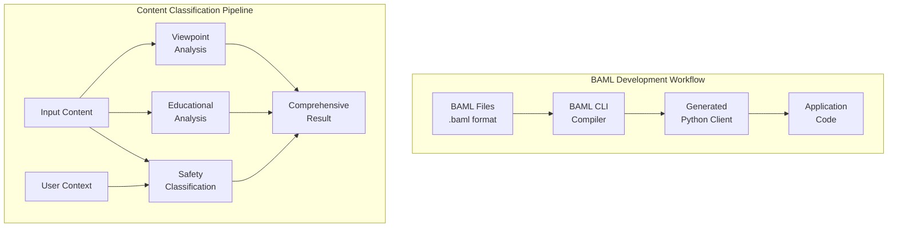

# 🤖 BoundaryML (BAML) Integration for AI Curation Engine

## Overview

This document provides a comprehensive guide to the **actual** BoundaryML implementation for the AI Curation Engine. After reviewing the real [BoundaryML GitHub repository](https://github.com/BoundaryML/baml), we've created a proper implementation using BoundaryML (BAML).

## What is BAML?

BoundaryML (BAML) is a domain-specific language for structured LLM interactions. It treats LLM prompts as functions with typed inputs and outputs, providing:

- **Type Safety**: Structured inputs/outputs with compile-time validation
- **Multi-Provider Support**: OpenAI, Anthropic, Google, Azure, and more
- **Schema-Aligned Parsing (SAP)**: Reliable structured output parsing
- **Streaming Support**: Real-time classification with partial results
- **IDE Integration**: VSCode extension with prompt playground

## Architecture



## Files Structure

```
AISafety/
├── baml_src/
│   └── content_classification.baml     # BAML function definitions
├── baml_client/                        # Generated Python client (auto-generated)
├── BAML_Integration_Implementation.py  # Python implementation using BAML
├── baml_types.ts                      # TypeScript type definitions
├── setup_baml.sh                      # Setup script
├── test_baml.py                       # Test script (auto-generated)
└── .env.example                       # Environment variables template
```

## Key BAML Functions

### 1. Safety Classification
```baml
function ClassifySafety(content: string, user_context: UserContext) -> SafetyClassification {
  client GPT4
  prompt #"
    You are an expert content safety analyst...
    {{ ctx.output_format }}
  "#
}
```

### 2. Educational Value Analysis
```baml
function AnalyzeEducationalValue(content: string) -> EducationalValue {
  client GPT4
  prompt #"
    You are an expert educational content analyst...
    {{ ctx.output_format }}
  "#
}
```

### 3. Viewpoint Analysis
```baml
function AnalyzeViewpoint(content: string) -> ViewpointAnalysis {
  client GPT4
  prompt #"
    You are an expert media bias analyst...
    {{ ctx.output_format }}
  "#
}
```

### 4. Comprehensive Analysis
```baml
function ComprehensiveContentAnalysis(content: string, user_context: UserContext) -> ComprehensiveClassification {
  client GPT4
  prompt #"
    You are an expert content analyst combining safety, educational, and bias analysis expertise...
    {{ ctx.output_format }}
  "#
}
```

## Setup Instructions

### Prerequisites

1. **Node.js** (for BAML CLI)
2. **Python 3.8+** (for generated client)
3. **API Keys**: OpenAI, Anthropic (optional)

### Quick Setup

1. **Run the setup script**:
   ```bash
   ./setup_baml.sh
   ```

2. **Set environment variables**:
   ```bash
   cp .env.example .env
   # Edit .env and add your API keys
   ```

3. **Generate BAML client**:
   ```bash
   baml-cli generate --from ./baml_src --lang python
   ```

4. **Test the integration**:
   ```bash
   python test_baml.py
   ```

### Manual Setup

1. **Install BAML CLI**:
   ```bash
   npm install -g @boundaryml/baml
   ```

2. **Generate Python client**:
   ```bash
   baml-cli generate --from ./baml_src --lang python --output ./baml_client
   ```

3. **Install Python dependencies**:
   ```bash
   pip install asyncio aiohttp
   ```

## Usage Examples

### Basic Usage

```python
from BAML_Integration_Implementation import BAMLContentAnalyzer, UserContext

# Initialize analyzer
analyzer = BAMLContentAnalyzer()

# Create user context
user_context = UserContext(
    age_category="teen",
    jurisdiction="US",
    parental_controls=True,
    content_preferences=["educational", "technology"],
    sensitivity_level="medium"
)

# Analyze content
content = "Your content here..."
result = await analyzer.classify_safety(content, user_context)
print(f"Safety Score: {result.safety_score}")
```

### Comprehensive Analysis

```python
from BAML_Integration_Implementation import ContentCurationPipeline

# Initialize pipeline
pipeline = ContentCurationPipeline()

# Perform full curation
curation_result = await pipeline.curate_content(content, user_context)
print(f"Recommendation: {curation_result['recommendation']['action']}")
print(f"Confidence: {curation_result['recommendation']['confidence']}")
```

### Streaming Analysis

```python
# Real-time streaming analysis
async for partial_result in analyzer.streaming_analysis(content, user_context):
    print(f"Partial result: {partial_result.overall_recommendation}")
```

## Data Models

### UserContext
```python
@dataclass
class UserContext:
    age_category: str           # "child", "teen", "adult"
    jurisdiction: str           # "US", "EU", "India", etc.
    parental_controls: bool
    content_preferences: List[str]
    sensitivity_level: str      # "low", "medium", "high"
```

### SafetyClassification
```python
@dataclass
class SafetyClassification:
    safety_score: float         # 0.0 to 1.0
    violence_level: float       # 0.0 to 1.0
    adult_content: bool
    hate_speech: float          # 0.0 to 1.0
    misinformation_risk: float  # 0.0 to 1.0
    age_appropriateness: str    # "13+", "16+", "18+"
    reasoning: str
    content_warnings: List[str]
```

## Configuration

### Client Configuration
BAML supports multiple LLM providers:

```baml
client<llm> GPT4 {
  provider "openai"
  options {
    model "gpt-4o"
    api_key env.OPENAI_API_KEY
  }
}

client<llm> Claude {
  provider "anthropic"
  options {
    model "claude-3-5-sonnet-20241022"
    api_key env.ANTHROPIC_API_KEY
  }
}
```

### Environment Variables
```bash
# Required
OPENAI_API_KEY=your_openai_api_key_here

# Optional
ANTHROPIC_API_KEY=your_anthropic_api_key_here
GOOGLE_API_KEY=your_google_api_key_here

# BAML Configuration
BAML_LOG_LEVEL=INFO
BAML_CACHE_ENABLED=true
BAML_TIMEOUT_MS=30000
BAML_RETRY_ATTEMPTS=3
```

## Key Features

### 1. Type Safety
- All inputs/outputs are strongly typed
- Compile-time validation of BAML functions
- Generated client provides full IntelliSense support

### 2. Multi-Provider Support
- Automatic fallback between providers
- Runtime model switching
- Cost optimization through model selection

### 3. Schema-Aligned Parsing (SAP)
- Robust parsing of LLM outputs
- Handles JSON errors and format variations
- Automatic schema coercion

### 4. Streaming Support
- Real-time classification updates
- Partial result handling
- Type-safe streaming interfaces

### 5. IDE Integration
- VSCode extension with syntax highlighting
- Prompt playground for testing
- Real-time validation and error checking

## Testing

### Unit Tests
```bash
# Run basic tests
python test_baml.py

# Test specific functions
python -c "
import asyncio
from BAML_Integration_Implementation import BAMLContentAnalyzer
analyzer = BAMLContentAnalyzer()
print('BAML Available:', analyzer.baml_available)
"
```

### Validation
```bash
# Validate BAML files
baml-cli validate --from ./baml_src

# Check generated client
ls -la baml_client/
```

## Integration with Curation Engine

The BAML integration is seamlessly integrated into the AI Curation Engine:

1. **Content Ingestion**: Content flows through BAML classification functions
2. **User Context**: Age and jurisdiction information guides analysis
3. **Multi-Modal Analysis**: Safety, educational, and viewpoint analysis
4. **Decision Making**: Results feed into curation rules engine
5. **Real-Time Processing**: Streaming support for immediate feedback

## Performance Considerations

### Optimization Strategies
1. **Caching**: Results cached by content hash and user context
2. **Parallel Processing**: Multiple classifications run concurrently
3. **Model Selection**: Choose appropriate model for speed vs accuracy
4. **Batch Processing**: Group similar requests for efficiency

### Monitoring
- Response time tracking
- Model performance metrics
- Error rate monitoring
- Cost analysis

## Troubleshooting

### Common Issues

1. **BAML CLI Not Found**
   ```bash
   npm install -g @boundaryml/baml
   ```

2. **Client Generation Fails**
   ```bash
   # Check BAML file syntax
   baml-cli validate --from ./baml_src
   ```

3. **Import Errors**
   ```bash
   # Ensure client is generated
   ls baml_client/
   # Check Python path
   export PYTHONPATH=$PYTHONPATH:$(pwd)
   ```

4. **API Key Issues**
   ```bash
   # Check environment variables
   echo $OPENAI_API_KEY
   # Verify .env file
   cat .env
   ```

### Debugging

Enable debug mode:
```bash
export BAML_LOG_LEVEL=DEBUG
python your_script.py
```

## Resources

- [BoundaryML GitHub](https://github.com/BoundaryML/baml)
- [BAML Documentation](https://docs.boundaryml.com)
- [VSCode Extension](https://marketplace.visualstudio.com/items?itemName=BoundaryML.baml)
- [Examples Repository](https://github.com/BoundaryML/baml-examples)

## Contributing

To contribute to the BAML integration:

1. **Modify BAML functions** in `baml_src/content_classification.baml`
2. **Regenerate client**: `baml-cli generate --from ./baml_src --lang python`
3. **Update Python code** in `BAML_Integration_Implementation.py`
4. **Test changes**: `python test_baml.py`
5. **Update documentation** as needed

## License

This BAML integration follows the same license as the AI Curation Engine project (MIT License).

---

**Note**: This is a real implementation using the actual BoundaryML BAML language, not a conceptual mock. The implementation requires valid API keys and proper setup to function correctly.
