# AI Curation Engine - Complete Deployment Guide

*How to Deploy the AI Curation Engine in the Wild - From Local Development to Global Production*

## Overview

This comprehensive guide explains how the AI Curation Engine can be deployed in real-world scenarios, covering everything from local family setups to global multi-region cloud deployments. The system is designed with multiple deployment options to suit different needs, scales, and privacy requirements.

## Table of Contents

1. [Deployment Options Overview](#deployment-options-overview)
2. [Local Development/Testing Deployment](#local-developmenttesting-deployment)
3. [Docker Container Deployment](#docker-container-deployment)
4. [Cloud Production Deployment](#cloud-production-deployment)
5. [Global Multi-Region Deployment](#global-multi-region-deployment)
6. [Real-World Deployment Scenarios](#real-world-deployment-scenarios)
7. [Deployment Costs](#deployment-costs)
8. [Key Deployment Features](#key-deployment-features)
9. [Step-by-Step Deployment Instructions](#step-by-step-deployment-instructions)

## Deployment Options Overview

The AI Curation Engine supports multiple deployment strategies:

```mermaid
graph TB
    subgraph "Deployment Options"
        LOCAL[🏠 Local Deployment<br/>Family/Development]
        DOCKER[🐳 Docker Deployment<br/>Institution/Medium Scale]
        CLOUD[☁️ Cloud Deployment<br/>Production/Enterprise]
        GLOBAL[🌍 Global Deployment<br/>Multi-Region/Platform]
    end
    
    subgraph "Local Deployment"
        SINGLE[Single Machine<br/>Privacy-First]
        FAMILY[Family Home<br/>Offline Capable]
        DEV[Development<br/>Testing]
    end
    
    subgraph "Cloud Deployment"
        AWS[🇺🇸 AWS<br/>Auto-Scaling]
        AZURE[🇪🇺 Azure<br/>Enterprise]
        OCI[🌏 OCI<br/>Cost-Effective]
    end
    
    LOCAL --> SINGLE
    LOCAL --> FAMILY
    LOCAL --> DEV
    
    CLOUD --> AWS
    CLOUD --> AZURE
    CLOUD --> OCI
    
    style LOCAL fill:#e8f5e8
    style DOCKER fill:#e3f2fd
    style CLOUD fill:#fff3e0
    style GLOBAL fill:#f3e5f5
```



## Local Development/Testing Deployment

### Quick Start (One Command)

```bash
git clone https://github.com/gitmujoshi/ai-curation-engine.git
cd ai-curation-engine
./deploy_local.sh
```

This single command deploys:
- **Demo Frontend** (Flask:5001)
- **Curation Engine** with pluggable strategies
- **BAML Integration** with real AI processing
- **Ollama Server** (:11434) with Llama 3.2 models
- **MongoDB** for data storage
- **Redis** for caching

### System Requirements

#### Minimum Requirements
- **OS**: macOS, Linux, or Windows with WSL2
- **RAM**: 8GB (minimum)
- **Storage**: 20GB+ free space for models
- **CPU**: Modern multi-core processor
- **Network**: Internet for initial model download

#### Recommended Requirements
- **RAM**: 16GB+ (for better performance)
- **GPU**: NVIDIA GPU with CUDA support (optional but recommended)
- **Storage**: 50GB+ free space (for multiple models)
- **CPU**: 8+ cores for faster processing

### Local Deployment Architecture

```mermaid
graph TB
    subgraph "Local Deployment (2024)"
        DEMO[🎯 Demo Frontend<br/>Flask:5001]
        ENGINE[🤖 Curation Engine<br/>Pluggable Strategies]
        BAML[🔄 BAML Integration<br/>Real Implementation]
        OLLAMA[🦙 Ollama Server<br/>:11434]
    end
    
    subgraph "Curation Strategies"
        LLM[🧠 LLM-Only Strategy<br/>5-10s processing]
        MULTI[⚡ Multi-Layer Strategy<br/>0.1-5s processing]
        HYBRID[🎯 Hybrid Strategy<br/>Adaptive]
    end
    
    subgraph "Local AI Models"
        LLAMA32[🧠 Llama 3.2<br/>7B Parameters]
    end
    
    DEMO --> ENGINE
    ENGINE --> LLM
    ENGINE --> MULTI
    ENGINE --> HYBRID
    BAML --> OLLAMA
    OLLAMA --> LLAMA32
    LLM --> BAML
    MULTI --> BAML
    HYBRID --> BAML
```



### Local Deployment Benefits

- **Privacy-First**: All processing happens locally
- **No Internet Required**: Works offline after initial setup
- **Family Control**: Parents configure all safety settings
- **Cost**: Free (uses local hardware)
- **No Data Exposure**: Content never leaves your device

## Docker Container Deployment

### Production Docker Setup

```bash
# Build and run containers
docker-compose -f build/docker/docker-compose.yml up -d

# Scale for production
docker-compose -f build/docker/docker-compose.prod.yml up -d
```

### Complete Container Stack

The Docker deployment includes:

```mermaid
graph TB
    subgraph "Docker Container Stack"
        MONGODB[🗄️ MongoDB<br/>Database Service]
        OLLAMA[🦙 Ollama<br/>Local LLM Server]
        REDIS[⚡ Redis<br/>Caching Layer]
        API[🔧 Curation API<br/>Main Backend]
        BAML[🧠 BAML Service<br/>AI Classification]
        WEB[🌐 Test Interface<br/>Web Interface]
        NGINX[🔄 Nginx<br/>Reverse Proxy]
        MONITOR[📊 Prometheus<br/>Monitoring]
        DASH[📈 Grafana<br/>Dashboard]
    end
    
    WEB --> NGINX
    NGINX --> API
    API --> BAML
    API --> MONGODB
    API --> REDIS
    BAML --> OLLAMA
    MONITOR --> API
    MONITOR --> BAML
    DASH --> MONITOR
```



#### Container Services

1. **MongoDB** (Port 27017)
   - Database service for storing user profiles and classifications
   - Automated backups and data persistence
   - Health checks and monitoring

2. **Ollama** (Port 11434)
   - Local LLM server with Llama 3.2 models
   - GPU acceleration support
   - Model management and caching

3. **Redis** (Port 6379)
   - High-performance caching layer
   - Session management
   - Temporary data storage

4. **Curation API** (Port 3001)
   - Main backend service
   - RESTful API endpoints
   - User management and authentication

5. **BAML Service** (Port 8000)
   - AI classification service
   - Content analysis and safety scoring
   - Real-time processing capabilities

6. **Test Interface** (Port 5000)
   - Web-based testing interface
   - Content classification demo
   - Strategy switching interface

7. **Nginx** (Ports 80/443)
   - Reverse proxy and load balancer
   - SSL termination
   - Request routing

8. **Prometheus** (Port 9090)
   - Metrics collection and monitoring
   - Performance tracking
   - Alerting capabilities

9. **Grafana** (Port 3000)
   - Visualization dashboard
   - Performance metrics display
   - Custom monitoring panels

### Docker Deployment Benefits

- **Scalability**: Easy to scale individual services
- **Isolation**: Each service runs in its own container
- **Portability**: Runs on any Docker-compatible system
- **Monitoring**: Built-in health checks and metrics
- **Easy Updates**: Simple container replacement

## Cloud Production Deployment

The system supports **three major cloud platforms** with complete Terraform infrastructure:

### AWS Deployment

```bash
cd infra/terraform/aws
terraform init && terraform apply
```

#### AWS Infrastructure Components

```mermaid
graph TB
    subgraph "AWS Infrastructure"
        VPC[🌐 VPC<br/>Public/Private Subnets]
        ALB[⚖️ Application Load Balancer<br/>Health Checks + SSL]
        ASG[📈 Auto Scaling Groups<br/>EC2 Instances]
        RDS[🗄️ RDS PostgreSQL<br/>Managed Database]
        S3[📦 S3 Storage<br/>Model Storage]
        SG[🛡️ Security Groups<br/>Access Control]
        CW[📊 CloudWatch<br/>Monitoring]
        WAF[🔒 WAF<br/>Web Application Firewall]
    end
    
    VPC --> ALB
    ALB --> ASG
    ASG --> RDS
    ASG --> S3
    SG --> ASG
    CW --> ASG
    WAF --> ALB
```



**AWS Infrastructure Features:**
- **VPC** with public/private subnets and NAT Gateway
- **Auto Scaling Groups** with EC2 instances (1-3 instances)
- **Application Load Balancer** with health checks and SSL
- **RDS PostgreSQL** with automated backups
- **S3 Storage** for model storage with encryption
- **Security Groups** with restrictive access
- **CloudWatch** for logging and monitoring
- **Route53 + ACM** for domain and SSL certificates
- **WAF** for web application firewall

### Azure Deployment

```bash
cd infra/terraform/azure
terraform init && terraform apply
```

#### Azure Infrastructure Components

```mermaid
graph TB
    subgraph "Azure Infrastructure"
        VNET[🌐 Virtual Network<br/>Public/Private Subnets]
        LB[⚖️ Load Balancer<br/>Health Probes]
        VMSS[📈 VM Scale Sets<br/>Scalable VMs]
        PG[🗄️ PostgreSQL Flexible Server<br/>Managed Database]
        SA[📦 Storage Account<br/>Blob Storage]
        NSG[🛡️ Network Security Groups<br/>Traffic Filtering]
        MON[📊 Azure Monitor<br/>Logging & Metrics]
        AG[🔒 Application Gateway<br/>HTTPS Termination]
    end
    
    VNET --> LB
    LB --> VMSS
    VMSS --> PG
    VMSS --> SA
    NSG --> VMSS
    MON --> VMSS
    AG --> LB
```



**Azure Infrastructure Features:**
- **Virtual Network** with public/private subnets
- **VM Scale Sets** for scalable virtual machines
- **Load Balancer** with health probes
- **PostgreSQL Flexible Server** (managed database)
- **Storage Account** for blob storage
- **Network Security Groups** for traffic filtering
- **Application Gateway** for HTTPS termination
- **Azure Monitor** for logging and metrics

### Oracle Cloud Infrastructure (OCI)

```bash
cd infra/terraform/oci
terraform init && terraform apply
```

#### OCI Infrastructure Components

```mermaid
graph TB
    subgraph "OCI Infrastructure"
        VCN[🌐 Virtual Cloud Network<br/>Public/Private Subnets]
        OLB[⚖️ OCI Load Balancer<br/>Health Checks]
        IP[📈 Instance Pools<br/>Scalable Compute]
        MDS[🗄️ MySQL Database Service<br/>Managed Database]
        OS[📦 Object Storage<br/>Model Storage]
        SL[🛡️ Security Lists<br/>Network Access]
        MON[📊 OCI Monitoring<br/>Logging]
    end
    
    VCN --> OLB
    OLB --> IP
    IP --> MDS
    IP --> OS
    SL --> IP
    MON --> IP
```



**OCI Infrastructure Features:**
- **Virtual Cloud Network** with public/private subnets
- **Instance Pools** for scalable compute
- **Load Balancer** with health checks
- **MySQL Database Service** (optional managed database)
- **Object Storage** for model storage
- **Security Lists** for network access controls

## Global Multi-Region Deployment

### Production Architecture

The system is designed for **global deployment** across multiple regions:

```mermaid
graph TB
    subgraph "🌍 Global Edge"
        CDN[🚀 Global CDN]
        LB[⚖️ Load Balancer]
        WAF[🛡️ Security Layer]
    end
    
    subgraph "🇺🇸 US Region"
        US_K8S[☸️ Kubernetes Cluster]
        US_ZKP[🔐 ZKP Service x3]
        US_API[🤖 Curation API x5]
        US_BML[🧠 BoundaryML x3]
        US_DB[(🗄️ PostgreSQL)]
        US_CACHE[(⚡ Redis)]
    end
    
    subgraph "🇪🇺 EU Region"
        EU_K8S[☸️ Kubernetes Cluster]
        EU_ZKP[🔐 ZKP Service x3]
        EU_API[🤖 Curation API x5]
        EU_BML[🧠 BoundaryML x3]
        EU_DB[(🗄️ PostgreSQL)]
        EU_CACHE[(⚡ Redis)]
    end
    
    subgraph "🌏 Asia Region"
        AS_K8S[☸️ Kubernetes Cluster]
        AS_ZKP[🔐 ZKP Service x3]
        AS_API[🤖 Curation API x5]
        AS_BML[🧠 BoundaryML x3]
        AS_DB[(🗄️ PostgreSQL)]
        AS_CACHE[(⚡ Redis)]
    end
    
    subgraph "🔍 Monitoring"
        PROM[📈 Prometheus]
        GRAF[📊 Grafana]
        TRACE[🔍 Jaeger]
    end
    
    CDN --> WAF --> LB
    LB --> US_ZKP
    LB --> EU_ZKP
    LB --> AS_ZKP
    
    US_ZKP --> US_API --> US_BML
    EU_ZKP --> EU_API --> EU_BML
    AS_ZKP --> AS_API --> AS_BML
    
    US_API --> US_DB
    US_API --> US_CACHE
    EU_API --> EU_DB
    EU_API --> EU_CACHE
    AS_API --> AS_DB
    AS_API --> AS_CACHE
    
    US_BML --> PROM
    EU_BML --> PROM
    AS_BML --> PROM
    PROM --> GRAF
```



### Regional Compliance

#### 🇺🇸 US Region
- **COPPA Compliance**: Children under 13 protection
- **Data Residency**: US-only data processing
- **Parental Controls**: Comprehensive oversight capabilities
- **State Laws**: California CCPA, social media age restrictions

#### 🇪🇺 EU Region
- **GDPR Compliance**: Data minimization and user rights
- **Data Sovereignty**: EU-only data processing
- **DSA Compliance**: Risk assessment and transparency
- **Regional Processing**: Local data handling

#### 🇧🇷 Brazil
- **LGPD Compliance**: Under-18 consent requirements
- **Data Localization**: Local data processing requirements
- **Transparency**: Right to information and data handling
- **No Targeted Ads**: Behavioral monitoring restrictions

#### 🇮🇳 India
- **DPDPA Compliance**: Under-18 consent requirements
- **No Targeted Advertising**: No behavioral monitoring for under 18
- **Data Localization**: Local data processing requirements
- **Grievance Mechanisms**: User complaint and resolution systems

#### 🇨🇳 China
- **Minor Mode Compliance**: Time restrictions and strict filtering
- **Real-name Authentication**: Identity verification requirements
- **Content Filtering**: Strict content filtering for underage users
- **Parental Controls**: Mandatory parental oversight

## Real-World Deployment Scenarios

### 🏠 Family Home Deployment

**Use Case**: Single family protecting children online

```bash
# Simple local deployment for family use
./deploy_local.sh
```

**Configuration:**
```yaml
family_deployment:
  users: 4-6 family members
  children: 2-3 under 18
  devices: 3-5 devices
  privacy: maximum (local only)
  cost: free
```

**Benefits:**
- **Privacy-First**: All processing happens locally
- **No Internet Required**: Works offline after initial setup
- **Family Control**: Parents configure all safety settings
- **Cost**: Free (uses local hardware)
- **Customization**: Tailored to family values and needs

### 🏫 Educational Institution Deployment

**Use Case**: School or university protecting students

```bash
# Docker deployment for schools
docker-compose -f build/docker/docker-compose.yml up -d
```

**Configuration:**
```yaml
educational_deployment:
  users: 100-1000+ students
  age_groups: K-12 or higher education
  compliance: FERPA, educational data protection
  features: age-appropriate filtering, educational focus
```

**Benefits:**
- **Multi-User Support**: Handles multiple students
- **Educational Focus**: Prioritizes learning content
- **Age-Appropriate Filtering**: Different settings per grade level
- **Compliance**: FERPA and educational data protection
- **Scalability**: Easy to expand as student body grows

### 🏥 Healthcare/Assisted Living Deployment

**Use Case**: Healthcare facilities protecting patients and elderly residents

```bash
# Cloud deployment for healthcare facilities
cd infra/terraform/aws
terraform apply -var="environment=healthcare"
```

**Configuration:**
```yaml
healthcare_deployment:
  users: 50-500+ patients/residents
  compliance: HIPAA, healthcare data protection
  features: elderly protection, accessibility support
  oversight: caregiver transparency
```

**Benefits:**
- **HIPAA Compliance**: Healthcare data protection
- **Elderly Protection**: Scam detection and fraud prevention
- **Accessibility**: Support for cognitive impairments
- **Caregiver Oversight**: Transparent monitoring capabilities
- **Medical Integration**: Health-specific content filtering

### 🌐 Large-Scale Platform Integration

**Use Case**: Social media platforms, content providers, or government systems

```bash
# Global multi-region deployment
./deployment/scripts/deploy_global.sh --regions us,eu,asia
```

**Configuration:**
```yaml
platform_deployment:
  users: millions of users
  regions: multiple countries
  compliance: global regulatory requirements
  features: auto-scaling, load balancing, global CDN
```

**Benefits:**
- **Auto-Scaling**: Handles traffic spikes automatically
- **Load Balancing**: Distributes traffic across instances
- **Global CDN**: Fast content delivery worldwide
- **Compliance**: Automatic regional regulatory adherence
- **High Availability**: 99.9%+ uptime with redundancy

## Deployment Costs

### Development Environment

#### AWS Development
- **Instance Type**: 2 x t3.large (2 vCPU, 8GB RAM each)
- **Database**: RDS PostgreSQL db.t3.micro
- **Storage**: 100GB EBS + 50GB S3
- **Load Balancer**: Application Load Balancer
- **Monthly Cost**: ~$150-200

#### Azure Development
- **Instance Type**: 2 x Standard_D2s_v3 (2 vCPU, 8GB RAM each)
- **Database**: PostgreSQL Flexible Server B1ms
- **Storage**: 100GB managed disk + 50GB blob storage
- **Load Balancer**: Standard Load Balancer
- **Monthly Cost**: ~$120-180

#### OCI Development
- **Instance Type**: 2 x VM.Standard.E4.Flex (2 vCPU, 8GB RAM each)
- **Database**: MySQL Database Service (optional)
- **Storage**: 100GB block storage + 50GB object storage
- **Load Balancer**: Load Balancer service
- **Monthly Cost**: ~$100-150

### Production Environment

#### AWS Production
- **Instance Type**: 3-5 x t3.xlarge (4 vCPU, 16GB RAM each)
- **Database**: RDS PostgreSQL db.r5.large (multi-AZ)
- **Storage**: 500GB EBS + 200GB S3
- **Load Balancer**: Application Load Balancer + WAF
- **Monitoring**: CloudWatch + additional services
- **Monthly Cost**: ~$400-600

#### Azure Production
- **Instance Type**: 3-5 x Standard_D4s_v3 (4 vCPU, 16GB RAM each)
- **Database**: PostgreSQL Flexible Server GP_Gen5_2
- **Storage**: 500GB managed disk + 200GB blob storage
- **Load Balancer**: Standard Load Balancer + Application Gateway
- **Monitoring**: Azure Monitor + additional services
- **Monthly Cost**: ~$350-550

#### OCI Production
- **Instance Type**: 3-5 x VM.Standard.E4.Flex (4 vCPU, 16GB RAM each)
- **Database**: MySQL Database Service (optional)
- **Storage**: 500GB block storage + 200GB object storage
- **Load Balancer**: Load Balancer service
- **Monitoring**: OCI Monitoring + additional services
- **Monthly Cost**: ~$300-500

### Local Deployment
- **Cost**: Free (uses existing hardware)
- **Requirements**: 8GB+ RAM, 20GB+ storage
- **Models**: Llama 3.2 (7B parameters) runs locally
- **Ongoing**: No monthly fees, only electricity costs

## Key Deployment Features

### ✅ Production-Ready Features

#### Scalability
- **Auto-Scaling**: Handles traffic spikes automatically
- **Load Balancing**: Distributes traffic across instances
- **Horizontal Scaling**: Easy to add more instances
- **Vertical Scaling**: Easy to increase instance sizes

#### Reliability
- **High Availability**: Multi-AZ deployment
- **Health Checks**: Automatic failure detection
- **Rolling Updates**: Zero-downtime deployments
- **Backup & Recovery**: Automated data protection

#### Security
- **Network Isolation**: VPC/private networks
- **Access Controls**: Security groups/firewalls
- **Encryption**: Data at rest and in transit
- **WAF Protection**: Web application firewall

#### Monitoring
- **Centralized Logging**: All logs in one place
- **Performance Metrics**: Real-time monitoring
- **Alerting**: Proactive issue detection
- **Dashboards**: Visual monitoring interfaces

### ✅ Privacy-Preserving Architecture

#### Local Processing
- **No External Calls**: All AI analysis happens locally
- **Zero Data Exposure**: Content never leaves local infrastructure
- **Edge Computing**: Processing at network edge
- **Device-Level**: Runs on user devices

#### Data Protection
- **Minimal Collection**: Only necessary data for safety
- **Right to Erasure**: Complete data deletion capabilities
- **Transparent Usage**: Clear data handling policies
- **User Control**: Complete user authority over data

#### Compliance
- **GDPR**: EU data protection compliance
- **COPPA**: US children's privacy protection
- **LGPD**: Brazil data protection compliance
- **DPDPA**: India data protection compliance

### ✅ Global Compliance Framework

#### Automatic Compliance
- **Region-Specific Rules**: Applied automatically based on user location
- **Regulatory Updates**: Easy updates for new regulations
- **Audit Trails**: Complete logging for regulatory review
- **Cross-Border Support**: Seamless international deployment

#### Compliance Features
- **Age Verification**: Privacy-preserving age checking
- **Data Localization**: Regional data processing requirements
- **Content Filtering**: Region-appropriate content restrictions
- **User Rights**: GDPR-style user data rights

## Step-by-Step Deployment Instructions

### Local Deployment

#### Step 1: Prerequisites
```bash
# Check system requirements
python3 --version  # Should be 3.8+
git --version
curl --version
```

#### Step 2: Clone Repository
```bash
git clone https://github.com/gitmujoshi/ai-curation-engine.git
cd ai-curation-engine
```

#### Step 3: Make Scripts Executable
```bash
chmod +x *.sh
chmod +x tools/scripts/*.sh
```

#### Step 4: Deploy Everything
```bash
./deploy_local.sh
```

#### Step 5: Verify Deployment
```bash
# Check all services are running
curl http://localhost:5001/api/health
curl http://localhost:3001/api/health
curl http://localhost:8000/health
curl http://localhost:11434/api/tags
```

### Docker Deployment

#### Step 1: Prerequisites
```bash
# Install Docker and Docker Compose
docker --version
docker-compose --version
```

#### Step 2: Clone Repository
```bash
git clone https://github.com/gitmujoshi/ai-curation-engine.git
cd ai-curation-engine
```

#### Step 3: Build and Start Services
```bash
docker-compose -f build/docker/docker-compose.yml up -d
```

#### Step 4: Wait for Services
```bash
# Wait for all services to be healthy
docker-compose -f build/docker/docker-compose.yml ps
```

#### Step 5: Access Services
- **Web Interface**: http://localhost:5000
- **API**: http://localhost:3001
- **BAML Service**: http://localhost:8000
- **Grafana**: http://localhost:3000 (admin/admin123)
- **Prometheus**: http://localhost:9090

### Cloud Deployment (AWS Example)

#### Step 1: Prerequisites
```bash
# Install Terraform
terraform --version

# Configure AWS CLI
aws configure
```

#### Step 2: Clone Repository
```bash
git clone https://github.com/gitmujoshi/ai-curation-engine.git
cd ai-curation-engine
```

#### Step 3: Navigate to AWS Terraform
```bash
cd infra/terraform/aws
```

#### Step 4: Configure Variables
```bash
# Copy and edit terraform.tfvars
cp terraform.tfvars.example terraform.tfvars
# Edit terraform.tfvars with your values
```

#### Step 5: Deploy Infrastructure
```bash
terraform init
terraform plan
terraform apply
```

#### Step 6: Get Outputs
```bash
terraform output
```

#### Step 7: Access Services
```bash
# Get the load balancer URL
aws elbv2 describe-load-balancers --names ai-curation-engine-alb --query 'LoadBalancers[0].DNSName'
```

### Global Multi-Region Deployment

#### Step 1: Prerequisites
```bash
# Install required tools
terraform --version
kubectl --version
helm version
```

#### Step 2: Configure Regions
```bash
# Edit deployment configuration
vim deployment/configs/global-config.yaml
```

#### Step 3: Deploy Infrastructure
```bash
# Deploy to multiple regions
./deployment/scripts/deploy_global.sh --regions us,eu,asia
```

#### Step 4: Configure Global Load Balancer
```bash
# Set up global load balancing
./deployment/scripts/setup-global-lb.sh
```

#### Step 5: Verify Deployment
```bash
# Check all regions
./deployment/scripts/verify-global.sh
```

## Conclusion

The AI Curation Engine is designed to be deployed anywhere from a single family's home computer to global multi-region cloud infrastructure. The system maintains the same privacy-first principles and safety features across all deployment scales while providing the flexibility to meet different requirements for:

- **Privacy**: Complete local processing for maximum privacy
- **Scalability**: From single-user to millions of users
- **Compliance**: Automatic adherence to regional regulations
- **Cost**: From free local deployment to enterprise cloud solutions
- **Reliability**: Production-ready with monitoring and auto-scaling

Whether you're a family looking to protect your children online, an educational institution serving students, a healthcare facility caring for vulnerable populations, or a large platform serving millions of users globally, the AI Curation Engine provides the right deployment option for your needs.

---

*This guide provides comprehensive deployment instructions for the AI Curation Engine. For specific deployment scenarios or custom requirements, please refer to the detailed documentation in the respective deployment directories or contact the development team.*

**Keywords**: AI Safety, Deployment, Cloud Infrastructure, Privacy-Preserving AI, Content Filtering, Vulnerable Population Protection, Docker, Kubernetes, Terraform, Multi-Region Deployment

**Document Version**: 1.0  
**Last Updated**: January 2025  
**Authors**: Project Contributors  
**License**: Creative Commons Attribution 4.0 International
