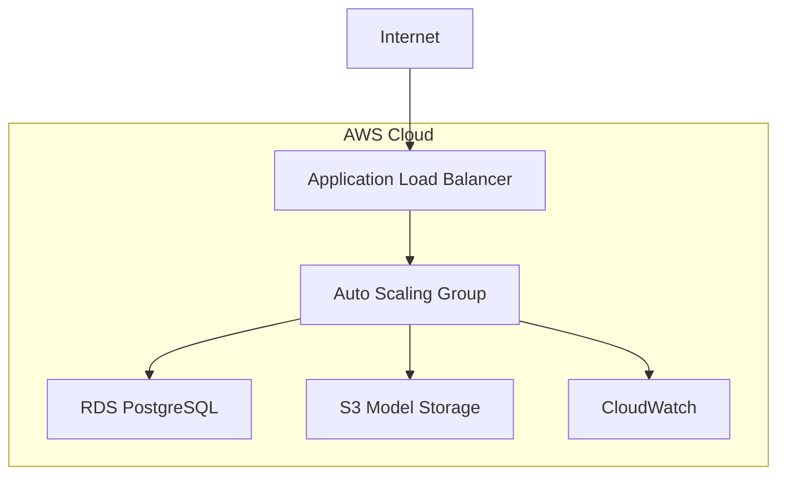
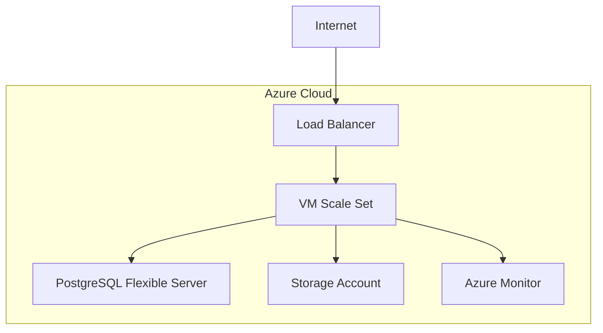
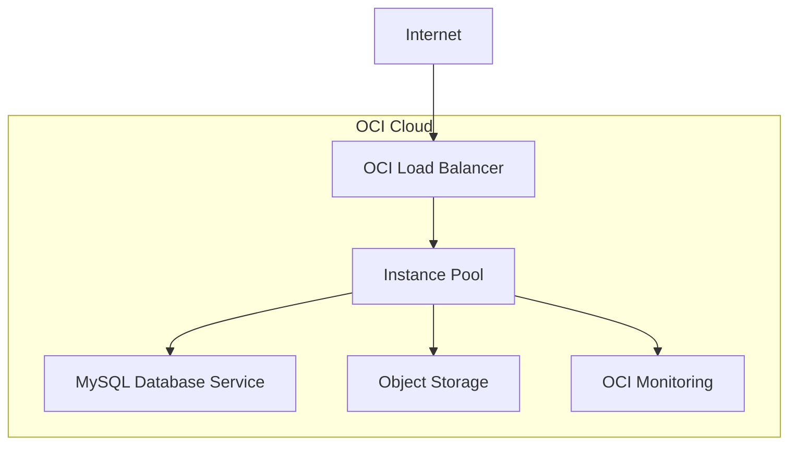

# 🚀 AI Curation Engine - Cloud Deployment Guide

## Overview

This comprehensive guide covers deploying the AI Curation Engine to **AWS**, **Azure**, and **Oracle Cloud Infrastructure (OCI)** using Terraform. All deployments maintain the same features as the local version while providing cloud scalability, reliability, and managed services.

## 🎯 Supported Cloud Platforms

### ✅ Amazon Web Services (AWS)
- **Compute**: EC2 Auto Scaling Groups with Application Load Balancer
- **Database**: RDS PostgreSQL with automated backups
- **Storage**: S3 for model storage, EBS for instance storage
- **Network**: VPC with public/private subnets, NAT Gateway
- **Security**: Security Groups, IAM roles, WAF (production)
- **Monitoring**: CloudWatch Logs and Metrics

### ✅ Microsoft Azure
- **Compute**: Virtual Machine Scale Sets with Load Balancer
- **Database**: PostgreSQL Flexible Server
- **Storage**: Storage Account for models, managed disks
- **Network**: Virtual Network with subnets, NSGs
- **Security**: Managed identities, Application Gateway (optional)
- **Monitoring**: Azure Monitor and Application Insights

### ✅ Oracle Cloud Infrastructure (OCI)
- **Compute**: Instance Pools with Load Balancer
- **Database**: MySQL Database Service or local database
- **Storage**: Object Storage for models, block storage
- **Network**: VCN with subnets, security lists
- **Security**: IAM policies, security lists
- **Monitoring**: OCI Monitoring and Logging

## 📋 Prerequisites

### Common Requirements
- **Terraform**: Version 1.0 or later
- **Git**: For cloning the repository
- **jq**: For JSON processing (recommended)
- **SSH Key Pair**: For instance access

### Cloud-Specific Requirements

#### AWS Prerequisites
- **AWS CLI**: Configured with appropriate credentials
- **AWS Account**: With necessary permissions
- **Key Pair**: Created in target region
- **Domain** (optional): For custom domain setup

#### Azure Prerequisites
- **Azure CLI**: Configured with subscription access
- **Azure Subscription**: With contributor permissions
- **SSH Public Key**: For VM access
- **Resource Group**: Or permission to create one

#### OCI Prerequisites
- **OCI CLI**: Configured with API keys
- **OCI Tenancy**: With compartment access
- **API Key Pair**: For authentication
- **Compartment OCID**: Target compartment

## 🚀 Quick Start Deployment

### AWS Deployment

```bash
# Clone repository
git clone https://github.com/gitmujoshi/ai-curation-engine.git
cd ai-curation-engine

# Run AWS deployment script
./deployment/scripts/deploy_aws.sh \
  --environment dev \
  --region us-west-2 \
  --key-pair my-aws-key

# Or manual deployment
cd terraform/aws
terraform init
terraform plan
terraform apply
```

### Azure Deployment

```bash
# Set up Azure authentication
az login

# Create terraform.tfvars
cd terraform/azure
cat > terraform.tfvars << EOF
environment     = "dev"
project_name    = "ai-curation-engine"
azure_region    = "East US"
ssh_public_key  = "ssh-rsa AAAAB3NzaC1yc2E..."
EOF

# Deploy
terraform init
terraform plan
terraform apply
```

### OCI Deployment

```bash
# Set up OCI authentication
oci setup config

# Create terraform.tfvars
cd terraform/oci
cat > terraform.tfvars << EOF
tenancy_ocid        = "ocid1.tenancy.oc1..xxx"
user_ocid           = "ocid1.user.oc1..xxx"
fingerprint         = "xx:xx:xx:xx:xx:xx:xx:xx:xx:xx:xx:xx:xx:xx:xx:xx"
private_key_path    = "~/.oci/oci_api_key.pem"
compartment_id      = "ocid1.compartment.oc1..xxx"
environment         = "dev"
ssh_public_key      = "ssh-rsa AAAAB3NzaC1yc2E..."
EOF

# Deploy
terraform init
terraform plan
terraform apply
```

## 🏗️ Architecture Comparison

### AWS Architecture


### Azure Architecture


### OCI Architecture


## 📊 Feature Comparison Matrix

| Feature | AWS | Azure | OCI |
|---------|-----|-------|-----|
| **Auto Scaling** | ✅ Auto Scaling Groups | ✅ VM Scale Sets | ✅ Instance Pools |
| **Load Balancing** | ✅ ALB | ✅ Load Balancer | ✅ Load Balancer |
| **Managed Database** | ✅ RDS PostgreSQL | ✅ PostgreSQL Flexible | ✅ MySQL Database Service |
| **Object Storage** | ✅ S3 | ✅ Blob Storage | ✅ Object Storage |
| **Monitoring** | ✅ CloudWatch | ✅ Azure Monitor | ✅ OCI Monitoring |
| **SSL/HTTPS** | ✅ ACM + ALB | ✅ Application Gateway | ✅ Load Balancer |
| **WAF Protection** | ✅ AWS WAF | ✅ Application Gateway | ✅ WAF (manual) |
| **Cost Optimization** | ✅ Spot Instances | ✅ Low Priority VMs | ✅ Preemptible Instances |

## 💰 Cost Estimation

### Development Environment (2 instances)
- **AWS**: ~$150-200/month
- **Azure**: ~$120-180/month  
- **OCI**: ~$100-150/month

### Production Environment (3-5 instances)
- **AWS**: ~$400-600/month
- **Azure**: ~$350-550/month
- **OCI**: ~$300-500/month

*Note: Costs include compute, database, storage, and network. Actual costs may vary based on usage.*

## 🔧 Configuration Options

### Environment Variables

#### Compute Configuration
```bash
# AWS
export INSTANCE_TYPE="t3.large"          # EC2 instance type
export MIN_INSTANCES=1                    # Minimum instances
export MAX_INSTANCES=3                    # Maximum instances
export DESIRED_INSTANCES=2                # Desired instances

# Azure
export VM_SIZE="Standard_D2s_v3"          # Azure VM size
export VM_INSTANCES=2                     # Number of instances

# OCI
export INSTANCE_SHAPE="VM.Standard.E4.Flex"  # OCI instance shape
export INSTANCE_OCPUS=2                   # Number of OCPUs
export INSTANCE_MEMORY_GB=16              # Memory in GB
```

#### Database Configuration
```bash
# AWS
export DB_INSTANCE_CLASS="db.t3.micro"   # RDS instance class
export DB_ALLOCATED_STORAGE=20            # Storage in GB

# Azure
export DB_SKU_NAME="B_Standard_B1ms"      # PostgreSQL SKU
export DB_STORAGE_MB=32768                # Storage in MB

# OCI
export MYSQL_SHAPE="MySQL.VM.Standard.E3.1.8GB"  # MySQL shape
export MYSQL_STORAGE_GB=50                # Storage in GB
```

### Application Configuration
All platforms support the same application configuration:

```bash
export BAML_LOG_LEVEL="ERROR"
export BOUNDARY_TELEMETRY_DISABLED=true
export OLLAMA_TIMEOUT_MS=60000
export ENABLE_CACHING=true
export DEFAULT_STRATEGY="hybrid"
export OLLAMA_MODELS="llama3.2,llama3.1"
```

## 📱 Post-Deployment URLs

After successful deployment, each platform provides the same application URLs:

### Standard URLs
- **🏠 Main Application**: `http://<load-balancer-ip>/`
- **🧪 Content Tester**: `http://<load-balancer-ip>/content-test`
- **❤️ Health Check**: `http://<load-balancer-ip>/health`
- **🔧 API Base**: `http://<load-balancer-ip>/api`

### API Endpoints
- **Content Classification**: `POST /api/classify`
- **Strategy Management**: `GET/POST /api/strategy`
- **Child Profiles**: `GET /api/children`

### Test Commands
```bash
# Health Check
curl -s http://<load-balancer-ip>/health | jq

# Content Classification
curl -X POST http://<load-balancer-ip>/api/classify \
     -H "Content-Type: application/json" \
     -d '{"content": "Educational content about science", "childId": "child_1"}' | jq

# Strategy Switching
curl -X POST http://<load-balancer-ip>/api/strategy \
     -H "Content-Type: application/json" \
     -d '{"strategy": "multi_layer"}' | jq
```

## 🔐 Security Best Practices

### Network Security
- **Private Subnets**: Application instances in private subnets
- **Security Groups/NSGs**: Restrictive inbound rules
- **Load Balancer**: Public endpoint with SSL termination
- **Database**: Private subnet with encrypted storage

### Access Control
- **SSH Keys**: Key-based authentication only
- **IAM Roles**: Minimal required permissions
- **Database**: Strong passwords, encrypted connections
- **API**: Rate limiting and input validation

### Monitoring & Logging
- **Application Logs**: Centralized logging service
- **Security Logs**: Failed authentication attempts
- **Performance Metrics**: CPU, memory, response times
- **Alerts**: Automated notifications for issues

## 📊 Monitoring & Management

### AWS CloudWatch
```bash
# View logs
aws logs tail /aws/ec2/ai-curation-engine-dev --follow

# Check metrics
aws cloudwatch get-metric-statistics \
  --namespace AWS/EC2 \
  --metric-name CPUUtilization \
  --start-time 2024-01-01T00:00:00Z \
  --end-time 2024-01-01T23:59:59Z \
  --period 3600 \
  --statistics Average
```

### Azure Monitor
```bash
# View resource group
az group show --name ai-curation-engine-dev-rg

# Check VM scale set
az vmss show --resource-group ai-curation-engine-dev-rg \
             --name ai-curation-engine-dev-vmss

# View logs
az monitor activity-log list --resource-group ai-curation-engine-dev-rg
```

### OCI Monitoring
```bash
# List instances
oci compute instance list --compartment-id <compartment-ocid>

# Check instance pool
oci compute-management instance-pool get --instance-pool-id <pool-ocid>

# View metrics
oci monitoring metric list --compartment-id <compartment-ocid>
```

## 🔄 Scaling Operations

### Horizontal Scaling

#### AWS
```bash
# Update Auto Scaling Group
aws autoscaling update-auto-scaling-group \
  --auto-scaling-group-name ai-curation-engine-dev-asg \
  --desired-capacity 5
```

#### Azure
```bash
# Scale VM Scale Set
az vmss scale --resource-group ai-curation-engine-dev-rg \
              --name ai-curation-engine-dev-vmss \
              --new-capacity 5
```

#### OCI
```bash
# Update Instance Pool
oci compute-management instance-pool update \
  --instance-pool-id <pool-ocid> \
  --size 5
```

### Vertical Scaling

#### AWS
```bash
# Update Launch Template
aws ec2 modify-launch-template \
  --launch-template-id <template-id> \
  --version-description "Updated instance type" \
  --launch-template-data '{"InstanceType":"t3.xlarge"}'
```

#### Azure
```bash
# Update Scale Set
az vmss update --resource-group ai-curation-engine-dev-rg \
               --name ai-curation-engine-dev-vmss \
               --set sku.name=Standard_D4s_v3
```

#### OCI
```bash
# Update Instance Configuration
oci compute-management instance-configuration update \
  --instance-configuration-id <config-ocid> \
  --instance-details file://new-config.json
```

## 🛠️ Troubleshooting

### Common Issues

#### Deployment Fails
1. **Check Credentials**: Ensure cloud CLI is properly configured
2. **Verify Quotas**: Check service limits in target region
3. **Review Logs**: Check Terraform output for specific errors
4. **Network Issues**: Verify internet connectivity and DNS

#### Application Not Responding
1. **Health Check**: Verify load balancer health checks are passing
2. **Security Groups**: Ensure required ports are open
3. **Instance Logs**: Check application logs for errors
4. **Resource Utilization**: Monitor CPU and memory usage

#### Database Connection Issues
1. **Network**: Verify database subnet and security group rules
2. **Credentials**: Check database username and password
3. **Connectivity**: Test database connection from instances
4. **SSL**: Verify SSL requirements and certificates

### Debug Commands

#### AWS
```bash
# Check instance health
aws autoscaling describe-auto-scaling-groups \
  --auto-scaling-group-names ai-curation-engine-dev-asg

# View load balancer
aws elbv2 describe-load-balancers \
  --names ai-curation-engine-dev-alb

# Check RDS status
aws rds describe-db-instances \
  --db-instance-identifier ai-curation-engine-dev-db
```

#### Azure
```bash
# Check VM instances
az vmss list-instances --resource-group ai-curation-engine-dev-rg \
                       --name ai-curation-engine-dev-vmss

# Check load balancer
az network lb show --resource-group ai-curation-engine-dev-rg \
                   --name ai-curation-engine-dev-lb

# Check database
az postgres flexible-server show --resource-group ai-curation-engine-dev-rg \
                                 --name ai-curation-engine-dev-postgres
```

#### OCI
```bash
# Check instance pool
oci compute-management instance-pool-instance list \
  --compartment-id <compartment-ocid> \
  --instance-pool-id <pool-ocid>

# Check load balancer
oci lb load-balancer get --load-balancer-id <lb-ocid>

# Check database
oci mysql db-system get --db-system-id <db-ocid>
```

## 🔄 Backup & Disaster Recovery

### Automated Backups
- **AWS**: RDS automated backups, S3 versioning
- **Azure**: PostgreSQL automated backups, Storage Account redundancy
- **OCI**: MySQL automated backups, Object Storage replication

### Disaster Recovery
1. **Multi-Region**: Deploy to multiple regions for high availability
2. **Data Replication**: Cross-region database replication
3. **Infrastructure as Code**: Terraform enables quick recreation
4. **Monitoring**: Automated failover triggers

## 🎯 Production Readiness Checklist

### Security
- [ ] SSL/TLS certificates configured
- [ ] WAF protection enabled
- [ ] Database encryption at rest
- [ ] VPN or private connectivity
- [ ] Security group rules minimized
- [ ] IAM permissions reviewed

### Performance
- [ ] Auto scaling configured
- [ ] Load balancer health checks tuned
- [ ] Database performance monitoring
- [ ] CDN for static content (if needed)
- [ ] Caching strategies implemented

### Reliability
- [ ] Multi-AZ deployment
- [ ] Automated backups configured
- [ ] Monitoring and alerting setup
- [ ] Disaster recovery plan tested
- [ ] Infrastructure versioned in Git

### Operations
- [ ] CI/CD pipeline configured
- [ ] Log aggregation setup
- [ ] Metrics and dashboards created
- [ ] Runbook documentation
- [ ] On-call procedures defined

## 📚 Additional Resources

### Documentation
- [AWS Well-Architected Framework](https://aws.amazon.com/architecture/well-architected/)
- [Azure Architecture Center](https://docs.microsoft.com/en-us/azure/architecture/)
- [OCI Architecture Center](https://docs.oracle.com/en/solutions/)

### Cost Optimization
- [AWS Cost Optimization](https://aws.amazon.com/aws-cost-management/)
- [Azure Cost Management](https://azure.microsoft.com/en-us/services/cost-management/)
- [OCI Cost Management](https://docs.oracle.com/en-us/iaas/Content/Billing/home.htm)

### Support
- **AWS**: AWS Support Plans
- **Azure**: Azure Support Plans  
- **OCI**: Oracle Cloud Support

---

This cloud deployment guide provides everything needed to deploy the AI Curation Engine to any major cloud platform with production-ready configurations, monitoring, and management capabilities.
